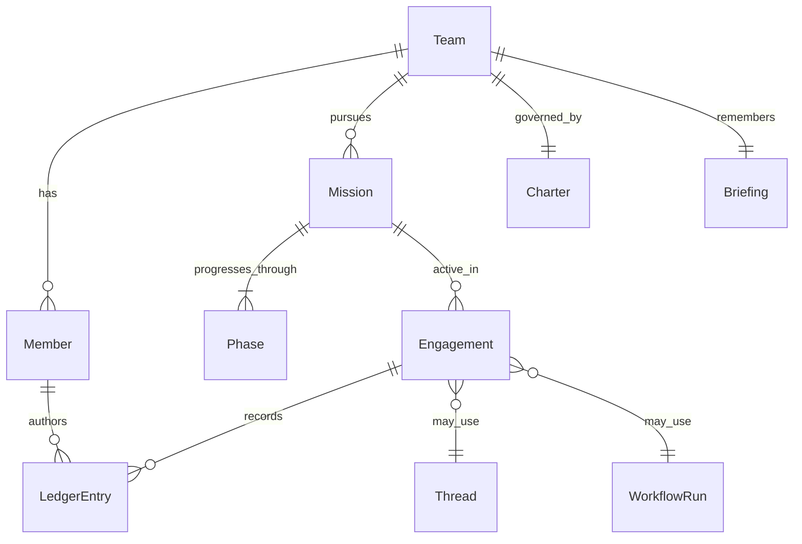

# agentTeams 详细实施方案

> 版本：v1.1  
> 日期：2026-07-06  
> 状态：可实施  
> 基于：myteams-草案.md + 横向对比矩阵 + 参考项目分析（借鉴不照抄）

---

## 执行摘要

**agentTeams = 可养成的专业 Agent 团队协作平台**

- **产品中心**：多支长期存在的专业 Team，每支队按自己的方式工作
- **协作模式**：双模式（Thread 轻量 + WorkflowRun 结构化），队自选默认模式
- **工作方式**：平台不预设固定阶段内容，只提供共性节奏框架
- **核心能力**：Briefing 驱动的自主进化、Harness 中立、可见协作现场
- **技术栈**：TypeScript + Bun monorepo
- **Phase 1**：应用开发队走完三段并沉淀记忆，证明可行

---

## 目录

1. [架构总览](#1-架构总览)
2. [核心领域模型](#2-核心领域模型)
3. [双模式协作](#3-双模式协作)
4. [团队工作方式](#4-团队工作方式)
5. [记忆与进化](#5-记忆与进化)
6. [Harness 适配层](#6-harness-适配层)
7. [Hub 设计](#7-hub-设计)
8. [技术栈与项目结构](#8-技术栈与项目结构)
9. [Phase 1 路线](#9-phase-1-路线)
10. [Phase 2-3 演进](#10-phase-2-3-演进)
11. [风险与缓解](#11-风险与缓解)

---

## 1. 架构总览

### 1.1 四层架构

```
┌─────────────────────────────────────────────────────────┐
│  L4 用户层              Hub（Web / Desktop / CLI）       │
│                     - Team 选择与现场                    │
│                     - 阶段视图与 Ledger                  │
│                     - L3 升级决策介入                    │
└────────────────────────┬────────────────────────────────┘
                         │
┌────────────────────────▼────────────────────────────────┐
│  L3 编排层           Platform Core（Daemon）            │
│                     - Team 生命周期                      │
│                     - Thread / WorkflowRun 编排          │
│                     - Briefing 记忆系统                  │
│                     - Workspace 隔离                     │
└────────────────────────┬────────────────────────────────┘
                         │
┌────────────────────────▼────────────────────────────────┐
│  L2 适配层           EngineAdapter Registry             │
│                     - Pi（默认）                         │
│                     - acpx / Codex / Claude / OpenCode   │
│                     - 统一 AgentSession 接口             │
└────────────────────────┬────────────────────────────────┘
                         │
┌────────────────────────▼────────────────────────────────┐
│  L1 执行层           Agent Harness（外部）              │
└─────────────────────────────────────────────────────────┘
```

**设计立场**：越往上越接近「做什么 / 怎么协作」；越往下越接近「单次 Agent 怎么跑」。产品中心在 L3-L4，不在 Harness。

### 1.2 系统拓扑

```
┌──────────────┐   WebSocket    ┌──────────────────┐
│  Hub (Web)   │◄──────────────►│  Platform Core   │
└──────────────┘                │  (teams-daemon)  │
┌──────────────┐   HTTP/WS       └────────┬─────────┘
│ Hub (Desktop)│◄────────────────────────┘
└──────────────┘                          │
┌──────────────┐   CLI                     │
│  teams-cli   │◄──────────────────────────┘
└──────────────┘
                              ┌───────────┴───────────┐
                              │                       │
                         Pi RPC                  acpx session
```

Phase 1 以 **CLI + 文件存储** 为主，Hub Web 为只读现场；Daemon 与 CLI 共用 `@agentteams/core`。

### 1.3 数据持久化

| 数据 | 存储 | 说明 |
|------|------|------|
| Team 定义 | `teams/<id>/team.yaml` | Git 版本化，队可改 |
| Charter / Briefing | `teams/<id>/briefing/` | principles / patterns / scars |
| Ledger | `teams/<id>/ledger/*.jsonl` | append-only，按 Mission 分文件 |
| Mission 状态 | `teams/<id>/missions/<id>.json` | 当前 Phase、产物索引 |
| WorkflowRun | `teams/<id>/runs/<id>/` | 步骤状态 + 产物 |
| 运行时索引 | `~/.agentteams/` | daemon 锁、活跃 session |

**原则**：队的工作区在 `teams/<id>/` 下自包含，便于 Git 备份与队自治演进。

---

## 2. 核心领域模型

### 2.1 对象关系



### 2.2 Team

```yaml
id: app-dev
name: 应用开发队
domain: software
defaultMode: hybrid          # thread | workflow | hybrid
phases:
  - id: brainstorm
    label: 头脑风暴
  - id: scheme
    label: 确定方案
  - id: delivery
    label: 实施
members: [...]
charter: charter.md
```

Team 是 **一等对象**：创建后长期存在，不因单次 Mission 结束而销毁。

### 2.3 Mission

一次「作品 / 项目」推进：

```yaml
id: my-app-v1
title: 待办应用 MVP
teamId: app-dev
status: active               # active | paused | done
currentPhase: scheme
brief: "做一个本地优先的待办应用"
artifacts: []
```

### 2.4 Member

```yaml
id: architect
kind: agent                  # agent | human
role: 架构师
handle: "@architect"
harness:
  engine: pi
  model: claude-sonnet-4
persona: members/architect.md
autonomy: L2
```

Member 是队里的人格化角色，参考 Multica「Agent 像同事」，但不照搬其 Issue 中心。

### 2.5 Ledger

append-only 事件，类型包括：

| 类型 | 含义 |
|------|------|
| `message` | 队内发言（含 @mention） |
| `decision` | 阶段门禁决策 |
| `artifact` | 产物登记（路径 + 摘要） |
| `custody` | 责任转移 |
| `escalation` | 升级待人拍板 |
| `closeout` | 阶段 / Mission 收尾 |

### 2.6 Briefing（团队记忆）

```
briefing/
├── principles.md    # 经检验的原则
├── patterns.md      # 可复用模式
├── scars.md         # 踩坑与教训
└── changelog.md     # 记忆演进记录
```

进化路径：`干活 → Closeout → 写入 Briefing → 下次 Engagement 自动注入 context`。

---

## 3. 双模式协作

借鉴 OpenTeams 双模式，但不复制其单 Session 中心设计。

### 3.1 Thread 模式（轻）

| 场景 | 短剧队选题碰撞、开发队 quick fix |
|------|----------------------------------|
| 机制 | @mention 路由、Ledger 对话、可选 Custody |
| 参考借鉴 | Clowder @路由（裁剪球权 SM）、OpenCrew A2A 协议思想 |

```text
委托人: "@编剧 这集加个反转"
  → Ledger: message + custody → 编剧 Member
  → Harness 执行 → Ledger: artifact（分集梗概）
  → custody → @导演 审节奏
```

### 3.2 WorkflowRun 模式（重）

| 场景 | 应用开发定案后实施、短剧分镜流水线 |
|------|-------------------------------------|
| 机制 | YAML 步骤 DAG、逐步审批、单步重试 |
| 参考借鉴 | Archon node 定义、OpenTeams 计划图 |

```yaml
# teams/app-dev/workflows/feature-delivery.yaml
steps:
  - id: implement
    member: builder
    autonomy: L1
  - id: review
    member: reviewer
    requires: [implement]
    gate: human_optional
  - id: integrate
    member: builder
    requires: [review]
```

### 3.3 队级默认

| 队 | 默认模式 | 理由 |
|----|----------|------|
| 应用开发 | hybrid | brainstorm 用 Thread，delivery 用 Workflow |
| 短剧 | thread | 创作碰撞多，流程弹性大 |
| 小说 | thread | 连贯性互审适合对话式 |

平台提供两种模式；**选哪种、何时切换** 由 Team Charter 决定。

---

## 4. 团队工作方式

平台只保证 **共性节奏**：`头脑风暴 → 确定方案 → 实施`。  
每支队在 `team.yaml` + `phases/` 下自定义各阶段门禁、角色、产物。

### 4.1 应用开发队

| Phase | 做什么 | 产物 | 默认模式 |
|-------|--------|------|----------|
| brainstorm | 需求澄清、方案对比 | 需求摘要、方案对比表 | Thread |
| scheme | 架构评审、任务拆分 | 设计说明、验收标准 | Thread + 人批 |
| delivery | 实现、交叉 Review、集成 | PR、测试、可运行构建 | Workflow |

### 4.2 短剧创作队

| Phase | 做什么 | 产物 |
|-------|--------|------|
| brainstorm | 选题、人设、分集钩子 | 选题池、人物小传 |
| scheme | 分场大纲、节奏门禁 | 分集大纲、场景表 |
| delivery | 剧本 → 分镜 → 剪辑节奏 | 剧本定稿、分镜、成片 |

### 4.3 小说创作队

| Phase | 做什么 | 产物 |
|-------|--------|------|
| brainstorm | 世界观、人物弧、情节备选 | 设定笔记、关系图 |
| scheme | 卷章结构、伏笔表、文风规范 | 章节大纲 |
| delivery | 分章写作、互审、修订 | 章节稿、修订记录 |

### 4.4 Phase 门禁（队级可配置）

```yaml
# teams/app-dev/phases/scheme.yaml
gate:
  type: human_approval
  requiredArtifacts: [design-doc.md]
  approver: human
exitCriteria:
  - 架构决策已记录到 Ledger
  - 验收标准已写入 Mission
```

---

## 5. 记忆与进化

### 5.1 进化循环

```text
Engagement 执行
    ↓
Closeout（队自定义模板）
    ↓
Briefing 更新（principles / patterns / scars）
    ↓
Charter 微调（在自治边界内，L3 变更需人批）
    ↓
下次 prompt 注入 Briefing 摘要 + 相关 patterns
```

### 5.2 Closeout 模板（队级）

```markdown
## Closeout: {{mission}} / {{phase}}

### 什么管用
- ...

### 什么翻车
- ...

### 建议写入 Briefing
- [principle] ...
- [pattern] ...
- [scar] ...
```

### 5.3 自主演进边界

| 变更类型 | 自治等级 | 需人批准 |
|----------|----------|----------|
| 新增 pattern / scar | L1 | 否 |
| 修改 phase 产物清单 | L2 | 否 |
| 修改 Member persona | L2 | 否 |
| 修改 Charter 自治边界 | L3 | 是 |
| 对外发布成品 | L3 | 是 |

借鉴 OpenCrew L0–L3，写入平台 Policy 而非散落 prompt。

---

## 6. Harness 适配层

### 6.1 AgentSession 接口

```typescript
interface AgentSession {
  id: string;
  memberId: string;
  engine: string;
  prompt(messages: Message[]): AsyncIterable<AgentEvent>;
  resume(checkpoint: string): void;
  abort(): void;
}
```

### 6.2 Adapter 注册

| Engine | Phase 1 | 接入方式 |
|--------|---------|----------|
| **pi** | ✅ 默认 | `pi --mode rpc` JSONL |
| **acpx** | 预留 | `acpx pi prompt` |
| **codex** | 预留 | app-server JSON-RPC |
| **claude-code** | 预留 | CLI wrapper |

### 6.3 Context 注入

每次 Member 被调度时，平台组装：

1. Team Charter 摘要  
2. Briefing 相关条目（按 Mission 领域检索）  
3. 当前 Mission + Phase 说明  
4. Ledger 近期上下文（最近 N 条）  
5. Member persona  

Harness 只负责执行；**协作语义由平台管**。

---

## 7. Hub 设计

### 7.1 信息架构

```text
选 Team
  → 当前 Mission（可切换）
  → 当前 Phase（进度条）
  → Ledger 时间线（主视图）
  → 产物面板（队自定义字段）
  → 待拍板队列（L3 Escalation）
```

### 7.2 队差异化展示

| 队 | Hub 侧重 |
|----|----------|
| 短剧 | 分集列表、场景表、素材状态 |
| 小说 | 卷章树、人物关系、伏笔表 |
| 应用开发 | 任务列表、diff 摘要、测试结果 |

布局由 Team `hubLayout` 配置驱动，非全平台硬编码。

### 7.3 Phase 1 Hub 范围

- CLI：`teams hub` 输出 Ledger TUI 只读视图  
- Web：Phase 2；先保证 Ledger API 稳定

---

## 8. 技术栈与项目结构

```
myteams/
├── CONTEXT.md                 # 领域词汇表
├── package.json               # Bun workspaces
├── packages/
│   ├── core/                  # 领域模型 + 存储
│   ├── harness/               # EngineAdapter
│   ├── daemon/                # Platform Core（Phase 1 后期）
│   └── cli/                   # teams-cli
├── teams/
│   ├── app-dev/
│   ├── short-drama/
│   └── novel/
└── docs/
```

| 包 | 职责 |
|----|------|
| `@agentteams/core` | Team/Mission/Ledger/Briefing 类型与文件存储 |
| `@agentteams/harness` | AgentSession 接口与 Pi adapter |
| `@agentteams/cli` | 队管理、Mission、Ledger 查看 |
| `@agentteams/daemon` | 常驻编排、WebSocket API（Phase 1 末） |

---

## 9. Phase 1 路线

| 周 | 交付 | 验收标准 |
|----|------|----------|
| W1 | core 包 + 三队模板 + CLI `list/show/init` | 能加载三支 Team YAML |
| W2 | Mission 生命周期 + Ledger 写入 | 能创建 Mission、推进 Phase、记 Ledger |
| W3 | Pi harness 接入 + brainstorm 跑通 | 应用开发队完成真实 brainstorm |
| W4 | scheme 门禁 + delivery WorkflowRun | 走完三段，产出设计 doc + 代码 |
| W5 | Closeout + Briefing 写回 | 第二次同类 Mission 可感知记忆差异 |
| W6 | daemon 薄层 + Ledger API | CLI/Web 共用只读现场 |

**Phase 1 不做**：多 Harness、飞书/Slack、复杂进化算法、Workflow 可视化编辑器。

---

## 10. Phase 2-3 演进

### Phase 2：验证「同平台、异工作方式」

- 短剧队、小说队各完成一个 Mission  
- Thread 模式 Custody 完善  
- Hub Web 最小现场  
- acpx / Codex 第二引擎

### Phase 3：平台化

- WorkItem 入口（可选 Issue 层）  
- 跨 Team 委托人视图  
- Briefing 语义检索  
- Team 模板市场  
- Desktop Hub（Tauri 可选）

---

## 11. 风险与缓解

| 风险 | 缓解 |
|------|------|
| 做成「通用 DAG 平台」而非「养队」 | Team 一等对象；Workflow 是队可选工具 |
| Harness 绑定 Pi | EngineAdapter 抽象；Phase 1 只实现 Pi |
| 记忆膨胀污染 prompt | Briefing 分桶 + 按需检索 + changelog |
| 三队模板维护成本 | 共享 core schema，差异只在 `phases/` 与 `members/` |
| 进化失控 | L3 门禁 + Charter 变更需人批 |
| 参考项目拼盘 | 矩阵用于避坑；每个能力有明确「借鉴点 / 不搬什么」 |

---

## 附录 A：与参考项目对照

| 能力 | 借鉴 | 不搬 |
|------|------|------|
| 双模式 | OpenTeams Thread + Workflow | 单 Session 中心 |
| 工作对象 | Multica WorkItem 思想 | 完整 PM 产品 |
| @ 路由 | Clowder mention | 球权全状态机 |
| 岗位持久 | OpenCrew 频道=岗位 | Slack 外壳 |
| 自主等级 | OpenCrew L0–L3 | OpenClaw workspace 全套 |
| DAG 执行 | Archon YAML node | Archon 工单中心 |
| 执行引擎 | acpx 多 agent CLI | 绑 acpx 为唯一入口 |
| 本地 Hub | Paseo Timeline 思想 | AGPL 全栈 fork |

---

*词汇表见 [CONTEXT.md](../CONTEXT.md)；方向稿见 [myteams-草案.md](./myteams-草案.md)。*