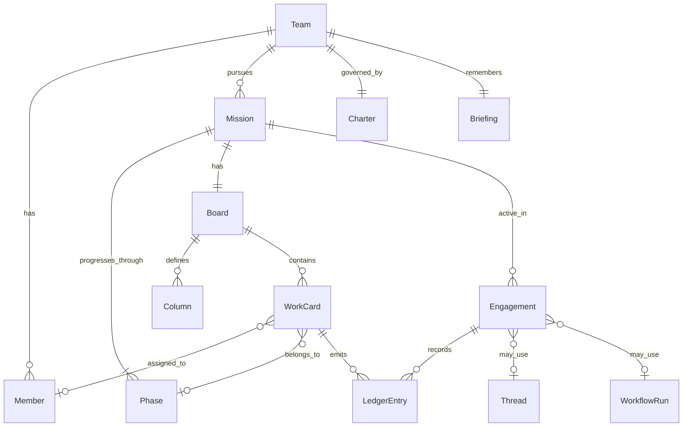

# agentTeams 最终方案

> 版本：v1.1（设计定稿稿）  
> 日期：2026-07-06
> 状态：待确认后实施  
> 依据：用户意图 + myteams-草案 + 参考项目矩阵（借鉴不照抄）

---

## 0. 一句话

**agentTeams = 养多支专业 Agent 团队的平台——短剧、小说、应用开发各干各的领域；每支队有自己的干活方式；队长期存在，会自己进化。**

不是 Pi 插件，不是单一编排器，不是给所有场景套同一套流水线。

---

## 1. 你要什么 → 方案怎么回应

| 你的要求 | 方案回答 |
|----------|----------|
| 多个专业团队，各干各的领域 | **Team 是一等对象**；平台管多支队并存，不管「一套流程打天下」 |
| 每队按自己的工作内容，用适合自己的方式 | 平台只提供 **共性节奏框架**；阶段内容、角色、产物、协作模式由 **队宪（Charter）** 自定 |
| 共性节奏：头脑风暴 → 确定方案 → 实施 | 三阶段是 **命名约定**，不是硬编码流水线；各队自行定义每阶段发生什么、谁参与、什么算完成 |
| 团队长期存在，可以自主进化 | Team 不随单个作品结束而销毁；跨 Mission 的 **Briefing（团队记忆）** 驱动养成 |
| 需要看板掌握进展 | 每 Mission 有 **队自定义看板**；卡片可 assign 给 Member；与 Ledger / Phase 联动，但 **不以看板替代 Team 中心** |

---

## 2. 产品边界

### 2.1 是什么

- 多支 **领域专业化**、**长期存在** 的 Agent Team
- 每支队 **自定义** 三阶段工作方式
- **可见的队内协作现场**（Hub：**看板 + 时间线 + 阶段**）
- **Mission 看板**：队自定义列、卡片 assign、状态拖拽（含 Agent Member）
- **团队记忆驱动** 的自主进化
- **Harness 中立** 的执行接入（Pi / Codex / Claude… 可插拔）

### 2.2 不是什么

| 不是 | 原因 |
|------|------|
| 全局 Workflow 编辑器当核心 | 会滑向「一套流程打天下」，背离「各队各的方式」 |
| 全局 Issue/PM 产品当中心 | 有看板，但挂在 **Team → Mission** 下；不做 Milestone/Inbox/多租户 SaaS 那套 |
| 单 Session 群聊产品 | OpenTeams 式中心适合单次协作，难表达「队长期存在、跨作品养成」 |
| Pi 的附属 MCP / 插件 | 平台管协作语义，Harness 管单次执行，产品不绑执行引擎 |
| 参考项目的功能拼盘 | 矩阵用于 **避坑与验证假设**，不是零件目录 |

---

## 3. 两层结构

```text
agentTeams（平台）
  ├── 编队：创建 / 管理多支 Team
  ├── 现场：Hub 展示看板、时间线、阶段与待拍板
  ├── 看板：Mission 级 WorkCard + 队自定义列 + Member assign
  ├── 记忆：Briefing 存储与注入
  ├── 接入：EngineAdapter 连接 Harness
  └── 编排：Thread / WorkflowRun 两种协作模式（队选用）

  └── Team × N（长期存在）
        ├── 领域与身份（短剧 / 小说 / 应用开发 …）
        ├── Member（持久角色，Agent + 可选人）
        ├── Charter（队宪：自治边界、升级规则）
        ├── 工作方式（本队三阶段定义、产物、门禁）
        ├── Mission（当前推进的作品 / 项目）
        │     └── Board（本 Mission 的工作看板）
        └── Briefing（原则 / 模式 / 教训）
```

**分工原则**：平台回答「怎么养多支队」；Team 回答「这支队怎么 brainstorm → 定案 → 实施」。

---

## 4. 核心领域模型

### 4.1 对象关系



### 4.2 核心对象定义

| 对象 | 定义 | 生命周期 |
|------|------|----------|
| **Team** | 专业编队：领域、成员、工作方式、历史 | **长期**；跨多个 Mission |
| **Member** | 队内角色（Agent 或人），有 handle、职责、人格 | 随 Team 存在；可演进 persona |
| **Charter** | 队宪：使命、自治边界（L0–L3）、升级条件 | 队可在边界内微调；L3 变更需人批 |
| **Mission** | 一件作品或项目（一部短剧、一本小说、一个应用） | 有始有终；结束后 Team 继续存在 |
| **Phase** | Mission 内阶段：brainstorm / scheme / delivery | 队自定义每阶段内容与门禁 |
| **Engagement** | 在某 Mission·Phase 上的一次活跃工作 | 可多次；结束触发 Closeout |
| **Ledger** | append-only 队内时间线 | 消息、决策、产物、责任、升级 |
| **Briefing** | 团队记忆：principles / patterns / scars | 跨 Mission 累积；驱动进化 |
| **Closeout** | Phase 或 Mission 收尾的结构化沉淀 | 触发 Briefing 更新 |
| **Board** | 某 Mission 的工作看板；列由队定义 | 随 Mission 创建；队模板可预设 |
| **Column** | 看板列（如「进行中」「待审」） | 队级配置，可映射 Phase 或队内部状态 |
| **WorkCard** | 看板卡片：一件可指派、可追踪的工作单元 | 可来自阶段产物拆分、委托人下达、Agent 自建 |

### 4.3 WorkCard 与 Team 中心的关系

看板解决 **「现在有哪些活、谁在干、卡在哪」**；Team 仍是中心，WorkCard **不独立存在**：

```text
Team（长期）
  └── Mission（一部作品）
        ├── Board（这张看板只属于这个 Mission）
        │     └── WorkCard × N
        ├── Phase（节奏：brainstorm / scheme / delivery）
        └── Ledger（发生了什么）
```

| 原则 | 说明 |
|------|------|
| 看板挂在 Mission 下 | 不是全平台统一 Backlog；换 Mission = 换看板 |
| 卡片可 assign 给 Member | Agent 与人同等待遇，出现在卡片头像/句柄上 |
| 卡片变动写 Ledger | 拖拽、assign、阻塞、完成 → 时间线可追溯 |
| 卡片可触发执行 | assign 给 Agent → 平台 enqueue Harness；也可仅作状态跟踪 |
| 列由队自定义 | 短剧、小说、开发的列名与语义各不相同 |

### 4.4 可选扩展（非 Phase 1）

| 对象 | 用途 | 引入时机 |
|------|------|----------|
| **Custody** | Thread 模式下「谁接了事」 | Phase 2；可与 WorkCard assign 合并 |
| **Team Board** | 跨 Mission 的队级总览看板 | Phase 2；Phase 1 先做 Mission 看板 |

---

## 5. 协作模式：双模式，队自选

借鉴 OpenTeams「Chat + Workflow」思想，但 **不以单 Session 为中心**。

### 5.1 Thread（轻）

**适合**：探索、创意碰撞、小修、对等讨论。

| 机制 | 说明 |
|------|------|
| @mention 路由 | `@编剧` `@架构师` 定向调度 Member |
| Ledger 对话 | 队内发言、决策可见 |
| Custody（可选） | 当前责任方，避免「说了没人接」 |

**借鉴**：Clowder @路由、OpenCrew A2A 协议  
**不搬**：球权全状态机、Slack 频道外壳

### 5.2 WorkflowRun（重）

**适合**：步骤清晰、需审批、可重试的交付流程。

| 机制 | 说明 |
|------|------|
| 队级 YAML 步骤 | 每步指定 Member、依赖、自治等级 |
| 逐步门禁 | 人批 / 队共识 / 验收 |
| 单步重试 | 失败只重跑该步，不推翻全局 |

**借鉴**：Archon node 定义、OpenTeams 计划图  
**不搬**：Archon 工单中心、全局 DAG 编辑器

### 5.3 三支队默认策略

| 队 | 默认模式 | 理由 |
|----|----------|------|
| **短剧** | Thread | 选题/人设/节奏碰撞多，流程弹性大 |
| **小说** | Thread | 连贯性互审、文风统一适合对话式 |
| **应用开发** | **Hybrid** | brainstorm/scheme 用 Thread；delivery 用 Workflow |

平台提供两种模式；**何时用哪种、何时切换** 写入各队 Charter，不由平台硬编码。

---

## 6. 三支队工作方式（同节奏、异诠释）

共性节奏：**头脑风暴 → 确定方案 → 实施**。  
下面是 **同一框架、不同诠释**——平台不强制阶段等价。

### 6.1 短剧创作队

| 阶段 | 这支队怎么做 | 典型产物 | 协作 |
|------|--------------|----------|------|
| 头脑风暴 | 选题、人设、冲突、分集钩子；编剧与总策划对等碰撞 | 选题池、人物小传、分集钩子 | Thread |
| 确定方案 | 选定本集/本季方向；导演卡节奏；分场大纲 | 分集大纲、场景表、制作清单 | Thread + 人批方向 |
| 实施 | 剧本 → 分镜 → 剪辑节奏 | 剧本定稿、分镜、成片 | Thread；按队宪谁审谁做 |

**成员**：总策划、编剧、导演、剪辑、委托人  
**看板列**：`选题池 → 大纲定稿 → 拍摄制作 → 待审 → 完成`（卡片单位：集/场）  
**Hub 侧重**：看板 + 分集列表、场景表、素材状态

### 6.2 小说创作队

| 阶段 | 这支队怎么做 | 典型产物 | 协作 |
|------|--------------|----------|------|
| 头脑风暴 | 世界观、主线、人物弧；发散与收敛交替 | 设定笔记、情节备选、人物关系 | Thread |
| 确定方案 | 卷章结构、POV、伏笔表；文风与禁忌 | 章节大纲、写作规范 | Thread + 人批主线 |
| 实施 | 分章写作 → 连贯性互审 → 文风修订 | 章节稿、修订记录 | Thread |

**成员**：主笔、世界观架构、连贯性编辑、文风编辑、委托人  
**看板列**：`构思 → 大纲 → 写作中 → 连贯审 → 文风审 → 定稿`（卡片单位：卷/章）  
**Hub 侧重**：看板 + 卷章树、人物关系、伏笔表

### 6.3 应用开发队

| 阶段 | 这支队怎么做 | 典型产物 | 协作 |
|------|--------------|----------|------|
| 头脑风暴 | 需求澄清、方案备选、风险与边界 | 需求摘要、方案对比 | Thread |
| 确定方案 | 架构/接口/里程碑；评审门禁 | 设计说明、验收标准 | Thread + **人批**后进入实施 |
| 实施 | 实现 → 交叉 Review → 集成验证 | PR、测试、可运行交付 | **WorkflowRun** |

**成员**：技术负责人、架构师、构建者、审查者、委托人  
**看板列**：`待办 → 进行中 → 待审 → 已完成`（卡片单位：功能/任务；scheme 后可批量生成）  
**Hub 侧重**：看板 + diff 摘要、测试结果

---

## 7. 看板设计

### 7.1 为什么需要看板

仅有 Ledger 时间线，委托人难一眼看清 **「还有多少活、卡在哪、谁在干」**。  
看板补这一层；与 Multica 的差别是：**看板服务 Team/Mission，不是反过来用 Issue 定义产品**。

```text
看板回答：有什么活、什么状态、谁负责
时间线回答：发生了什么、为何如此
阶段视图回答：在 brainstorm / scheme / delivery 的哪一段
```

### 7.2 Hub 三视图（并列，非二选一）

| 视图 | 回答的问题 | 典型操作 |
|------|------------|----------|
| **看板** | 活在哪一列、谁 assign、是否阻塞 | 拖拽、assign、点开卡片看详情 |
| **时间线（Ledger）** | 谁说了什么、何时决策、产物链接 | 浏览、插话、@mention |
| **阶段** | Mission 在三段节奏中的位置 | 推进 Phase、触发门禁 |

委托人默认 landing：**看板**；需要追溯细节时切 **时间线**。

### 7.3 看板结构

```text
Board（1 Mission : 1 Board）
  ├── columns[]     # 队定义，有序
  └── cards[]       # WorkCard
        ├── title / description
        ├── columnId
        ├── assignee（Member id，可空）
        ├── phase?（可选，关联 brainstorm/scheme/delivery）
        ├── status（open | blocked | done）
        ├── blocker?（阻塞原因，Agent 可主动填报）
        ├── artifacts[]（产物路径）
        └── links（关联 Ledger 条目、WorkflowRun 步骤）
```

**队级看板模板**写在 `teams/<id>/board.yaml`，创建 Mission 时实例化。

### 7.4 卡片生命周期

```text
创建（委托人 / Agent / Phase 产物拆分 / Workflow 步骤 spawn）
  → 落入第一列或指定列
  → assign Member（可选自动 enqueue 执行）
  → 列间移动（每次移动写 Ledger）
  → blocked（Member 报阻塞 → 看板标记 + Ledger + 可选通知委托人）
  → done（可触发 Closeout 片段或 Workflow 下一步）
```

| 触发源 | 示例 |
|--------|------|
| 委托人 | 「做登录功能」→ 新建卡片 |
| scheme 产物拆分 | 设计说明拆成 N 张实施卡 |
| WorkflowRun | 每步对应一张卡或更新卡状态 |
| Agent | 发现子任务，L1/L2 自治下自建卡 |

### 7.5 三支队看板差异（同机制、异列语义）

| 队 | 列（示例） | 卡片粒度 | assign 习惯 |
|----|------------|----------|-------------|
| **短剧** | 选题池 / 大纲 / 制作 / 待审 / 完成 | 集、场、镜头包 | 编剧、导演、剪辑 |
| **小说** | 构思 / 大纲 / 写作 / 连贯审 / 文风审 / 定稿 | 卷、章 | 主笔、连贯编辑、文风编辑 |
| **应用开发** | 待办 / 进行中 / 待审 / 完成 | 功能、bug、子任务 | 构建者、审查者 |

列名与顺序 **队自定义**；平台只提供看板组件（列、卡、拖拽、assign、阻塞），不强制全局列名。

### 7.6 看板与协作模式联动

| 协作模式 | 看板角色 |
|----------|----------|
| **Thread** | 卡片是可 @ 的上下文锚点；讨论挂卡片，Ledger 双向链接 |
| **WorkflowRun** | 步骤可映射到卡片列移动；审批门禁 = 卡进入「待审」列 |
| **Hybrid（应用开发）** | brainstorm/scheme 少量卡；delivery 卡暴增，Workflow 驱动列流转 |

### 7.7 借鉴 Multica、不搬什么

| 借鉴 | 不搬 |
|------|------|
| Agent 出现在看板、可 assign | Issue 当全产品中心 |
| 卡片阻塞（blocker）可见 | 完整 Project/Milestone/Inbox |
| assign → enqueue 执行 | 云 SaaS、多租户优先 |
| Member 像同事一样被指派 | Squad leader 路由（Phase 2 可考虑轻量编组） |

---

## 8. 长期存在与自主进化

### 8.1 长期存在

```text
Team 创建
  → 连续推进 Mission A、B、C …（多部短剧 / 多本小说 / 多个应用）
  → 成员与人格跨 Mission 保持
  → 委托人可随时旁观、插话、在升级点拍板
  → Mission 结束 ≠ Team 销毁
```

### 8.2 进化循环

```text
Engagement 执行（带 Briefing 上下文）
        ↓
Closeout（队自定义：什么管用 / 什么翻车）
        ↓
Briefing 更新
  ├── principles  经检验的原则
  ├── patterns    可复用模式
  └── scars       踩坑与教训
        ↓
Charter / 工作方式微调（在自治边界内）
        ↓
下次 brainstorm / 定案 / 实施 自动带上这些惯例
```

**进化发生在 Team 层**，不是平台替队改代码。

### 8.3 自主等级（Autonomy）

借鉴 OpenCrew L0–L3，写入队宪与平台 Policy：

| 等级 | 含义 | 典型操作 |
|------|------|----------|
| **L0** | 仅建议 | 提案、分析，不执行 |
| **L1** | 可逆 | 措辞修订、局部实现、测试补充 |
| **L2** | 可回滚 | 模块拆分、人设调整、phase 产物清单变更 |
| **L3** | 不可逆 / 对外 | 发布成品、不可逆迁移、Charter 变更 → **必须经委托人批准** |

### 8.4 进化边界（建议默认）

| 变更 | 自治 | 需人批 |
|------|------|--------|
| 新增 pattern / scar | L1 ✓ | |
| 修改 Member persona | L2 ✓ | |
| 修改阶段产物清单 | L2 ✓ | |
| 修改 Charter 自治边界 | | L3 ✓ |
| 对外发布成品 | | L3 ✓ |

---

## 9. 人的角色：委托人，不是传话员

```text
1. 创建或选用一支专业 Team（模板或自建）
2. 下达方向 — 新作品、新功能、新一季 …
3. 旁观协作（可选）
4. 在 L3 升级点拍板（方向冲突、不可逆、验收）
5. 验收成品；Closeout 触发 Briefing 更新
```

各队 Charter 写明：**哪些自治，哪些必须叫委托人**。

---

## 10. Hub：各队现场的窗户

### 10.1 通用导航

```text
选 Team
  → 当前 Mission（可多个，通常聚焦一个）
  → 【看板】默认视图：列 + 卡片 + assignee + 阻塞标记
  → 【阶段】头脑风暴 / 确定方案 / 实施
  → 【时间线】Ledger：消息、决策、产物、卡片的移动记录
  → 产物面板（队自定义，可与卡片关联）
  → 待拍板队列（L3 Escalation）
```

### 10.2 看板交互要点

- 拖拽改列 → 写 Ledger，可选触发 Agent（如拖入「进行中」且已 assign）
- 点击卡片 → 侧栏：描述、assignee、阻塞、产物、关联时间线条目
- 委托人可：新建卡、assign、拖列、标记阻塞、批准「待审」列中的卡
- Agent 可：更新自己负责的卡、报阻塞、L1/L2 自建子卡

### 10.3 队差异化布局

由 Team `hubLayout` 配置驱动，**不是**全平台同一套模块：

| 队 | 看板 + 辅助面板 |
|----|-----------------|
| 短剧 | 集/场看板 + 场景表、素材状态 |
| 小说 | 卷/章看板 + 伏笔表、人物关系 |
| 应用开发 | 任务看板 + diff、测试结果 |

人要看见 **活的状态、谁在干、卡在哪、关键决策**——不是终端滚屏。

---

## 11. 架构（概念层）

### 11.1 四层分工

```text
L4  Hub          人看现场、做 L3 决策
L3  Platform     Team 生命周期、编排、Briefing、Workspace 隔离
L2  Adapter      EngineAdapter：统一调度接口，对接多 Harness
L1  Harness      Pi / Codex / Claude / acpx …（外部，非产品中心）
```

**立场**：越往上越接近「做什么 / 怎么协作」；越往下越接近「单次 Agent 怎么跑」。

### 11.2 平台核心职责

| 职责 | 说明 |
|------|------|
| Team 生命周期 | 创建、持久化、多 Mission |
| 看板 | Board / WorkCard CRUD、列流转、assign、阻塞；变动同步 Ledger |
| 协作编排 | Thread / WorkflowRun 调度、Ledger 写入 |
| 上下文组装 | Charter + Briefing + Mission/Phase + Ledger 近期 + Member persona → 注入 Harness |
| Briefing 管理 | 存储、检索、注入、changelog |
| Workspace 隔离 | 每 Team 自包含工作区，便于 Git 与队自治 |
| 升级队列 | L3 Escalation 待人拍板 |

### 11.3 Harness 关系

- Member 级配置引擎（默认优先 Pi 生态，**不绑定**）
- 平台不管单次 Agent 内部推理；只管 **何时调谁、带什么上下文、结果写回哪**
- Phase 1 接 **一种** Harness 即可验证；其余 Phase 2+ 扩展

### 11.4 持久化原则（设计层）

每支 Team 工作区自包含、Git 友好：

```text
teams/<team-id>/
  team.yaml          # 队定义
  board.yaml         # 看板列模板（Mission 创建时实例化）
  charter.md         # 队宪
  members/           # 角色人格
  phases/            # 各阶段产物与门禁
  workflows/         # 可选 WorkflowRun 定义
  briefing/          # 团队记忆
  missions/
    <mission-id>/
      mission.json   # 作品状态
      board.json     # 看板实例（列 + 卡片）
  ledger/            # 时间线（append-only）
```

---

## 12. 参考项目：借鉴什么、不搬什么

| 参考 | 借鉴 | 不搬 |
|------|------|------|
| **OpenTeams** | Thread + Workflow 双模式 | 单 Session 中心 |
| **OpenCrew** | 持久岗位、L0–L3、Closeout、知识沉淀 | Slack + OpenClaw 外壳 |
| **Multica** | **看板 + assign Agent**、阻塞可见、卡片触发执行 | Issue 当全产品中心、完整 PM/SaaS |
| **Clowder** | @mention 路由、共享记忆、养成感 | 球权全状态机、Redis 重栈 |
| **Archon** | Workflow 步骤、门禁、单步重试 | 工单调度当产品中心 |
| **Symphony** | 工单驱动执行思路 | Codex 单绑定、Linear 中心 |
| **Paseo** | Timeline 可观测、本地 Hub | AGPL 全栈 fork |
| **acpx** | 多引擎 CLI 接入思路 | 绑 acpx 为唯一入口 |
| **Pi** | 默认执行底座之一 | 产品降为 Pi 插件 |

---

## 13. 实施路线（确认方案后再做）

### Phase 1 — 证明「一支队走完三段 + 看板可用」

**目标队**：应用开发队（易验证、参考多）

| 步骤 | 交付 | 验收 |
|------|------|------|
| 1 | Team / Mission / Member / Charter / **board.yaml** | 队定义与看板列模板可版本化 |
| 2 | **Mission 看板** + WorkCard assign + Ledger 联动 | 可建卡、拖列、assign；变动出现在时间线 |
| 3 | Phase 视图 + Ledger | 阶段与看板并列可见 |
| 4 | 接 1 种 Harness | brainstorm 跑通；卡可触发 Agent |
| 5 | scheme 人批 + delivery WorkflowRun ↔ 看板列同步 | 三段闭环；实施卡批量流转 |
| 6 | Closeout → Briefing | 第二次 Mission 可感知记忆 |
| 7 | **Hub Web 最小看板**（+ 时间线只读） | 委托人默认看板掌握进展 |

**Phase 1 不做**：第二/三队模板、多 Harness、飞书/Slack、跨 Mission 队级总览看板、Workflow 可视化编辑器

### Phase 2 — 验证「同平台、异工作方式」

- 短剧队、小说队各完成一个 Mission（**各自看板列**）
- 卡片阻塞 + Custody 与 assign 合并
- 看板拖拽触发 Agent 执行
- 第二 Harness（acpx / Codex）

### Phase 3 — 平台化

- Team 级跨 Mission 总览看板
- 跨 Team 委托人仪表盘
- Briefing 语义检索
- Team 模板市场

---

## 14. 风险与缓解

| 风险 | 缓解 |
|------|------|
| 做成通用 DAG 平台 | Team 一等对象；Workflow 是队可选工具 |
| 做成聊天产品 | 看板 + Mission + Phase；Hub 默认看板 |
| 做成 Multica 式 Issue 中心 | 看板挂在 Mission 下；不做全局 Backlog/PM |
| Harness 绑定 | EngineAdapter 抽象；Pi 为默认之一 |
| 记忆污染 prompt | Briefing 分桶 + 按需检索 + changelog |
| 参考项目拼盘 | 每项能力标明「借鉴 / 不搬」；矩阵作教科书 |

---

## 15. 待你确认

确认本方案后，再进入实施（代码、CLI、Harness 接入）。

1. **Phase 1 样板队**：应用开发队是否 OK？还是短剧 / 小说优先？
2. **进化边界**：L0–L3 默认是否合理？有无必须追加的 L3 场景？
3. **看板默认列**：应用开发 `待办→进行中→待审→完成` 是否 OK？
4. **Hub**：Phase 1 直接 **Web 看板 + 时间线**，是否同意？
5. **默认 Harness**：Pi RPC 优先，是否同意？

---

## 附录：词汇表

见 [CONTEXT.md](../CONTEXT.md)。

## 附录：方向稿

见 [myteams-草案.md](./myteams-草案.md)。

## 附录：参考矩阵

见 [横向对比矩阵.md](./横向对比矩阵.md)。

---

*本文档为 agentTeams 最终设计方案；确认前不进行实现。*