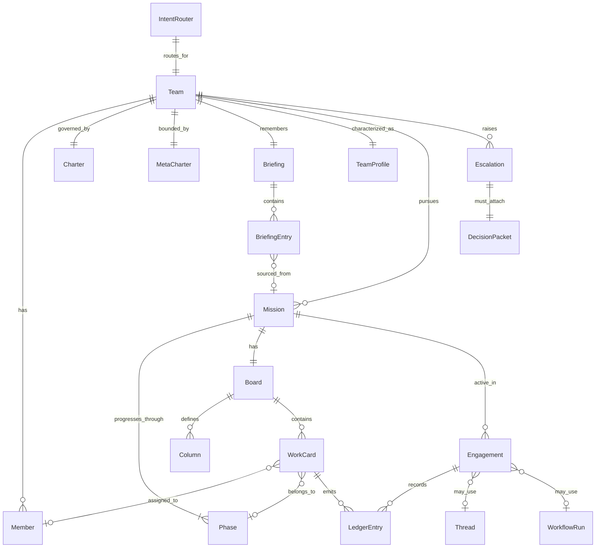
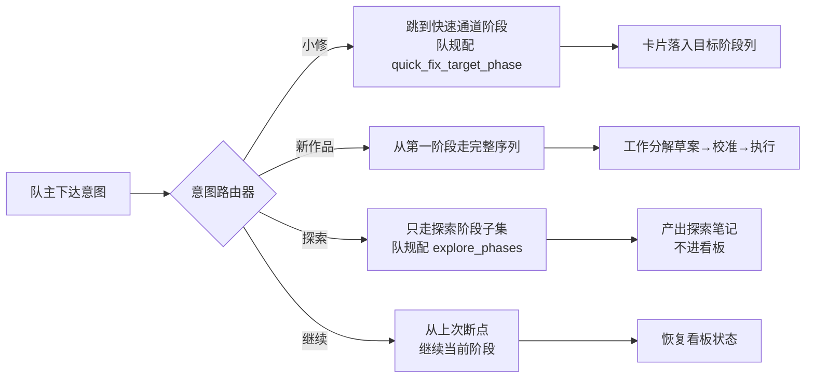
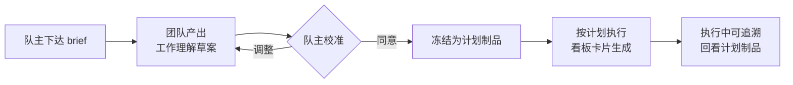
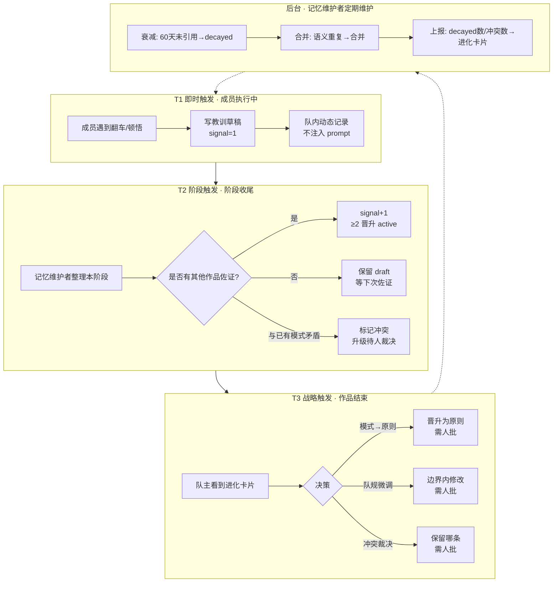

# myteams 方案 v2.2

> 版本：v2.2
> 日期：2026-07-06
> 状态：设计定稿，待架构评审
> 作者：产品经理 许清楚
> 基于：v1.2 方案 + 4 份探索报告（可理解性诊断 / 进化与看板 / 文档洞察 / 外部调研）+ 主理人综合判断
> 前序文档：`docs/myteams-方案.md`（v1.2）
>
> **v2.1 变更**：阶段模型从固定三阶段（brainstorm/scheme/delivery）改为队完全自定义阶段序列，平台不预设任何阶段名/数/语义（队主反馈）。其余设计保留 v2.0 不变。
>
> **v2.2 变更**：深化 A2A、MCP、Skills 三层设计——新增 §9.9（A2A/MCP/Skills 三层设计），将原 §9.8（A2A+MCP 双栈实现）合并为 §9.9 的引用入口。核心交付：平台级 MCP 工具清单（9 个工具）、Skills 三层体系（平台级/模板级/队级）与 Briefing 职责边界、A2A 三阶段演进路径（Phase 1 语义对标 → Phase 2 平台代理 → Phase 3 跨队协作）、三层成对设计示例。同步更新 §4 specialties 定位、§9.2 平台核心职责、§9.3 新增模块、§9.7 项目结构、§10 实施路线、§12 变更对照表。

---

## 目录

1. [愿景与核心主张](#1-愿景与核心主张)
2. [概念体系：5 个核心 + 3 个偶尔 + 内部隐藏](#2-概念体系5-个核心--3-个偶尔--内部隐藏)
3. [架构：保留 v1.2 骨架 + 补强](#3-架构保留-v12-骨架--补强)
4. [三套官方模板（模板 + 微调）](#4-三套官方模板模板--微调)
5. [工作流：意图路由 + 自定义阶段 + 工作分解可见](#5-工作流意图路由--自定义阶段--工作分解可见)
6. [看板设计（重构）](#6-看板设计重构)
7. [记忆与进化（补强为"可看见的养成"）](#7-记忆与进化补强为可看见的养成)
8. [人的角色与工作台](#8-人的角色与工作台)
9. [架构与技术栈](#9-架构与技术栈)
   - [9.9 A2A / MCP / Skills 三层设计（v2.2 新增）](#99-aaa--mcp--skills-三层设计)
10. [实施路线（调整）](#10-实施路线调整)
11. [风险与缓解（更新）](#11-风险与缓解更新)
12. [v1.2 → v2.2 变更对照表](#12-v12--v22-变更对照表)

---

## 1. 愿景与核心主张

### 1.1 一句话定位

**myteams = 养多支专业 Agent 团队的平台——短剧、小说、应用开发各干各的领域；每支队有自己的干活方式；队长期存在，会自己进化。**

> 保留 v1.2 §1.1 一句话，不变。

### 1.2 v1.2 → v2.0 的三大改变

v1.2 的架构骨架（Team 一等对象、两层结构、Briefing 进化、Harness 中立、双模式协作）是对的，保留。v2.0 在三个层面做改变：

| 改变层面 | v1.2 现状 | v2.0 改变 | 参考来源 |
|----------|-----------|-----------|----------|
| **体验层重构** | 20 个概念、6 层抽象链路、洋化命名、从零自定义、无总览首页 | 5 核心概念 + 中文化 + 模板微调 + 团队总览首页 + 阶段降级为进度条 | 探索报告 03 全文 |
| **机制层补强** | 进化缺信号筛选/条件注入/衰减；看板缺跨团队总览/新字段/健康度；协作缺意图路由/Decision Packet/工作分解可见；治理缺执行校验；成本完全缺失 | T1/T2/T3 三档触发 + 信号阈值晋升 + 条件注入 + Curator 衰减 + 跨团队活态摘要卡 + 卡片补三字段 + 健康度算法 + 意图路由 + Decision Packet + 工作分解可见 + 双层校验 + 成本可见 | 探索报告 04 进化与看板 + 探索报告 01 文档洞察 + 探索报告 02 外部调研 |
| **差异化发挥** | 团队当配置；工作分解黑盒；决策只记结论；跨团队视图推迟 Phase 3 | 团队作为可养成角色（角色卡）+ 工作分解可见可干预 + 决策叙事（Decision Packet + 决策故事）+ 跨团队农场视图提前到 Phase 1 | 探索报告 01 §4 差异化机会 |

### 1.3 是什么 / 不是什么

| 是 | 不是 |
|----|------|
| 多支**领域专业化**、**长期存在**、**可养成**的团队 | 一套流程打天下 |
| 每支队**自定义**阶段序列（模板预置建议起点 + 可任意调整） | 从零自定义配置的工程平台 |
| **一眼看见**所有团队的农场视图 | 缩微看板并排 |
| **可见的**队内协作现场（看板 + 队内动态下钻） | 黑盒后台跑 Agent |
| **可看见的养成**（团队角色卡 + 成长日志 + 能力雷达） | 静态配置、每次从零 |
| **工作分解可见可干预**（brief → 理解草案 → 校准 → 执行） | 需求进黑盒、成品出黑盒 |
| **Harness 中立**的执行接入（A2A + MCP 双栈） | Pi 的附属 MCP / 插件 |

> 保留 v1.2 §1.3 的"是什么/不是什么"框架，补强三行（可养成、工作分解可见、农场视图）。

---

## 2. 概念体系：5 个核心 + 3 个偶尔 + 内部隐藏

> 设计依据：探索报告 03 §3「最小可理解概念集」——用户日常只需 5 个核心概念，偶尔碰 3 个，其余全部隐藏。

### 2.1 日常核心 5 件套

用户打开工作台，脑子里只有这 5 个概念就能驾驭全部日常操作：

| # | 概念 | 用户脑中的理解 | 一句话说清 |
|---|------|----------------|------------|
| 1 | **团队** | 「我养了几支专业队伍，比如短剧队、小说队、开发队」 | 团队是我养的专业队伍，长期存在，越养越聪明 |
| 2 | **作品**（创作类）/ **项目**（开发类） | 「这支队现在在做哪件活，比如第 1 季短剧、待办应用 MVP」 | 作品是这支队正在做的一件活，有始有终 |
| 3 | **看板** | 「这件活的进展，分成几张卡，谁在干、卡在哪、还要多久」 | 看板让我一眼看见活的进展和卡点 |
| 4 | **团队笔记本** | 「这支队记住了什么经验，会越来越聪明」 | 团队做完一件活会自动记笔记，下次带着经验开工 |
| 5 | **待你拍板** | 「有哪些事团队拿不准，在等我决定」 | 团队遇到拿不准的事会等我拍板，不会擅自行动 |

### 2.2 偶尔碰到的 3 件套

| # | 概念 | 用户脑中的理解 | 何时碰到 |
|---|------|----------------|----------|
| 6 | **队规** | 「这支队哪些事能自己定、哪些事必须问我」 | 建队时看一眼，之后偶尔调整 |
| 7 | **队内动态** | 「团队内部说了什么、做了什么」 | 想追溯细节时点开看 |
| 8 | **阶段** | 「这件活分成了几段做，现在在第几段」 | 看看板上方的阶段进度条 |

> v2.1 更新：阶段不再固定为"头脑风暴/定方案/实施"三段。这支队把一件活分成几段做、每段叫什么、做什么，由队规/模板规定——可能 3 段、5 段、7 段，平台不预设。

### 2.3 完全隐藏的内部概念

以下概念用户**永远不需要看到**，作为内部实现存在，架构师需要理解：

| 内部概念 | 对用户隐藏后的形态 | 保留理由 |
|----------|---------------------|----------|
| Engagement（活跃工作） | 用户只看到"团队在干活" | 内部执行调度单元，Phase×Member 的执行实例 |
| Closeout（收尾） | 合并进"团队自动记笔记" | 阶段/作品收尾触发笔记更新的内部环节 |
| Thread / WorkflowRun | 模板预置，用户不选 | 双模式协作的内部实现 |
| EngineAdapter / Harness | 用户最多知道"可换 AI 引擎" | 执行层抽象，对接多种 AI 底座 |
| Custody（球权） | 合并进卡片的 assignee | 运行时责任方的内部语义 |
| Autonomy L0–L3 | 只暴露"待你拍板"队列 | 自治等级的内部实现 |
| IntentRouter（意图路由） | 用户只看到"我说改台词，团队直接改了" | 平台层路由，决定走轻流程还是重流程 |
| TeamProfile（角色卡合成器） | 用户看到"团队角色卡" | 从 Briefing + 历史 Mission 自动合成画像 |
| HealthCalculator | 用户看到绿/黄/红健康徽章 | 平台统一健康度算法 |
| CostAggregator | 用户看到"本月花费 ¥XX" | Token/成本聚合 |

### 2.4 命名对照表（全中文化）

> 设计依据：探索报告 03 §4「命名优化建议」+ 主理人命名规范。

| 原英文（v1.2） | 中文名（v2.0） | 用户理解 |
|----------------|----------------|----------|
| Team | **团队** | 我养了几支专业队伍 |
| Member | **成员** / **队员** | 队里的人 |
| Mission | **作品**（创作类）/ **项目**（开发类） | 这支队在做哪件活 |
| Briefing | **团队笔记本** | 这支队记住了什么经验，会越来越聪明 |
| Charter | **队规** | 哪些事能自己定、哪些必须问我 |
| Ledger | **队内动态** | 团队内部说了什么、做了什么 |
| Escalation | **待你拍板** | 有哪些事在等我决定 |
| Hub | **工作台** | 我看现场的地方 |
| Board / WorkCard | **看板** / **卡片** | 这件活的进展 |
| Phase | **阶段** | 这件活分几段做，现在在第几段（队自定义，平台不预设） |
| 委托人 | **队主** | 我就是这些团队的主人 |
| Engagement | （隐藏） | 内部执行调度单元 |
| Closeout | （隐藏） | 合并进笔记本更新 |
| Thread / WorkflowRun | （隐藏） | 模板预置的工作方式 |
| EngineAdapter / Harness | （隐藏） | 执行层 |
| Custody | （隐藏） | 合并进卡片 assignee |
| Autonomy L0–L3 | （隐藏） | 只暴露"待你拍板" |

---

## 3. 架构：保留 v1.2 骨架 + 补强

### 3.1 两层结构（保留 v1.2 §3.1，对用户隐藏）

> 保留 v1.2 §3.1 两层结构，仅在架构师视角呈现，用户文档不提。

```text
myteams（平台层）
  ├── 编队：创建 / 管理多支团队
  ├── 现场：工作台展示总览、看板、队内动态、待你拍板
  ├── 看板：作品级卡片 + 队自定义列 + 成员 assign
  ├── 记忆：团队笔记本存储与条件注入
  ├── 路由：意图路由（小修 / 新作品 / 探索 / 继续）
  ├── 接入：引擎适配层连接多 AI 底座
  ├── 健康度：平台统一算法
  ├── 成本：Token / 费用聚合
  └── 通信：A2A + MCP 双栈标准

  └── 团队 × N（长期存在）
        ├── 领域与身份（短剧 / 小说 / 应用开发 …）
        ├── 成员（持久角色，Agent + 可选人）
        ├── 队规（自治边界、升级规则）+ 元队规（平台层不可改）
        ├── 工作方式（本队自定义阶段序列、产物、门禁）
        ├── 作品 / 项目（当前推进的活）
        │     └── 看板（本作品的工作看板）
        ├── 团队笔记本（原则 / 模式 / 教训，带激活条件）
        └── 团队角色卡（从笔记本 + 历史作品自动合成）
```

**分工原则**（保留 v1.2）：平台回答「怎么养多支队」；团队回答「这支队怎么干」。

### 3.2 四层技术分工（保留 v1.2 §9.1，补强协调层）

```text
L5  协调层        意图路由 / 协作模式调度 / 跨队协作         ← 新增（借鉴探索报告 02 §4.3「协调作为架构层」）
L4  工作台        队主看现场、做拍板决策
L3  平台核心      团队生命周期、编排、笔记本、工作区隔离、健康度、成本
L2  引擎适配      统一调度接口，对接多 AI 底座（能力矩阵声明）
L1  执行底座      Pi / Codex / Claude / acpx …（外部，非产品中心）
```

> 保留 v1.2 §9.1 四层分工，新增 L5 协调层。
> 借鉴自：探索报告 02 §4.3「协调作为架构层」——多 Agent 系统生产失败率 41%-87% 源于协调缺陷，协调应独立于 Agent 逻辑和 Agent 能力。

### 3.3 领域对象关系（保留 v1.2 对象 + 补强）

> 保留 v1.2 §3.2 的 ER 关系骨架，补强：Briefing 加激活条件字段、WorkCard 加 eta/last_touched/next_action、新增 TeamProfile 角色卡、新增 IntentRouter。
> v2.1：图中 Phase 与 Mission 的关系保留，但 Phase 不再是平台固定三段，而是**队自定义阶段实例**——每队定义自己的 phases 数组，Phase 实例引用该队阶段定义中的 id。



**新增对象说明**：

| 新增对象 | 定义 | 借鉴来源 |
|----------|------|----------|
| **MetaCharter**（元队规） | 平台层不可改规则 + 队可改边界声明 | 探索报告 04 §1.2.3 Clowder guardrails/ 分层 |
| **TeamProfile**（团队角色卡） | 从笔记本 + 历史作品自动合成的用户可读画像 | 探索报告 01 §4.1「团队作为可养成角色」 |
| **IntentRouter**（意图路由器） | 平台层路由，小修/新作品/探索/继续四档 | 探索报告 01 §4.5 + CCG Strategy Router |
| **BriefingEntry**（笔记本条目） | 每条带激活条件的结构化记忆条目 | 探索报告 04 §1.1.3 Clowder SystemPromptBuilder |
| **DecisionPacket**（决策包） | L3 升级强制附选项+后果+建议+参考笔记本 | 探索报告 01 §4.3 + Clowder handoff Decision Packet |

### 3.4 补强的对象字段

#### BriefingEntry（团队笔记本条目，补强自探索报告 04 §1.4.1）

```typescript
interface BriefingEntry {
  id: string;                    // P-007 / SC-012 / PR-003
  bucket: 'principles' | 'patterns' | 'scars';
  text: string;                  // 条目正文
  phase: string[];              // 在哪些阶段注入（激活条件）；值为该队自定义阶段 id，非平台固定枚举
  triggers: string[];            // 检索关键词（激活条件）
  signal: number;                // 信号强度 1-5（≥2 才晋升 active）
  hit_count: number;             // 被引用次数
  status: 'draft' | 'active' | 'decayed' | 'archived';
  source_missions: string[];     // 来源作品
  source_ledger_seq?: number[];  // 源队内动态条目序号（证据链）
  created_at: string;
  last_used: string;
  conflicts_with?: string[];     // 与哪些条目冲突（需人裁决）
}
```

> v1.2 的 Briefing 只有 principles.md / patterns.md / scars.md 三个文件，无结构化字段。
> 补强自：探索报告 04 §1.1.3「每条 Briefing 必须带激活条件字段，否则无法条件注入」。

#### WorkCard（卡片，补强自探索报告 04 §2.5.2）

```typescript
interface WorkCard {
  // 基础（保留 v1.2）
  id: string;
  title: string;
  description?: string;
  column_id: string;

  // 人（保留 v1.2，Custody 合并进 assignee）
  assignee?: string;
  assigned_at?: string;

  // 阶段（v2.1：队自定义阶段 id，非平台固定枚举）
  phase?: string;

  // 状态（保留 v1.2 + 补强）
  status: 'open' | 'active' | 'blocked' | 'in_review' | 'done';
  blocker?: {
    reason: string;
    raised_by: string;
    raised_at: string;
    suggested_fix?: string;
  };

  // 时间（新增——回答"还要多久/上次什么时候动的/下一步谁动"）
  created_at: string;
  last_touched: string;           // 最后一次状态变更或队内动态写入
  eta?: string;                   // 预计完成（Agent 估或人填）
  next_action?: {
    who: string;                  // 该谁动（成员 id 或 'human'）
    what: string;                 // 动什么
  };

  // 产物（保留 v1.2）
  artifacts: string[];

  // 链接（保留 v1.2 + 补强双向链接）
  links: {
    thread_id?: string;           // Thread 模式：关联讨论
    workflow_run_id?: string;     // Workflow 模式：关联运行
    workflow_step_id?: string;    // 对应的 step
    ledger_seqs: number[];        // 相关队内动态条目
  };
}
```

> v1.2 的 WorkCard 缺 eta / last_touched / next_action 三字段。
> 补强自：探索报告 04 §2.1「委托人最常问的 10 个问题」——Q4(还要多久)/Q6(上次进展)/Q7(下一步谁动) 三个问题 v1.2 无法回答。

**字段更新机制**（v1.2 只定义了字段，未定义谁填、何时更新）：

| 字段 | 谁填 | 何时更新 | 准确性保障 |
|------|------|----------|------------|
| `last_touched` | **平台自动** | 每次 `card_move`（列流转）或 `ledger_append`（队内动态写入）事件触发时自动更新 | 平台事件驱动，无需人工或 LLM 介入，保证准确 |
| `eta` | **assignee 填写**（可选） | 卡片创建或 assign 时填写；assignee 可随时修正 | 平台在 `last_touched` 超过 `eta` 时自动标黄提醒（陈旧度可视化）；eta 不作为硬约束，只作参考 |
| `next_action` | **平台规则推断**（不额外调用 LLM） | 每次 `last_touched` 更新时同步重算 | 基于 `status` + `column_id` + `assignee` 自动生成，规则如下 |

`next_action` 推断规则（平台规则引擎，零 LLM 调用）：

| status | column_id | 推断结果 |
|--------|-----------|----------|
| `blocked` | 任意 | `{who: 'human', what: blocker.reason}` — 阻塞时该队主介入 |
| `active` | "进行中" | `{who: assignee, what: "执行中"}` — 该成员正在干 |
| `open` | "待办" | `{who: null, what: "待分配"}` — 还没人认领 |
| `in_review` | "待审" | `{who: 'human', what: "待审"}` — 该队主审查 |
| `done` | "完成" | `{who: null, what: "已完成"}` — 无需动作 |

### 3.5 A2A + MCP 双栈通信标准

> 借鉴自：探索报告 02 §1.2.6 + 启示 10「A2A + MCP 作为标准化通信底座」。

myteams 不自建通信协议，直接采用 2026 年事实标准：

| 标准 | 职责 | 在 myteams 中的应用 |
|------|------|---------------------|
| **MCP**（Anthropic → Linux Foundation） | Agent ↔ 工具/数据 | 团队成员调用外部工具（文件读写、API 调用、代码执行等）的标准接口 |
| **A2A**（Google → Linux Foundation） | Agent ↔ Agent | 团队成员间通信、跨团队协作的发现与任务传递 |

**Agent Card**：每个团队成员/团队发布 JSON 名片（`/.well-known/agent.json`），包含 name / description / url / skills / capabilities / authentication，其他成员可发现并协作。

**任务状态机**（A2A 标准）：`submitted → working → input-required → completed / failed / canceled`

**关键收益**：
- 跨团队协作无需自研协议
- 未来接入第三方 Agent 零成本
- 与生态兼容（78% 企业已采用 MCP）

> v1.2 自建 Thread / WorkflowRun 协作模式，v2.0 保留双模式作为协作语义，底层通信改为 A2A + MCP 双栈。
>
> **落地节奏**：Phase 1 为目标声明，内部通信走平台调度（平台核心直接调用 Pi RPC），A2A + MCP 双栈在 Phase 2 接入第二引擎时正式落地。原因：Phase 1 只接 Pi（无原生 MCP、无 app-server），A2A 要求 HTTP 端点而 Pi RPC 是 JSONL 管道，双栈在 Phase 1 无法落地。

---

## 4. 三套官方模板（模板 + 微调）

> 设计依据：探索报告 03 §7「自定义工作方式简化建议」——用户面对"从零搭系统"的负担，应提供模板+微调替代从零自定义。

### 4.1 建队流程

```text
队主打开工作台 → 点「建队」
  → 选模板（三选一，默认展开）
    🎬 短剧创作队  —— 选题/编剧/导演/剪辑，看板列已配好
    📖 小说创作队  —— 主笔/世界观/连贯审/文风审，看板列已配好
    💻 应用开发队  —— 架构/构建/审查，看板列已配好
    ⚙️ 自定义      —— 高级用户从零配（默认折叠）
  → 微调四件事
    1. 成员：加人/减人/改角色人格
    2. 看板列：加列/改列名/删列
    3. 阶段序列：加阶段/改阶段名/改顺序/删阶段（模板预置建议起点，队可任意调整）
    4. 必问清单：哪些事必须队主批
  → 一键建队
```

**用户可微调四件事**，其余（协作模式、阶段门禁、阶段产物清单）由模板预置，对用户隐藏。阶段序列虽可调，但模板已预置领域建议起点，多数队无需改动。

**自定义入口默认折叠**，99% 用户用模板 + 微调，1% 高级用户展开自定义。

> 借鉴自：探索报告 03 §7.2.1-7.2.4。

### 4.2 短剧创作队模板

> 保留 v1.2 §5.1 三支队工作方式的骨架，用中文重述，补全模板字段。

```yaml
# templates/short-drama-team.yaml
id: short-drama
name: 短剧创作队
domain: drama
icon: 🎬

members:
  - id: producer
    role: 总策划
    handle: "@总策划"
    kind: agent
    autonomy: L2
  - id: screenwriter
    role: 编剧
    handle: "@编剧"
    kind: agent
    autonomy: L2
  - id: director
    role: 导演
    handle: "@导演"
    kind: agent
    autonomy: L2
  - id: editor
    role: 剪辑
    handle: "@剪辑"
    kind: agent
    autonomy: L1

# 阶段为建议起点，队可任意增删改阶段、改顺序
phases:
  - id: topic
    label: 选题
  - id: script
    label: 剧本
  - id: shooting
    label: 拍摄
  - id: post
    label: 后期
  - id: release
    label: 发布

board:
  columns: [选题池, 大纲定稿, 拍摄制作, 待审, 完成]
  card_unit: 集/场

charter:
  auto_approve: [新增笔记本条目, 看板列微调]
  must_ask_human: [发布成品, 队规变更, 新一季方向]

collaboration_mode: thread   # 内部：Thread 模式，用户不选

# 借鉴 Toonflow：角色一致性 Agent + 章节事件图谱
# v2.2：specialties 字段引用模板级 Skills（见 §9.9.2），每个 specialty 对应一个 SKILL.md
specialties:
  - skill: character_consistency       # 模板级 Skill：角色一致性检查
    path: skills/character-consistency/SKILL.md
  - skill: event_graph                 # 模板级 Skill：章节事件图谱驱动改编
    path: skills/event-graph/SKILL.md
```

> 借鉴自：v1.2 §5.1 + 探索报告 02 §1.2.2 Toonflow 三层 Agent 协作 + 角色一致性 Agent + 章节事件图谱。

| 阶段 | 这支队怎么做 | 典型产物 | 协作 |
|------|--------------|----------|------|
| 选题 | 选题、人设、冲突、分集钩子；编剧与总策划对等碰撞 | 选题池、人物小传、分集钩子 | Thread |
| 剧本 | 选定本集/本季方向；导演卡节奏；分场大纲与剧本定稿 | 分集大纲、场景表、剧本定稿 | Thread + 队主批方向 |
| 拍摄 | 分镜、选角、现场拍摄 | 分镜脚本、拍摄素材 | Thread |
| 后期 | 剪辑节奏、配乐、特效 | 成片初剪、配乐定稿 | Thread；按队规谁审谁做 |
| 发布 | 终审、平台投放、数据回收 | 成片终版、发布报告 | Thread + 队主批发布 |

### 4.3 小说创作队模板

```yaml
# templates/novel-team.yaml
id: novel
name: 小说创作队
domain: novel
icon: 📖

members:
  - id: lead-writer
    role: 主笔
    handle: "@主笔"
    kind: agent
    autonomy: L2
  - id: worldbuilder
    role: 世界观架构
    handle: "@世界观"
    kind: agent
    autonomy: L2
  - id: continuity-editor
    role: 连贯性编辑
    handle: "@连贯审"
    kind: agent
    autonomy: L2
  - id: style-editor
    role: 文风编辑
    handle: "@文风审"
    kind: agent
    autonomy: L2

# 阶段为建议起点，队可任意增删改阶段、改顺序
phases:
  - id: concept
    label: 构思
  - id: outline
    label: 大纲
  - id: writing
    label: 写作
  - id: revision
    label: 修订
  - id: finalize
    label: 定稿

board:
  columns: [构思, 大纲, 写作中, 连贯审, 文风审, 定稿]
  card_unit: 卷/章

charter:
  auto_approve: [新增笔记本条目, 看板列微调]
  must_ask_human: [发布成品, 队规变更, 主线方向变更]

collaboration_mode: thread
```

| 阶段 | 这支队怎么做 | 典型产物 | 协作 |
|------|--------------|----------|------|
| 构思 | 世界观、主线、人物弧；发散与收敛交替 | 设定笔记、情节备选、人物关系 | Thread |
| 大纲 | 卷章结构、POV、伏笔表；文风与禁忌 | 章节大纲、写作规范 | Thread + 队主批主线 |
| 写作 | 分章写作，按大纲推进 | 章节初稿 | Thread |
| 修订 | 连贯性互审 → 文风修订 | 修订记录 | Thread |
| 定稿 | 终审定稿、排版 | 定稿成书 | Thread + 队主批发布 |

### 4.4 应用开发队模板

```yaml
# templates/app-dev-team.yaml
id: app-dev
name: 应用开发队
domain: software
icon: 💻

members:
  - id: tech-lead
    role: 技术负责人
    handle: "@技术负责人"
    kind: agent
    autonomy: L2
  - id: architect
    role: 架构师
    handle: "@架构师"
    kind: agent
    autonomy: L2
  - id: builder
    role: 构建者
    handle: "@构建者"
    kind: agent
    autonomy: L1
  - id: reviewer
    role: 审查者
    handle: "@审查者"
    kind: agent
    autonomy: L2

# 阶段为建议起点，队可任意增删改阶段、改顺序
phases:
  - id: requirement
    label: 需求
  - id: design
    label: 设计
  - id: implementation
    label: 实现
  - id: test
    label: 测试
  - id: deploy
    label: 部署

board:
  phase_templates:               # 自适应列模板（借鉴探索报告 04 §2.4.3）
    requirement:
      columns: [需求池, 待讨论, 已确认]
    design:
      columns: [方案草稿, 评审中, 已定案]
    implementation:
      columns: [待办, 进行中, 待审]
    test:
      columns: [待测, 测试中, 已通过]
    deploy:
      columns: [待部署, 部署中, 已上线]
  card_unit: 功能/任务

charter:
  auto_approve: [新增笔记本条目, 看板列微调, L1 代码修改]
  must_ask_human: [生产部署, 队规变更, 架构方向变更]

collaboration_mode: hybrid       # 内部：需求/设计用 Thread，实现/测试/部署用 Workflow
```

> 借鉴自：v1.2 §5.3 + 探索报告 04 §2.4.3「自适应列模板（按 phase 切换看板列）」。

| 阶段 | 这支队怎么做 | 典型产物 | 协作 |
|------|--------------|----------|------|
| 需求 | 需求澄清、方案备选、风险与边界 | 需求摘要、方案对比 | Thread |
| 设计 | 架构/接口/里程碑；评审门禁 | 设计说明、验收标准 | Thread + 队主批后进入实现 |
| 实现 | 编码 → 交叉 Review | PR、代码 | WorkflowRun |
| 测试 | 单元/集成/验收测试 | 测试报告、缺陷修复 | WorkflowRun |
| 部署 | 集成验证 → 生产部署 | 可运行交付、部署记录 | WorkflowRun + 队主批部署 |

### 4.5 模板可演进

> 借鉴自：探索报告 03 §7.3「模板本身也会随平台进化」。

当平台发现「很多短剧队都自己加了一列『素材准备』」，可以把这一列纳入官方模板。模板不僵化，会随使用数据迭代。

> **阶段同样可演进**：各模板预置的阶段序列是建议起点，队可任意增删改阶段、改顺序。平台发现「很多开发队都在需求阶段前加了『调研』阶段」时，可将该阶段纳入官方模板建议起点。

---

## 5. 工作流：意图路由 + 自定义阶段 + 工作分解可见

### 5.1 意图路由（新增，平台层）

> 借鉴自：探索报告 01 §4.5「意图路由」+ CCG Strategy Router + Archon 条件节点。
> 解决 v1.2 盲点：所有任务都走完整阶段序列，改一句台词不该走全流程。
> v2.1 改变：路由目标不再基于固定三阶段假设，改由队规配置——每队定义自己的"快速通道阶段"和"探索阶段子集"。

队主下达意图后，平台**先路由**，决定走轻流程还是重流程：



**四档路由规则**：

| 意图 | 路由到 | 典型场景 | 示例 |
|------|--------|----------|------|
| **小修** | 跳到队规指定的"快速通道阶段"（`quick_fix_target_phase`，默认最后阶段） | 改一句台词、修一个 bug、调整一段文风 | 「第 3 集第 5 场加个反转」→ 短剧队跳到"后期"阶段 |
| **新作品** | 从第一阶段走完整序列 | 新一季、新小说、新应用 | 「做第 2 季短剧」→ 选题→剧本→拍摄→后期→发布 |
| **探索** | 只走队规指定的"探索阶段子集"（`explore_phases`，默认前 1-2 阶段） | 试方向、做调研、不急着交付 | 「试试悬疑风格能不能行」→ 只走选题+剧本 |
| **继续** | 从上次断点阶段继续 | 接着上次干的 | 「继续做第 1 季第 3 集」→ 恢复看板状态 |

> 四档路由的语义保留（小修/新作品/探索/继续），但"跳到哪"由队规定，不由平台假设。

**路由规则写队规，可微调**：

```yaml
# 队规中的意图路由配置（以短剧队为例）
intent_router:
  quick_fix_target_phase: post      # 小修跳到"后期"阶段
  explore_phases: [topic, script]   # 探索只走"选题"+"剧本"
  rules:
    - pattern: "改.*台词|修.*bug|调整.*文风"
      route: quick_fix
    - pattern: "新.*季|新.*本|新.*应用"
      route: full_flow
    - pattern: "试试|探索|调研"
      route: explore_only
    - pattern: "继续|接着"
      route: resume
  # 队可自定义路由规则和目标阶段
```

### 5.2 阶段（队自定义，平台只提供有序容器）

> v2.1 改变：阶段从"平台固定三阶段（头脑风暴/定方案/实施）"改为"队完全自定义有序阶段序列"。
> 平台只提供"阶段"抽象容器——有序工作段落，有进度条、有门禁接口——不规定阶段名、阶段数、阶段语义。

**核心原则**：
- 平台只提供"阶段是有顺序的工作段落"这一抽象
- 阶段名、阶段数、阶段语义由队规/模板定，平台不预设
- 阶段数不固定（可能 3 段、5 段、7 段），各队各异
- 模板预置建议起点（如短剧队 5 阶段、开发队 5 阶段），队可任意增删改阶段、改顺序

共性只在"阶段是有顺序的工作段落"这一抽象层面，不在具体阶段名/数/语义。三支队的阶段诠释已在 §4 模板中给出。

### 5.3 工作分解可见可干预（新增）

> 借鉴自：探索报告 01 §4.2「工作分解可见可干预」+ OMA planOnly→冻结→runFromPlan + OpenWiki impact plan。
> 解决 v1.2 盲点（探索报告 01 §3.3）：brief→卡片过程是黑盒，用户看不见团队怎么理解需求。



**四步流程**：

| 步骤 | 发生什么 | 用户看到什么 |
|------|----------|-------------|
| 1. brief | 队主下达意图 | 「做一个本地优先的待办应用」 |
| 2. 工作理解草案 | 团队产出分解计划 | 「我们理解你要的是 X，打算分这几个部分做，每部分验收标准是 Y」——可调 |
| 3. 队主校准 | 队主确认或调整 | 「第 3 部分改一下验收标准」→ 团队更新草案 |
| 4. 冻结执行 | 草案冻结为计划制品，生成看板卡片。冻结后，团队通过 `create_submember` MCP 工具创建子成员分配执行（§9.9.3） | 卡片出现在看板上，可回看计划制品 |

> 借鉴 OMA 的 `planOnly`（预览）→ `createPlanArtifact`（冻结）→ `runFromPlan`（回放）三段控制。
> 计划即数据，可检视、可修改、可回放，避免重复调用协调器。

**队主可在执行前校准团队的理解**，而非等交付才发现理解错了。这直接解决"我不知道他们会怎么做"的焦虑。

### 5.4 六种协作设计模式（作为模式语言）

> 借鉴自：探索报告 02 §1.2（刘道玉 2026-05「多 Agent 协作设计模式综述」）+ 启示 8。
> myteams 各团队"按自己方式协作"需要模式语言支撑，而非每种队硬编码一种模式。

| 模式 | 结构 | 适用场景 | myteams 哪队用 |
|------|------|----------|----------------|
| **管道式** | A→B→C→D 线性传递 | 内容创作流水线 | 短剧（选题→剧本→拍摄→后期）、小说（写作→连贯审→文风审） |
| **层级式** | PM 调度 + 多专家并行 | 需要分解+并行的开发 | 应用开发实现/测试阶段（技术负责人→构建者/审查者并行） |
| **辩论式** | 多 Agent 辩论收敛 | 方案评审、创意收敛 | 三支队的方案决策阶段（如短剧的剧本、小说的大纲、开发的设计） |
| **黑板式** | 共享状态，去中心化 | 跨团队协作 | 短剧队+小说队共享角色设定 |
| **共识式** | 提议→评审→投票 | 关键决策 | 队规变更、架构方向 |
| **演化式** | 元模式，包裹其他模式 | 长期团队自适应 | 所有队的元模式——随笔记本进化调整协作方式 |

**关键洞察**（保留探索报告 02 原文）：协调是架构层，不是实现细节。将协调显式化、可配置化，使协作效率可独立于 Agent 能力来优化。

### 5.5 Thread 与 WorkflowRun（保留 v1.2 §4，对用户隐藏）

> 保留 v1.2 §4 双模式协作骨架，对用户隐藏。用户不选模式，模板预置。

| 模式 | 适合 | 机制 | 借鉴 |
|------|------|------|------|
| **Thread**（轻） | 探索、创意碰撞、小修、对等讨论 | @mention 路由、队内动态对话、卡片为上下文锚点 | Clowder @路由、OpenCrew A2A |
| **WorkflowRun**（重） | 步骤清晰、需审批、可重试的交付 | 队级 YAML 步骤、逐步门禁、单步重试 | Archon node 定义、OpenTeams 计划图 |
| **Hybrid** | 应用开发队 | 需求/设计用 Thread；实现/测试/部署用 Workflow | OpenTeams hybrid 模板 |

> 保留 v1.2 §4.3 三支队默认策略：短剧/小说默认 Thread，应用开发默认 Hybrid。

---

## 6. 看板设计（重构）

> 设计依据：探索报告 04 第二部分「看板可见机制」+ 探索报告 03 §5「可见性设计建议」。
> v1.2 看板问题：缺跨团队总览、卡片缺三字段、缺健康度算法、三视图并列认知负担重。

### 6.1 三层视图（重构自 v1.2 §6.2 三视图）

> v1.2 三视图并列（看板/时间线/阶段），v2.0 重构为三层视图，按使用频率分层。

```text
L1 跨团队总览（工作台首页）
  └── 每支队一张活态摘要卡
  └── 顶部：待拍板总数、阻塞总数、今日 ETA 到期数

L2 单作品看板（点摘要卡进入，主视图）
  └── 顶部：阶段进度条 + 健康度徽章 + ETA
  └── 主体：看板列 + 卡片（含新字段）
  └── 侧栏（点卡片）：卡片详情 + 相关讨论 + 产物

L3 队内动态（点卡片侧栏「查看历史」下钻）
  └── 该卡片的队内动态条目流
  └── 或切到全局队内动态 tab
```

**关键改变**：
- **阶段从独立 tab 降级为看板顶部进度条**（借鉴探索报告 04 §2.2.1 + 探索报告 03 §5.3）
- **时间线从并列 tab 降级为卡片下钻视图**（借鉴探索报告 04 §2.2.2）
- **跨团队总览从 Phase 3 提前到 Phase 1**（借鉴探索报告 03 §5.2.1 + 探索报告 04 §2.3）
- 三视图变两层视图（看板 + 队内动态下钻），认知负担更低

### 6.2 跨团队总览：活态摘要卡（新增，首页）

> 借鉴自：探索报告 04 §2.3.2「活态摘要卡」+ Paseo Agent 摘要 + Clowder Mission Hub。

队主打开工作台，第一眼看到所有团队的摘要卡墙：

```text
┌─────────────────────────────────────────────────────────────┐
│  我的团队                                              [+建队] │
│  待拍板 2 · 阻塞 3 · 今日到期 1                               │
├──────────────────┬──────────────────┬────────────────────────┤
│ 🎬 短剧队         │ 📖 小说队         │ 💻 应用开发队           │
│ 第1季·第3集       │ 第2本·第8章       │ 待办应用 MVP            │
│ ●━◉━━○━○ 后期     │ ●━◉━━○━○ 写作     │ ◉━━○━○━○ 需求           │
│ 进度: 12/15 场   │ 进度: 8/20 章    │ 进度: 0/8 功能          │
│ 健康: 🟢 无阻塞   │ 健康: 🟢 无阻塞   │ 健康: 🟡 2张阻塞        │
│ 在干: @导演 剪辑  │ 在干: @主笔 写第9章│ 在干: @架构师 设计       │
│ 待拍板: 0         │ 待拍板: 0         │ 待拍板: 1 (方案审批)     │
│ ETA: 7/09         │ ETA: 7/20         │ ETA: 7/15              │
│ 上次活动: 2小时前  │ 上次活动: 10分钟前 │ 上次活动: 刚刚           │
│ [进入看板]        │ [进入看板]        │ [进入看板]              │
└──────────────────┴──────────────────┴────────────────────────┘
```

**每张摘要卡的字段**（探索报告 04 §2.3.2）：

```typescript
interface TeamSummaryCard {
  team_id: string;
  team_name: string;
  mission_id: string;
  mission_title: string;
  phase: string;                 // 当前阶段（队自定义阶段 id，非平台固定枚举）
  phase_label: string;           // 当前阶段显示名（如"后期""写作""需求"）
  progress: { done: number; total: number; unit: string }; // 12/15 场
  health: 'green' | 'yellow' | 'red';
  health_reason: string;         // "2张阻塞" / "无进展3天"
  active_members: string[];      // 当前在干的成员
  pending_escalations: number;   // 待拍板数
  eta: string;                   // 预计完成日
  last_activity: string;         // 最近一次活动（相对时间）
}
```

> **阶段进度条渲染**（v2.1）：读取该队 phases 数组，按顺序渲染 N 个圆点（N = 该队实际阶段数），当前阶段高亮为 ◉。不假设固定数量——短剧队 5 个圆点、开发队 5 个圆点、某自定义队 7 个圆点都能正确渲染。

### 6.3 健康度算法（平台统一，不让队自报）

> 借鉴自：探索报告 04 §2.5.4「健康度计算（平台统一，不让队自报）」。

```typescript
function calcHealth(mission: Mission): HealthStatus {
  const blocked = mission.cards.filter(c => c.status === 'blocked').length;
  const stalled = mission.cards.filter(c => isStalled(c)).length;  // last_touched > 3天
  const pending = mission.escalations.filter(e => !e.resolved).length;
  const hoursSince = hoursSince(mission.last_activity_at);

  if (blocked >= 3 || hoursSince > 72 || pending >= 3) return 'red';
  if (blocked > 0 || hoursSince > 24 || pending > 0) return 'yellow';
  return 'green';
}
```

| 健康 | 条件（任一满足即降级） |
|------|----------------------|
| 🟢 正常 | 无阻塞 且 最近活动 < 24h 且 待拍板 = 0 |
| 🟡 注意 | 有阻塞 < 3 张 或 最近活动 1-3 天 或 待拍板 1-2 |
| 🔴 需介入 | 阻塞 ≥ 3 张 或 最近活动 > 3 天 或 待拍板 ≥ 3 |

### 6.4 卡片字段补全 + 陈旧度可视化

> 借鉴自：探索报告 04 §2.5.2-2.5.3。

卡片补全 eta / last_touched / next_action 三字段（§3.4 已给出数据结构），并按 last_touched 显示陈旧度：

| last_touched | 视觉表现 |
|--------------|----------|
| < 6h | 正常 |
| 6-24h | 轻微灰边 |
| 1-3 天 | 黄色「陈旧」徽章 |
| > 3 天 | 红色「停滞」徽章 + 自动加入健康度计算 |

**这三字段直接回答队主最焦虑的问题**（探索报告 04 §2.1）：
- Q4「还要多久」→ eta
- Q6「上次什么时候动的」→ last_touched + 陈旧度
- Q7「下一步该谁动」→ next_action

### 6.5 看板与协作模式联动（保留 v1.2 §6.5 + 补强双向链接）

> 保留 v1.2 §6.5 看板与协作模式联动，补强双向链接数据结构（探索报告 04 §2.4）。

| 协作模式 | 看板角色 |
|----------|----------|
| **Thread** | 卡片是可 @ 的上下文锚点；讨论挂卡片，队内动态双向链接 |
| **WorkflowRun** | 步骤映射到卡片列移动；审批门禁 = 卡进入「待审」列 |
| **Hybrid**（应用开发） | 需求/设计少量卡；实现/测试卡暴增，Workflow 驱动列流转；**阶段切换时看板列自动切换**（自适应列模板） |

**自适应列模板**（借鉴探索报告 04 §2.4.3）：

```yaml
# 应用开发队看板配置（阶段 id 为队自定义，非平台固定）
phase_templates:
  requirement:
    columns: [需求池, 待讨论, 已确认]
  design:
    columns: [方案草稿, 评审中, 已定案]
  implementation:
    columns: [待办, 进行中, 待审]
  test:
    columns: [待测, 测试中, 已通过]
  deploy:
    columns: [待部署, 部署中, 已上线]
```

### 6.6 始终可见的「待你拍板」队列

> 借鉴自：探索报告 03 §5.2.3「待你拍板队列始终可见」。

不管在哪个视图，工作台顶部常驻一个**「待你拍板(N)」**入口，点开是跨所有团队的待决策列表。这是队主最重要的入口，不能埋在某个团队内部。

待拍板项必须附带 **Decision Packet**（§8.3），而非只问"批不批"。

### 6.7 卡片生命周期（保留 v1.2 §6.4）

> 保留 v1.2 §6.4 卡片生命周期，补强：每次状态变更更新 last_touched。

```text
创建（队主 / 成员 / 阶段产物拆分 / 工作流步骤 spawn）
  → 落入第一列或指定列
  → assign 成员（可选自动执行）
  → 列间移动（每次移动写队内动态 + 更新 last_touched）
  → blocked（成员报阻塞 → 看板标记 + 队内动态 + 通知队主）
  → done（触发笔记本更新片段或工作流下一步）
```

---

## 7. 记忆与进化（补强为"可看见的养成"）

> 设计依据：探索报告 04 第一部分「团队自主进化机制」+ 探索报告 01 §4.1「团队作为可养成角色」+ §3.4「进化对用户不可见」。
> v1.2 进化问题：缺信号筛选（每次都写→膨胀）、缺条件注入（全文塞 prompt）、缺衰减机制、进化过程对用户不可见。

### 7.1 进化循环：T1/T2/T3 三档触发

> 借鉴自：探索报告 04 §1.1.2「三档触发器」+ OpenCrew signal≥2 + Clowder retain_memory。
> v1.2 只有"Mission/Phase 结束→Closeout→Briefing 更新"单一触发器。



| 触发档 | 时机 | 写入目标 | 重量级 | 谁执行 |
|--------|------|----------|--------|--------|
| **T1 即时** | 成员执行中遇翻车/顿悟 | 教训草稿（signal=1，draft 状态） | 轻量，成员自助 | 成员自动 |
| **T2 阶段** | 阶段收尾时整理 | 模式/教训（signal≥2 晋升 active） | 中量，记忆维护者整理 | 记忆维护者角色 |
| **T3 战略** | 作品结束 + 队主验收 | 原则 / 队规微调提案 | 重量，需人批 | 队主决策 |

> **关键设计**：T1 是 v1.2 缺失的。成员在执行中就能"记一笔"，不用等到阶段结束。

### 7.2 信号阈值晋升 + 条目生命周期

> 借鉴自：探索报告 04 §1.2.2「Briefing 污染/膨胀的防护」+ OpenCrew signal≥2 + Agno Curator + Clowder hit_count 衰减。

```text
草稿区（signal=1，draft）
  │  T1 即时写入
  │  ↓ T2 收尾时被另一作品佐证 → signal+1
  ▼
正式区（signal≥2，active）
  │  注入 prompt、被检索
  │  ↓ hit_count 长期为 0（60天未引用）
  ▼
衰减区（decayed）
  │  不再注入，但可被检索
  │  ↓ 队主可删除
  ▼
归档区（archived，需人批，L3）
```

**Curator 机制**（记忆维护者角色，借鉴 OpenCrew KO + Agno LearningMachine.Curator）：
1. 合并语义重复的教训
2. 标记冲突的模式（如"快优先" vs "稳优先"）→ 升级待人裁决
3. 衰减长期未引用的条目（60天未引用 → decayed）

### 7.3 Briefing 条目数据结构

> 数据结构已在 §3.4 给出。每条必须带激活条件（phase / triggers），否则无法条件注入。

```yaml
# 团队笔记本条目示例
- id: P-007
  bucket: patterns
  text: "短剧第三集必须有反转钩子"
  phase: [script]               # 在短剧队"剧本"阶段注入（队自定义阶段 id）
  triggers: [反转, 钩子, 第三集]   # 检索关键词
  hit_count: 5                   # 被引用次数
  signal: 3                      # 信号强度（≥2 才晋升 active）
  source_missions: [drama-s1]    # 来源作品
  source_ledger_seq: [142, 156]  # 源队内动态条目（证据链）
  last_used: 2026-06-12
  status: active                 # draft | active | decayed | archived
```

### 7.4 回流注入三层模型

> 借鉴自：探索报告 04 §1.1.3「回流注入的精确性」+ Clowder SystemPromptBuilder 片段化 + Agno ContextProvider。
> v1.2 说"下次自动带上"但没说怎么带。直接全文塞 prompt 是反模式。

```text
注入层 1：常驻段（永远带，~200 token）
  └── 原则 Top-3 条（按 hit_count 排序）
  └── 例："角色一致性必须跨场景检查" / "反转钩子放第三集" / "伏笔提前2章埋"

注入层 2：按阶段条件注入（按该队当前阶段 id 匹配）
  └── 短剧队·剧本阶段（script）→ 注入"结构/节奏/反转钩子"相关模式
  └── 开发队·设计阶段（design）→ 注入"架构/接口/风险边界"相关模式
  └── 队自定义其他阶段 → 按队规匹配注入规则

注入层 3：按需检索（成员主动查）
  └── 成员遇相似场景 → 调用 briefing_search(query) 检索教训
  └── 例：写第5集时搜"节奏拖沓" → 返回第2本第5章的教训 + 源证据链
```

### 7.5 双层校验：元队规 + 队规

> 借鉴自：探索报告 04 §1.2.1-1.2.3「双层校验」+ Clowder guardrails/ vs defaults/ Pack 分层。
> v1.2 把 L0-L3 写在文档但没执行校验。如果队能改"什么是 L3"，就能把任何变更降级为 L2 自行通过。

```yaml
# ~/.myteams/meta-charters/<team-id>.yaml —— 平台控制目录，不在队工作区内，队无文件系统访问权
# 平台启动时和每次变更校验时读取此文件并校验 hash，不匹配则拒绝启动
immutable_rules:
  - id: IM-01
    rule: "发布成品必须经队主批准"
    scope: L3
    owner: platform
  - id: IM-02
    rule: "修改本元队规必须经队主批准"
    scope: L3
    owner: platform
  - id: IM-03
    rule: "笔记本条目总数不超过 200 条"
    scope: platform_policy
    owner: platform

boundary:
  team_can_modify:
    - 阶段产物清单（L2，需队内评审）
    - 成员人格（L2，需队内评审）
    - 看板列定义（L1，自助）
    - 笔记本模式/教训（L1，自助）
  team_cannot_modify:
    - 元队规本身（存储在平台控制目录 ~/.myteams/meta-charters/，队无访问权）
    - 原则（需 L3 人批）
    - 对外发布动作
```

```yaml
# teams/<id>/charter.md —— 队内可改，在 meta-charter 边界内
# 队规：哪些事能自己定、哪些必须问队主
auto_approve:
  - 新增笔记本模式/教训（L1）
  - 看板列微调（L1）
  - 成员人格微调（L2，需队内评审）
must_ask_human:
  - 发布成品（L3）
  - 队规变更（L3）
  - 架构/主线方向变更（L3）
```

**双层校验流程**：
1. 队发起变更 → 平台先从 `~/.myteams/meta-charters/<team-id>.yaml` 读取元队规并校验文件 hash（不匹配则拒绝执行，记录安全告警）
2. 校验通过后，查 meta-charter 的 immutable_rules（Layer A 硬校验）
3. 若在 team_can_modify 列表内 → 按队规自治等级处理
4. 若触碰 immutable_rules → 强制 L3 人批
5. 所有变更写队内动态，附 autonomy_level + approved_by

### 7.6 三层可见性：让队主看见"团队在变聪明"

> 借鉴自：探索报告 04 §1.3「进化的可理解性」+ Agno decision_log + Clowder search_evidence。
> v1.2 的 Briefing changelog 是内部文件，队主看不到团队"学到了什么"。

```text
L1 摘要层（工作台默认看到）
  └── 进化卡片：「本月新增 3 条模式、2 条教训；2 条教训晋升为模式」
  └── 能力雷达：5 维（领域知识 / 协作效率 / 产物质量 / 错误减少 / 自治程度）
  └── 团队角色卡（§7.7）

L2 追溯层（点开进化卡片）
  └── 笔记本变更日志：每条变更附 source_mission、signal、hit_count
  └── 可点击回到源作品的收尾记录

L3 证据层（队主主动查证）
  └── briefing_search(query) → 返回条目 + 源队内动态证据链
  └── 例：查"反转钩子" → P-007 + 来源 drama-s1 第3集翻车记录
```

**能力雷达 5 维**（借鉴 Agno decision_log + learned_knowledge）：

```text
应用开发队 · 能力雷达（对比上个作品）
  领域知识    ████████░░ +12%
  协作效率    ███████░░░ +8%
  产物质量    █████████░ +15%
  错误减少    ██████░░░░ 持平
  自治程度    ███████░░░ +5%
```

### 7.7 团队角色卡（差异化核心）

> 借鉴自：探索报告 01 §4.1「团队作为可养成角色」+ Clowder 品牌叙事 + OpenCrew SOUL.md + OpenWiki 自文档化。
> 这是 myteams 最大的差异化：所有参考项目都把团队当配置，没人当角色。用户能看懂角色，看不懂配置。

**从笔记本 + 历史作品自动合成用户可读的团队画像**：

```text
┌─────────────────────────────────────────────┐
│ 🎬 短剧创作队 · 角色卡                        │
├─────────────────────────────────────────────┤
│ 风格: 擅长甜宠反转、节奏明快                   │
│ 擅长: 第3集反转钩子、角色一致性维护             │
│ 成长轨迹:                                    │
│   第1季 → 学会了"伏笔提前2集埋"               │
│   第2季 → 学会了"配角不超过3个新角色/集"       │
│ 代表作品:                                    │
│   《甜心陷阱》第1季（12集，爆款）              │
│   《甜心陷阱》第2季（15集，口碑↑）             │
│ 踩过的坑:                                    │
│   第1季第5集节奏拖沓 → 已记入笔记本            │
│   第1季第8集角色变脸 → 已加一致性检查          │
│ 累计经验: 12条模式 · 5条教训 · 3条原则         │
│ [查看完整笔记本] [查看成长日志]                │
└─────────────────────────────────────────────┘
```

**角色卡合成规则**：
- **风格**：从笔记本 patterns 中提取高频关键词
- **擅长**：从 hit_count 最高的 patterns 中提取
- **成长轨迹**：从笔记本 changelog 按时间排序提取
- **代表作品**：从历史作品列表 + 完成质量排序
- **踩过的坑**：从 scars 中提取（signal≥2 的 active 条目）
- **累计经验**：统计 principles/patterns/scars 各桶数量

> 团队角色卡不是静态配置，是**自动合成、动态更新**的。每次作品结束，角色卡自动刷新。队主选团队时像"看简历"，而非看 YAML 配置。

### 7.8 队成长日志

> 借鉴自：探索报告 01 §3.4「进化对用户不可见」+ §4.1「队成长日志」。

每次作品结束，团队用一句话总结"学到了什么"，队主可看到成长轨迹：

```text
📚 短剧队 · 成长日志

[第2季·2026-06] 
  学到了：伏笔要提前2集埋，第5集节奏拖沓下次注意

[第1季·2026-03]
  学到了：POV-A 文风适合主线推进，人物出场不超过3个新角色/集
```

> 这直接命中"用户能看懂"的核心：用户能看懂"团队变聪明了"，而非看 Briefing 内部文件。

### 7.9 Mission 间连续性可见

> 借鉴自：探索报告 01 §3.10「Mission 之间的连续性对用户不可见」。

创建新作品时，显示"本队带入的笔记本摘要"——让队主知道团队这次会带着哪些经验开工：

```text
🎬 短剧队 · 新作品：第3季

本队带入 15 条经验：
  ✓ 反转钩子放第三集（被引用5次）
  ✓ 角色一致性跨场景检查（被引用8次）
  ✓ 伏笔提前2集埋（被引用3次）
  ...
[查看完整笔记本]
```

---

## 8. 人的角色与工作台

### 8.1 队主的 5 件事

> 保留 v1.2 §8.1 框架（v1.2 叫"委托人"，v2.0 改为"队主"）。

```text
1. 选模板建队（模板 + 微调，不从零配）
2. 下达意图（新作品/小修/探索/继续，意图路由自动分流）
3. 校准团队理解（工作分解草案→队主调→冻结执行）
4. 在待你拍板处做决策（Decision Packet 附选项+后果+建议）
5. 验收成品 + 看团队变聪明（角色卡更新 + 成长日志）
```

> v1.2 的"旁观协作（可选）"保留，但在 v2.0 中降级——队主日常看总览摘要卡即可，需要细节时下钻。

### 8.2 工作台导航

> 重构自 v1.2 §8.2。v1.2 是"选 Team → 看 Mission 看板"，v2.0 首页改为跨团队总览。

```text
工作台
  ├── 【团队总览】首页：所有团队的活态摘要卡（§6.2）
  │     └── 顶部：待拍板(N) · 阻塞(N) · 今日到期(N)
  │
  ├── 【单作品看板】点摘要卡进入（§6.1 L2）
  │     └── 顶部：阶段进度条 + 健康度徽章 + ETA
  │     └── 主体：看板列 + 卡片
  │     └── 侧栏（点卡片）：详情 + 相关讨论 + 产物
  │
  ├── 【队内动态】点卡片侧栏「查看历史」下钻（§6.1 L3）
  │     └── 该卡片的队内动态条目流
  │     └── 或切到全局队内动态 tab
  │
  ├── 【待你拍板】常驻顶部，跨所有团队（§6.6）
  │     └── 每项附 Decision Packet
  │
  ├── 【团队角色卡】点团队名进入（§7.7）
  │     └── 风格/擅长/成长轨迹/代表作品/踩过的坑
  │
  └── 【团队笔记本】角色卡内「查看完整笔记本」（§7.6 L2/L3）
        └── 变更日志 + 证据库检索
```

### 8.3 Decision Packet（决策包）

> 借鉴自：探索报告 01 §3.6「决策为什么缺失」+ §4.3「决策叙事」+ Clowder handoff Decision Packet。
> v1.2 的 L3 升级只问"批不批"，不给选项和后果。

L3 升级**强制附 Decision Packet**，而非只问"批不批"：

```text
┌─────────────────────────────────────────────┐
│ ⚠ 待你拍板 · 应用开发队 · 方案审批            │
├─────────────────────────────────────────────┤
│ 背景：待办应用 MVP 设计阶段，团队选了方案A  │
│                                             │
│ 选项：                                       │
│  A. 本地优先 + SQLite（团队建议）             │
│     后果：离线可用、数据自主；需自建同步       │
│     参考：笔记本 P-003"本地优先适合MVP"       │
│                                             │
│  B. 云端 + Postgres                          │
│     后果：多端同步容易；依赖云服务、有月费     │
│     参考：笔记本 SC-007"云依赖导致第2季延期"  │
│                                             │
│  C. 混合（本地优先 + 可选云同步）             │
│     后果：兼顾两者；开发量 +30%               │
│     参考：无直接经验                          │
│                                             │
│ 团队建议：选 A（符合 MVP 快速验证原则）       │
│                                             │
│ [选 A]  [选 B]  [选 C]  [驳回要求重新评估]    │
└─────────────────────────────────────────────┘
```

**Decision Packet 结构**：

```typescript
interface DecisionPacket {
  background: string;              // 为什么需要拍板
  options: {
    id: string;
    label: string;                 // 方案A/B/C
    consequences: string;          // 各自后果
    ref_briefing?: string[];       // 参考笔记本条目
  }[];
  team_recommendation: string;     // 团队建议
  team_reasoning: string;          // 建议理由
}
```

### 8.4 成本可见（新增）

> 借鉴自：探索报告 01 §3.7「成本与健康度不可见」+ Symphony token 聚合 + Clowder finance 包。
> v1.2 完全没提 token/费用，队主会问"这支队烧了多少钱"。

| 层级 | 展示内容 | 位置 |
|------|----------|------|
| 作品级 | 本作品 Token 消耗 + 费用估算 | 看板顶部 |
| 队级 | 本月成本 + 趋势 + 模型分布 | 团队角色卡底部 |
| 跨队级 | 所有队月度成本对比 | 工作台总览页 |

```text
┌─────────────────────────────────────────────┐
│ 💰 成本概览                                   │
├──────────────────┬──────────────┬───────────┤
│ 短剧队 ¥320/月    │ 小说队 ¥180/月│ 开发队 ¥850/月│
│ Claude 60%        │ Claude 80%   │ Pi 70%     │
│ GPT 40%           │ GPT 20%      │ Claude 30% │
│ [查看明细]        │ [查看明细]    │ [查看明细]  │
└──────────────────┴──────────────┴───────────┘
```

---

## 9. 架构与技术栈

### 9.1 四层分工（保留 v1.2 §9.1 + 新增协调层）

> 保留 v1.2 §9.1 四层分工，新增 L5 协调层（§3.2）。

```text
L5  协调层        意图路由 / 协作模式调度 / 跨队协作
L4  工作台        队主看现场、做拍板决策
L3  平台核心      团队生命周期、编排、笔记本、工作区隔离、健康度、成本
L2  引擎适配      统一调度接口，对接多 AI 底座
L1  执行底座      Pi / Codex / Claude / acpx …
```

### 9.2 平台核心职责（保留 v1.2 §9.3 + 补强）

> 保留 v1.2 §9.3 平台核心职责表，新增四项。

| 职责 | 说明 | v1.2 / 新增 |
|------|------|-------------|
| 团队生命周期 | 创建、持久化、多作品 | 保留 v1.2 |
| 看板 | 卡片 CRUD、列流转、assign、阻塞；变动同步队内动态 | 保留 v1.2 |
| 协作编排 | Thread / WorkflowRun 调度、队内动态写入 | 保留 v1.2 |
| 上下文组装 | 队规 + 笔记本条件注入 + 作品/阶段 + 队内动态近期 + 成员人格 | 保留 v1.2，补强条件注入 |
| 笔记本管理 | 存储、检索、条件注入、变更日志、Curator 衰减 | 保留 v1.2 + 补强 |
| 工作区隔离 | 每队自包含工作区 | 保留 v1.2 |
| 升级队列 | L3 待人拍板 + Decision Packet | 保留 v1.2 + 补强 |
| **意图路由** | 小修/新作品/探索/继续四档路由 | **新增** |
| **健康度计算** | 平台统一算法（阻塞/停滞/待拍板三因子） | **新增** |
| **成本聚合** | 作品级 Token / 队级月度成本 | **新增** |
| **角色卡合成** | 从笔记本 + 历史作品自动合成团队画像 | **新增** |
| **MCP 服务器** | 平台 daemon 暴露 MCP 端点，成员通过标准 MCP 调用平台能力（briefing/card/ledger/escalate 等，见 §9.9.3） | **v2.2 新增** |
| **Skills 加载** | 平台级/模板级/队级 Skills 的发现、渐进披露注入、阶段门禁联动（见 §9.9.2） | **v2.2 新增** |
| **A2A 代理** | Phase 2 起平台作 A2A 代理，代成员发布 Agent Card、转发 A2A 任务、认证校验（见 §9.9.4） | **v2.2 新增** |

### 9.3 新增模块

| 模块 | 职责 | 借鉴来源 |
|------|------|----------|
| **IntentRouter** | 意图路由，四档分流 | CCG Strategy Router + 探索报告 01 §4.5 |
| **TeamProfile 合成器** | 从笔记本 + 历史作品自动合成角色卡 | 探索报告 01 §4.1 |
| **HealthCalculator** | 平台统一健康度算法 | 探索报告 04 §2.5.4 |
| **CostAggregator** | Token/成本聚合 | Symphony token 聚合 + Clowder finance |
| **BriefingInjector** | 三层条件注入（常驻/按阶段/按需检索） | Clowder SystemPromptBuilder + 探索报告 04 §1.1.3 |
| **Curator** | 笔记本定期维护（衰减/合并/冲突上报） | Agno LearningMachine.Curator + 探索报告 04 §1.2.2 |
| **DecisionPacketBuilder** | L3 升级强制附决策包 | Clowder handoff Decision Packet + 探索报告 01 §4.3 |
| **WorkDecomposer** | brief→工作理解草案→冻结→执行 | OMA planOnly/createPlanArtifact/runFromPlan + 探索报告 01 §4.2 |
| **McpServer** | 平台 daemon 暴露 MCP 端点，包装平台核心能力为标准 MCP 工具（briefing/card/ledger/escalate 等 9 个工具，见 §9.9.3） | Paseo mcp-server.ts + mcp-skills-分析.md §5（模式 B） |
| **SkillsLoader** | Skills 发现、渐进披露注入（name+description 进 prompt，按需 read 全文）、阶段门禁 suggested_skill 联动 | Pi Skills 渐进披露 + Clowder SOP suggested_skill（mcp-skills-分析.md §1、§2.5） |
| **A2AProxy** | Phase 2 起平台作 A2A 代理：代成员发布 Agent Card、转发 A2A 任务、令牌认证、跨队权限网关 | A2A 协议 Agent Card + 任务状态机（探索报告 02 §1.2.6） |

### 9.4 SQLite 持久化看板参考

> 借鉴自：探索报告 02 §1.2.1「Hermes Agent Kanban」+ 启示 1。

myteams 的看板持久化参考 Hermes 的 SQLite WAL + compare-and-swap 方案：

| 机制 | 说明 | 借鉴 Hermes |
|------|------|-------------|
| SQLite WAL | 写前日志，崩溃可恢复 | ✓ |
| compare-and-swap | 原子 claim，无需 Redis/etcd | ✓ |
| 七状态机 | triage→todo→ready→running→done→archived + blocked | 参考，myteams 用队自定义列 |
| parent-child DAG | 任务依赖，父全完成才提升子 | ✓（WorkCard links） |
| 结构化交接 | summary + metadata 是阶段间通信主通道 | ✓（队内动态条目） |
| 永久审计 | task_runs 表记录每次 claim/blocked/crashed/completed | ✓（队内动态 append-only） |

> **关键收益**：SQLite WAL + compare-and-swap 即可实现原子 claim，无需引入 Redis/etcd 等额外基础设施。

### 9.5 引擎适配层能力矩阵声明

> 借鉴自：探索报告 01 §2.6「Harness 中立」+ Omnigent 能力矩阵声明。
> v1.2 的 EngineAdapter 假设所有引擎能力等价，但 Pi 无 MCP、Codex 有 app-server、Claude 有原生 MCP，能力差异大。

```typescript
interface EngineCapability {
  engine: string;                 // "pi" | "codex" | "claude-code" | "acpx"
  capabilities: {
    has_mcp: boolean;             // 是否原生支持 MCP
    has_sandbox: boolean;         // 是否有内置沙箱
    has_app_server: boolean;      // 是否有 app-server JSON-RPC
    supports_interrupt: boolean;  // 是否支持中断恢复
    supports_streaming: boolean;  // 是否支持流式输出
    max_context: number;          // 最大上下文窗口
  };
}
```

| 引擎 | MCP | 沙箱 | app-server | 中断恢复 | 流式 | Phase |
|------|-----|------|------------|----------|------|-------|
| **pi** | ✗（靠 extension） | ✗ | ✗ | ✗ | ✓ | Phase 1 默认 |
| **acpx** | ✓ | ✓（--cwd） | ✗ | ✓ | ✓ | Phase 2 |
| **codex** | ✓ | ✓ | ✓ | ✓ | ✓ | Phase 2 |
| **claude-code** | ✓（原生） | ✗ | ✗ | ✗ | ✓ | Phase 2 |

> 每次接新引擎，先声明能力矩阵，协作语义层补能力差异抽象，否则 Pi 的限制会变成平台限制。

**Phase 1 Pi 工具调用机制说明**：Pi 虽无原生 MCP，但通过 extension 机制提供工具调用能力（文件读写、bash 执行等）。Phase 1 平台通过 Pi extension 封装基本工具接口供成员使用，功能上等价于 MCP 的子集。Phase 2 接入 acpx/Codex 后，统一切换为标准 MCP 接口，成员代码不需改动（EngineAdapter 层抹平差异）。

### 9.6 协调作为独立架构层

> 借鉴自：探索报告 02 §4.3「协调作为架构层」+ arXiv:2605.03310。

```text
三层架构（协调层独立）：
  ┌─────────────────────────┐
  │   Agent 逻辑层            │  ← 成员的推理、工具调用
  ├─────────────────────────┤
  │   协调层（独立可配置）     │  ← 意图路由、协作模式、跨队协作
  ├─────────────────────────┤
  │   信息访问层              │  ← 笔记本、队内动态、工具（MCP）
  └─────────────────────────┘
```

**关键洞察**：多 Agent LLM 系统生产失败率 41%-87%，大部分源于协调缺陷而非模型能力。myteams 显式化协调层，使其可独立于 Agent 能力来优化。

### 9.7 项目结构（保留 v1.2 §9.5）

> 保留 v1.2 §9.5 项目结构，补强新增包。

```text
myteams/
├── CONTEXT.md                 # 领域词汇表
├── package.json               # Bun workspaces
├── packages/
│   ├── core/                  # 领域模型 + 存储（保留 v1.2）
│   ├── harness/               # 引擎适配层（保留 v1.2）
│   ├── coordination/          # 协调层：意图路由 + 协作模式调度（新增）
│   ├── evolution/             # 进化引擎：BriefingInjector + Curator（新增）
│   ├── observability/         # 可观测性：HealthCalculator + CostAggregator（新增）
│   ├── mcp/                   # MCP 服务器：平台级 MCP 工具端点 + 引擎适配（v2.2 新增，见 §9.9.3）
│   ├── skills/                # Skills 加载器 + 平台级 Skills playbook（v2.2 新增，见 §9.9.2）
│   ├── daemon/                # 平台核心（保留 v1.2）
│   └── cli/                   # teams-cli（保留 v1.2）
├── templates/                 # 三套官方模板（新增）
│   ├── short-drama-team.yaml
│   ├── novel-team.yaml
│   └── app-dev-team.yaml
├── teams/                     # 队实例工作区（队有文件系统访问权）
│   ├── app-dev/               #   只放 charter.md（队可改）、笔记本、看板、队级 skills/ 等
│   ├── short-drama/
│   └── novel/
├── docs/
└── ~/.myteams/                # 平台控制目录（队无访问权，防篡改）
    └── meta-charters/         #   元队规存放处，平台启动时校验 hash
        ├── app-dev.yaml
        ├── short-drama.yaml
        └── novel.yaml
```

**技术栈**：TypeScript + Bun monorepo（保留 v1.2）。

### 9.8 A2A + MCP 双栈实现

> v2.2：原 §9.8 的双栈设计已深化为 A2A/MCP/Skills 三层设计，见 §9.9。本节保留为引用入口。
>
> §3.5 定义了 A2A + MCP 双栈通信标准（Agent Card、任务状态机、不自建通信层）。v2.2 将此设计展开为三层——Skills（方法层）/ MCP（工具层）/ A2A（通信层），并给出完整的平台级 MCP 工具清单、Skills 三层体系、A2A 三阶段演进路径。详见 §9.9。

### 9.9 A2A / MCP / Skills 三层设计

> v2.2 新增。深化 v2.1 §3.5（A2A+MCP 双栈）和 §9.5（能力矩阵）中未展开的三层设计。
> 设计纲领来源：主理人综合判断 + mcp-skills-分析.md §7（一句话总结：Skill 说明书 + MCP API 双轨）+ 探索报告 02 §1.2.6（A2A+MCP 双栈）+ 探索报告 01 §5.7（MCP 与 Skills 分工）。

#### 9.9.1 三层分工与成对设计原则

**核心理念**：成员（Agent）的能力由三层叠加构成，三层成对设计而非独立堆叠。

```text
┌─────────────────────────────────────────────────────────┐
│  成员（Agent）                                            │
│                                                         │
│  ┌─────────────┐  教"怎么做、何时做"    ┌──────────────┐ │
│  │  Skills     │ ────────────────────→ │   成员推理    │ │
│  │  (方法层)   │   playbook：何时调     │   执行层      │ │
│  │             │   什么MCP、按什么顺序  │              │ │
│  └──────┬──────┘                       └──────┬───────┘ │
│         │                                     │         │
│         │           ┌─────────────┐           │         │
│         │     调用   │    MCP      │  执行     │         │
│         └──────────→│  (工具层)   │←──────────┘         │
│                     │  给"能调什么"│                     │
│                     └──────┬──────┘                     │
│                            │                            │
│                     ┌──────┴──────┐                     │
│                     │    A2A      │  跟其他成员/队协作   │
│                     │  (通信层)   │  Agent Card 发现     │
│                     │             │  + 任务状态机        │
│                     └─────────────┘                     │
│                                                         │
│  Briefing（记忆）←→ Skills（方法）：                    │
│    Briefing patterns 反复管用 → 固化为 Skills           │
│    Skills 执行中产生新教训 → 回流 Briefing (T1/T2)      │
└─────────────────────────────────────────────────────────┘
```

**成对设计原则**（借鉴 mcp-skills-分析.md §4 模式 C + §7）：

| 原则 | 说明 |
|------|------|
| **Skill 教何时调什么 MCP** | Skill playbook 写清：遇到什么场景 → 按什么顺序 → 调哪些 MCP 工具。成员读 Skill 后知道"该做什么、怎么做" |
| **MCP 真正执行** | MCP 工具是平台/队级/外部能力的标准接口，成员通过 tool_call 调用，产生副作用（写笔记本、改卡片、发消息） |
| **A2A 处理成员间通信** | 成员间协作（交接、审查、通知）走 A2A 通信层，而非在 MCP 工具里硬编码消息路由 |
| **三者成对，不独立堆叠** | 一个 Skill 的 playbook 里引用具体的 MCP 工具名 + 参数；一个 MCP 工具的完整 spec 写在 Skill 的 refs/ 里；成员间通信最终走 A2A |

**Skills 与 Briefing 的职责边界**（v2.1 空白，必须说清）：

| 维度 | Briefing（记忆层） | Skills（方法层） |
|------|-------------------|-----------------|
| **定义** | 队从经验中提取的原则/模式/教训 | 怎么做某类工作的步骤规范（playbook） |
| **变化频率** | 动态累积，每个作品都在变 | 相对稳定，跟 repo 版本化 |
| **来源** | 队自己从执行中提取 | 模板预置 / 社区贡献 / 队自定义 |
| **注入方式** | 条件注入三层模型（§7.4：常驻/按阶段/按需检索） | 渐进披露（name+description 进 prompt，按需 read 全文） |
| **互相转化** | Briefing patterns 反复管用 → 固化为 Skills（"这个模式每次都对"→写成 Skill playbook） | Skills 执行中产生的新教训 → 回流 Briefing（T1/T2 触发，§7.1） |

> **关键设计**：Briefing 是"队学到了什么"（经验），Skills 是"队怎么做某类事"（方法）。一个模式从 Briefing 的 scars（踩过的坑）→ patterns（管用的做法）→ 固化为 Skill（写成标准 playbook），是知识从"记住了"到"标准化"的进化路径。

#### 9.9.2 Skills 设计

**定义**：Skills 是"教成员怎么做某类事"的 playbook（SKILL.md 格式，遵循 [Agent Skills 标准](https://agentskills.io/specification)）。相对稳定，可来自模板或社区。跟 repo 版本化。

**Skills 三层**：

| 层级 | 来源 | 跟谁走 | 示例 |
|------|------|--------|------|
| **平台级 Skills** | 平台预置，所有队通用 | 平台 repo（`packages/skills/`） | myteams-handoff / myteams-review / myteams-closeout |
| **模板级 Skills** | 领域专用，随模板安装 | 模板包（`templates/<id>/skills/`） | 短剧队：character-consistency / event-graph |
| **队级 Skills** | 队自定义沉淀 | 队工作区（`teams/<id>/skills/`） | 队自己提炼的 playbook |

**平台级 Skills 清单**（5 个起步 Skill）：

| Skill | 路径 | 教成员做什么 | 借鉴来源 |
|-------|------|-------------|----------|
| `myteams-handoff` | `packages/skills/myteams-handoff/SKILL.md` | 怎么交接：构造 handoff summary、调 member_message 通知接手方、更新卡片 assignee | Paseo paseo-handoff（mcp-skills-分析.md §2.3） |
| `myteams-review` | `packages/skills/myteams-review/SKILL.md` | 怎么交叉审查：写者与审者必须不同角色、调 briefing_search 查相关教训、产出 review 记录写 ledger_append | Clowder request-review + 跨 family review 硬规则（mcp-skills-分析.md §2.5） |
| `myteams-closeout` | `packages/skills/myteams-closeout/SKILL.md` | 怎么收尾记笔记：按顺序调 briefing_retain（写教训草稿 T1）→ card_update（标完成）→ ledger_append（记收尾）→ member_message（通知记忆维护者整理 T2） | OpenCrew Closeout + Clowder retain_memory（探索报告 04 §1.1.2） |
| `myteams-decompose` | `packages/skills/myteams-decompose/SKILL.md` | 怎么做工作分解：brief → 工作理解草案 → 调 create_submember 分配 → 校准 → 冻结（对应 §5.3） | OMA planOnly→createPlanArtifact→runFromPlan（探索报告 01 §4.2） |
| `myteams-escalate` | `packages/skills/myteams-escalate/SKILL.md` | 怎么发起待拍板：构造 Decision Packet（选项+后果+建议+参考笔记本）→ 调 escalate 提交（对应 §8.3） | Clowder handoff Decision Packet（探索报告 01 §4.3） |

**模板级 Skills 清单**（随模板安装）：

| 模板 | Skill | 路径 | 教成员做什么 | 借鉴来源 |
|------|-------|------|-------------|----------|
| 短剧队 | `character-consistency` | `templates/short-drama/skills/character-consistency/SKILL.md` | 角色一致性检查怎么做：调 character_check 查角色库 → 不一致则记教训+标阻塞 → 通知导演审 | Toonflow 角色一致性 Agent（探索报告 02 §1.2.2） |
| 短剧队 | `event-graph` | `templates/short-drama/skills/event-graph/SKILL.md` | 事件图谱怎么用：调 event_graph_query 查章节事件 → 按图谱调用上下文 → 控制token | Toonflow 章节事件图谱（探索报告 02 §1.2.2） |
| 小说队 | `continuity-check` | `templates/novel/skills/continuity-check/SKILL.md` | 连贯性检查怎么做 | Toonflow 质检 Agent |
| 小说队 | `style-review` | `templates/novel/skills/style-review/SKILL.md` | 文风审查怎么做 | Clowder cross-family review |
| 应用开发队 | `tdd` | `templates/app-dev/skills/tdd/SKILL.md` | 测试驱动开发流程 | Clowder tdd skill |
| 应用开发队 | `code-review` | `templates/app-dev/skills/code-review/SKILL.md` | 代码审查流程 | Clowder quality-gate / fresh-context-review |
| 应用开发队 | `deploy` | `templates/app-dev/skills/deploy/SKILL.md` | 部署流程与门禁 | Clowder merge-gate |

**加载机制**（借鉴 Pi 渐进披露 + Clowder SOP 映射，mcp-skills-分析.md §1、§2.5）：

```text
启动时：
  SkillsLoader 扫描三层 Skills 目录
  → 只注入 name + description（XML 格式进 system prompt，省 token）
  → 例：<skill name="myteams-closeout" description="阶段/作品收尾时记笔记、标完成、通知整理" />

按需加载（两种触发）：
  1. 成员遇到相关场景 → 主动 read SKILL.md 全文
  2. 阶段门禁 suggested_skill → 平台提示"进入收尾阶段，建议加载 myteams-closeout"

加载后：
  成员读全文 → 按 playbook 调用 MCP 工具 → 执行 → 产生教训回流 Briefing
```

**Skills 依赖链**（借鉴 Paseo paseo-handoff 依赖 paseo 先读，mcp-skills-分析.md §2.3）：

```text
myteams-decompose → myteams-handoff（分解后需交接）
myteams-closeout → myteams-review（收尾前需交叉审查）
myteams-escalate → myteams-review（拍板前需审查佐证）
```

> Skills 依赖链在 SKILL.md 的 frontmatter 声明 `depends_on: [skill-name]`，SkillsLoader 加载时自动检查依赖是否已加载。

**Skills 与阶段门禁联动**（借鉴 Clowder SOP `suggested_skill` 字段，mcp-skills-分析.md §2.5）：

```yaml
# 队规中的阶段门禁配置（以短剧队为例）
phases:
  - id: script
    label: 剧本
    gate:
      suggested_skills: [character-consistency, event-graph]  # 进入剧本阶段提示加载
  - id: post
    label: 后期
    gate:
      suggested_skills: [myteams-closeout]  # 进入后期/收尾阶段提示加载
```

#### 9.9.3 MCP 设计

**定义**：MCP 是成员调用工具的标准接口（Model Context Protocol）。分三层。

**MCP 三层**：

| 层级 | 来源 | 跟谁走 | 示例 |
|------|------|--------|------|
| **平台级 MCP 服务器** | 平台 daemon 暴露，所有成员可用 | 平台 repo（`packages/mcp/`） | briefing_search / card_update / ledger_append |
| **队级 MCP** | 队自定义领域工具，通过模板 specialties 配置 | 模板包 / 队工作区 | 短剧队：character_check / event_graph_query |
| **外部 MCP 服务器** | 社区 MCP（GitHub、文件系统、数据库等） | 外部安装 | run_tests / lint（应用开发队） |

**平台级 MCP 工具清单**（核心交付物，9 个工具）：

> 这些工具是 §9.2 平台核心职责的 MCP 接口化。成员通过标准 MCP 调用平台能力，而非平台硬编码编排。

| # | 工具名 | 参数 | 作用 | 对应平台职责 |
|---|--------|------|------|-------------|
| 1 | `briefing_search` | `query: string, limit?: number` | 检索团队笔记本（注入层 3 按需检索的 MCP 接口，§7.4） | 笔记本管理 |
| 2 | `briefing_retain` | `entry: { bucket, text, triggers?, signal? }` | T1 即时写教训草稿（成员执行中"记一笔"，signal=1，draft 状态，§7.1） | 笔记本管理 |
| 3 | `card_update` | `card_id: string, status?, column_id?, assignee?, blocker?` | 更新看板卡片（移动列/标阻塞/标完成/改 assignee，§6.7）。`last_touched` 由平台自动更新，成员无需手动传 | 看板 |
| 4 | `ledger_append` | `type: enum, content: string, card_id?: string`（`actor` 由平台自动填充为调用者 member id，成员无需传） | 写队内动态。`type` 枚举：`message`/`decision`/`artifact`/`card_move`/`escalation`/`closeout`/`evolution_event`。`card_id?` 可选关联卡片 | 协作编排 |
| 5 | `escalate` | `decision_packet: DecisionPacket` | 发起待拍板（构造 Decision Packet 提交，§8.3） | 升级队列 |
| 6 | `member_message` | `to: string, content: string, card_id?: string, message_type: 'text'\|'handoff'\|'request'\|'notify'` | 给其他成员发消息。`message_type` 区分普通文本/交接/请求/通知。**路由机制**：Phase 1 平台按 `to`（角色名）查 session 路由表转发；Phase 2 走 A2A 任务发送（§9.9.4） | 协作编排 |
| 7 | `create_submember` | `role: string, task: string, skills?: string[], parent_member: string, timeout?: number, max_count?: number` | 创建子成员（用于工作分解，借鉴 Paseo create_agent，§5.3）。`parent_member` 为创建者上下文；`timeout` 子成员执行超时（秒）；`max_count` 每队子成员数量限制（建议 ≤10）。**子成员生命周期**：随父 Engagement 结束自动归档 | 协作编排 |
| 8 | `phase_advance` | `mission_id: string, target_phase?: string` | 推进到下一阶段（`target_phase?` 可选，跳到指定阶段而非下一阶段，配合意图路由）。**返回值**：`{ gate_result: { passed: boolean, failed_reasons?: string[], missing_artifacts?: string[] }, suggested_skills: string[] }`（门禁通过/失败 + 失败原因 + 缺失产物 + 该阶段建议加载的 Skills） | 协作编排 |
| 9 | `skill_read` | `skill_name: string` | 读取 Skill 全文（SkillsLoader 的 MCP 接口，渐进披露的按需 read） | Skills 加载 |

> 完整接口 spec（含参数类型、返回值结构、错误码、调用示例）见 `packages/skills/refs/mcp-tools.md`（实施时编写）。上表为设计阶段定义，实施时以该文件为权威真相源。

> **工具 1-2 对应 §7 进化**：briefing_retain/briefing_search 是 T1/T2/注入层 3 的 MCP 接口。
> **工具 3 对应 §6 看板**：card_update 是卡片生命周期的 MCP 接口。
> **工具 4 对应队内动态**：ledger_append 是 append-only 审计日志的写入接口。
> **工具 5 对应 §8.3 Decision Packet**：escalate 是 L3 升级的 MCP 接口。
> **工具 6-8 对应 §5 工作流**：member_message/create_submember/phase_advance 是编排调度的 MCP 接口。
> **工具 9 对应 Skills 加载**：skill_read 是渐进披露的 MCP 接口。

**队级 MCP 清单**（随模板 specialties 配置）：

| 模板 | 工具名 | 参数 | 作用 |
|------|--------|------|------|
| 短剧队 | `character_check` | `scene: string` | 角色一致性检查（调用角色数据库） |
| 短剧队 | `event_graph_query` | `chapter: string` | 事件图谱查询（按章节提取事件结构） |
| 小说队 | `continuity_scan` | `chapters: string[]` | 连贯性扫描（跨章矛盾检测） |
| 应用开发队 | `run_tests` | `pattern?: string` | 运行测试（通过外部 MCP 服务器挂载） |
| 应用开发队 | `lint` | `path: string` | 代码检查（通过外部 MCP 服务器挂载） |

**引擎能力差异抹平**（借鉴 Clowder 三分法 + mcp-skills-分析.md §5.1 决策表）：

```text
原生 MCP 引擎（Claude/Codex/acpx）
  → 直接挂平台 MCP 服务器配置
  → 成员通过原生 MCP 协议调用 9 个平台工具

Pi（无原生 MCP）
  → 路径 A：pi-mcp-adapter extension（社区已有，mcp-skills-分析.md §2.1）
  → 路径 B：平台 Callback Bridge（借鉴 Clowder c1-mcp-callback，HTTP 回调模拟 tool_call）
  → Phase 1 过渡：Pi 通过 extension/Callback 调用平台工具（功能等价 MCP 子集）
  → Phase 2 统一切标准 MCP 时，EngineAdapter 层抹平差异
```

| 引擎 | MCP 支持 | 抹平路径 | Phase |
|------|----------|----------|-------|
| **pi** | ✗（靠 extension） | 路径 A：pi-mcp-adapter extension；路径 B：Callback Bridge | Phase 1 默认 |
| **acpx** | ✓ | 直接挂 `--mcp-config` | Phase 2 |
| **codex** | ✓ | 直接挂 app-server MCP | Phase 2 |
| **claude-code** | ✓（原生） | 直接挂 `.mcp.json` | Phase 2 |

> **Phase 1 Pi 工具调用**：Pi 通过 extension 封装基本工具接口（文件读写、bash 执行等，§9.5 已述）。v2.2 补充：平台级 MCP 工具（briefing_retain/card_update/ledger_append 等）在 Phase 1 通过 Callback Bridge 暴露给 Pi——平台 daemon 起 HTTP 端点，Pi extension 发 HTTP 请求模拟 tool_call，功能等价 MCP 子集。Phase 2 接入 acpx/Codex 后统一切标准 MCP。

**MCP 服务器实现**（借鉴 Paseo mcp-server.ts，mcp-skills-分析.md §2.3）：

```text
平台 daemon（packages/daemon/）
  ├── McpServer 模块（packages/mcp/）
  │     ├── 暴露 MCP 端点（Streamable HTTP 或 stdio）
  │     ├── 包装平台核心能力为 9 个标准 MCP 工具
  │     └── 成员连接后通过标准 MCP 协议调用
  │
  └── 成员（Pi/Codex/Claude session）
        ├── 启动时连接平台 MCP 服务器
        ├── 原生 MCP 引擎 → 直接 tool_call
        └── Pi → extension/Callback Bridge → HTTP → 平台 MCP 端点
```

**文档真相源**（借鉴 Clowder，mcp-skills-分析.md §2.5、§5.1）：

> 平台 MCP 工具的完整 spec（参数、返回值、错误码、调用示例）写在 Skills 的 `refs/mcp-tools.md`，Prompt 只留索引。
>
> 路径：`packages/skills/refs/mcp-tools.md`——所有平台级 MCP 工具的权威文档。成员读 Skill 时通过 `skill_read` 或直接 `read` 该文件获取完整工具 spec。Prompt 注入只给工具名+一句话描述，避免 token 浪费。

#### 9.9.4 A2A 设计

**三阶段演进路径**：Phase 1 平台内部调度（语义对标 A2A）→ Phase 2 平台作 A2A 代理 → Phase 3 跨队协作。

**Phase 1：平台内部调度（语义对标 A2A，为 Phase 2 铺路）**

> v2.1 §3.5 说"Phase 1 内部通信走平台调度"，但没说清编排语义如何对标 A2A。v2.2 补充映射表。

Phase 1 成员间通信走平台核心函数调用（`member_message` MCP 工具），不走 A2A HTTP 协议。但**编排语义已对标 A2A 任务状态机**，确保 Phase 2 平滑切换：

| A2A 任务状态 | myteams 对象映射 | 说明 |
|-------------|-----------------|------|
| `submitted` | WorkCard 创建 + assign | 任务已提交，分配给成员 |
| `working` | Engagement 执行 | 成员正在执行任务 |
| `input-required` | Escalation（待你拍板） | 成员需要队主输入/决策 |
| `completed` | WorkCard status=done | 任务完成 |
| `failed` | WorkCard status=**archived**（终态）+ 记录失败原因到 ledger | 任务失败，归档终态。注意：myteams 的 `blocked` 是**可恢复状态**（成员报阻塞→待修复→恢复），不映射 A2A 终态 `failed` |
| `canceled` | WorkCard 归档 | 任务取消 |
| `rejected` | Phase 1 不支持（Phase 2 评估），默认走 `failed` 路径 | A2A 标准状态，myteams Phase 1 暂不区分 rejected 与 failed |

> **blocked vs failed 的区别**（架构师 review P1 修正）：myteams 的 `blocked` 是可恢复状态——成员报阻塞（card_update status=blocked + blocker 记录原因）→ 等待修复 → 恢复执行（card_update status=doing）。A2A `failed` 是终态不可恢复。因此 `failed` 映射到 myteams 的 `archived`（终态），而非 `blocked`。`blocked` 在 A2A 语义中更接近 `input-required` 的子类型（等待外部输入修复阻塞），Phase 2 评估是否细化。

> **关键设计**：Phase 1 用平台内部函数调用模拟 A2A 语义，Phase 2 切换时 myteams 对象模型不变（WorkCard/Engagement/Escalation 不变），只换通信层（函数调用 → A2A HTTP）。成员代码（MCP 工具调用）不变，只有 `member_message` 工具的底层实现从函数调用切换为 A2A 任务发送。

**Phase 2：平台作 A2A 代理（成员不直接暴露 HTTP）**

> v2.1 只说"不自建通信层"，没设计 Agent Card 发布什么、谁发布、认证方案。v2.2 补充。

Phase 2 成员（Pi session / Codex app-server）不直接暴露 HTTP 端点——平台 daemon 作为 A2A 代理：

```text
成员（Pi/Codex session）
  ↑↓ 平台内部调度（MCP member_message）
平台 daemon（A2AProxy 模块）
  ├── 代每个成员发布 Agent Card
  ├── 转发 A2A 任务（收到 A2A 请求 → 路由到对应成员 session）
  └── 认证校验（令牌验证 + 权限检查）

外部 A2A Client（其他平台的 Agent / 跨队成员）
  → GET /.well-known/agent.json（发现成员）
  → POST /tasks/send（发送 A2A 任务）
  → 平台校验令牌 → 转发给成员 → 返回任务状态
```

**Agent Card 内容**（平台代发布，`/.well-known/agent.json`）：

```json
{
  "name": "编剧",
  "description": "短剧创作队·编剧，负责剧本创作与分场大纲",
  "url": "https://myteams-daemon/agents/short-drama/screenwriter",
  "skills": ["character-consistency", "event-graph", "myteams-closeout"],
  "capabilities": {
    "mcp_tools": ["briefing_search", "card_update", "ledger_append", "character_check"],
    "current_phase": "script",
    "team": "short-drama"
  },
  "authentication": {
    "type": "bearer",
    "issuer": "myteams-platform"
  }
}
```

| Agent Card 字段 | 内容 | 谁填 |
|-----------------|------|------|
| `name` / `description` | 成员角色名 + 职责描述 | 模板/队规 |
| `url` | 平台 daemon 的代理 URL | 平台自动 |
| `skills` | 成员已加载的 Skill 清单 | SkillsLoader 动态更新 |
| `capabilities.mcp_tools` | 成员可调用的 MCP 工具能力 | 平台 + 队级配置 |
| `capabilities.current_phase` | 成员当前所处阶段 | 平台动态更新 |
| `capabilities.team` | 所属团队 | 平台自动 |
| `authentication` | 平台签发的令牌 | 平台自动 |

**认证方案**：
- 平台为每个成员 session 签发令牌（Bearer Token）
- A2A 请求需带令牌，平台 daemon 校验后转发
- 令牌绑定 session 生命周期，session 结束令牌失效
- 队规规定哪些外部实体可发起 A2A 任务（权限白名单）

**Phase 3：跨队协作**

> v2.1 §5.4 提了黑板式协作模式但没设计跨队机制。v2.2 补充。

```text
短剧队·编剧 ←A2A→ 小说队·主笔
  │                         │
  │  A2A Agent Card 跨队发现  │
  │  （平台做权限网关）        │
  ↓                         ↓
  共享角色设定（黑板式协作）
```

- 通过 A2A Agent Card 跨队发现（`capabilities.team` 字段区分队属）
- 平台做权限网关：队规规定哪些队可协作（队级白名单/黑名单）
- 协作模式：黑板式（共享状态，去中心化，§5.4）——短剧队+小说队共享角色设定数据库
- 跨队 A2A 任务走平台代理，平台校验双方队规授权

#### 9.9.5 三者成对设计示例

> 以下两个示例证明三层协同而非独立堆叠。

**示例 1：myteams-closeout Skill（展示平台级 Skills + 平台级 MCP + A2A 协同）**

```text
阶段收尾触发 → 成员读 myteams-closeout SKILL.md（Skills 层）
  │
  │ Skill 教成员按顺序调用：
  ↓
  1. MCP briefing_retain(
       entry: { bucket: "scars", text: "第5集节奏拖沓", signal: 1 }
     )                                        ← MCP 层，T1 触发（§7.1）
  2. MCP card_update(
       card_id: "card-012", status: "done"
     )                                        ← MCP 层，卡片生命周期（§6.7）
  3. MCP ledger_append(
       type: "closeout", content: "第5集完成，记1条教训"
     )                                        ← MCP 层，队内动态
  4. MCP member_message(
       to: "记忆维护者",
       content: "第5集收尾，请整理本阶段教训"
     )                                        ← MCP 层 → A2A 通信层
                                               Phase 1: 平台内部函数调用
                                               Phase 2: 走 A2A 任务发送
  │
  ↓
  记忆维护者收到消息
  → 读 myteams-review SKILL.md（Skills 层，依赖链触发）
  → 调 briefing_search 查相关教训（MCP 层）
  → 做交叉审查 + T2 佐证晋升（§7.1 T2）
  → 调 briefing_retain 更新 signal（MCP 层）
```

**示例 2：短剧队 character-consistency（展示模板级 Skills + 队级 MCP + A2A 协同）**

```text
编剧写完一场 → 读 character-consistency SKILL.md（模板级 Skills 层）
  │
  │ Skill 教编剧调用：
  ↓
  1. MCP character_check(
       scene: "第3集第5场：女主在咖啡厅与男主对峙"
     )                                        ← 队级 MCP 层，查角色数据库
  │
  ├─ 一致 → 继续
  │
  └─ 不一致（女主发色从黑色变棕色）
     2. MCP briefing_retain(
          entry: { bucket: "scars", text: "第3集第5场角色变脸", signal: 1 }
        )                                    ← 平台级 MCP 层，T1 触发
     3. MCP card_update(
          card_id: "card-008", status: "blocked",
          blocker: { reason: "角色不一致：女主发色" }
        )                                    ← 平台级 MCP 层，标阻塞
     4. MCP member_message(
          to: "导演",
          content: "第3集第5场角色不一致，请审"
        )                                    ← A2A 通信层
                                               Phase 1: 内部调度
                                               Phase 2: A2A 任务
  │
  ↓
  导演收到消息 → 读 myteams-review SKILL → 审查 → 决策
```

> **两个示例的共同模式**：Skill 定义"做什么+按什么顺序"（方法层）→ MCP 工具执行具体操作（工具层）→ member_message 完成成员间协作（通信层）。三层缺一不可：没有 Skill 成员不知道该按什么顺序调工具；没有 MCP 工具 Skill 只是空谈；没有 A2A 成员间无法协作。

#### 9.9.6 与现有设计的衔接

| 现有设计 | MCP 工具衔接 | Skills 衔接 | 说明 |
|----------|-------------|-------------|------|
| **§7 进化（T1/T2/T3）** | `briefing_retain`（T1 写教训草稿）、`briefing_search`（注入层 3 按需检索） | `myteams-closeout` Skill 教成员调 briefing_retain 写 T1 教训、调 member_message 通知 T2 整理 | 进化循环的 MCP 接口化：T1 由 briefing_retain 触发，T2 由记忆维护者调 briefing_search + briefing_retain 完成 |
| **§6 看板（卡片生命周期）** | `card_update`（移动/标阻塞/标完成/改 assignee） | `myteams-closeout` Skill 教成员调 card_update 标完成；`myteams-escalate` 教成员调 card_update 标阻塞 | 卡片状态变更的 MCP 接口化，每次变更同步更新 last_touched |
| **§5.3 工作分解（brief→草案→冻结）** | `create_submember`（分解后创建子成员分配任务）、`phase_advance`（推进阶段触发门禁） | `myteams-decompose` Skill 教成员做工作分解：brief → 草案 → create_submember 分配 → 校准 → 冻结 | 工作分解的 MCP 接口化，create_submember 借鉴 Paseo create_agent |
| **§8.3 Decision Packet（待拍板）** | `escalate`（提交 Decision Packet） | `myteams-escalate` Skill 教成员构造 Decision Packet（选项+后果+建议+参考笔记本）→ 调 escalate 提交 | L3 升级的 MCP 接口化，Decision Packet 结构不变 |
| **§9.5 能力矩阵（引擎差异）** | 平台 MCP 服务器对原生 MCP 引擎直接挂载；Pi 通过 extension/Callback Bridge | SkillsLoader 的 skill_read 工具在所有引擎上等价（read 文件） | 引擎能力差异由 MCP 抹平路径解决，Skills 层引擎无关 |
| **§3.5 A2A+MCP 双栈** | `member_message` 工具 Phase 1 内部调度 → Phase 2 走 A2A | Skills 的 playbook 中 member_message 调用不变，底层通信层切换对成员透明 | 双栈落地的具体实现路径 |

> v1.2 Phase 1 只做应用开发队，Phase 3 才做跨团队总览。v2.0 调整：Phase 1 同时验证应用开发队 + 短剧队，Phase 1 就有跨团队总览。

### 10.1 Phase 1 — 证明"多支队 + 总览 + 进化最小闭环 + 意图路由"

**目标**：同时验证应用开发队 + 短剧队，验证"各队自定义阶段序列"、"阶段完全自定义"和"团队总览"。两队阶段序列不同（开发 5 阶段：需求/设计/实现/测试/部署；短剧 5 阶段：选题/剧本/拍摄/后期/发布），验证"平台不预设阶段"。

| 步骤 | 交付 | 验收 |
|------|------|------|
| 1 | 三套模板 + 建队流程（选模板→微调→一键建队） | 队主 3 分钟建一支队 |
| 1b | 各队自定义阶段序列（模板预置领域阶段，队可改） | 两支队阶段序列不同（开发 5 阶段、短剧 5 阶段，名不同），进度条正确渲染各自阶段数 |
| 2 | 团队总览首页（活态摘要卡） | 队主一眼看见 2 支队在干什么 |
| 3 | 单作品看板（含 eta/last_touched/next_action + 陈旧度） | 卡片回答"谁在干/卡在哪/还要多久" |
| 4 | 阶段进度条（降级为看板顶部，非独立 tab） | 队主不切 tab 就知道在哪个阶段 |
| 5 | 意图路由（小修/新作品/探索/继续四档） | 改台词不走全流程 |
| 6 | 进化最小闭环（T1+T2 触发 + 草稿/正式两态） | 第二个作品可感知记忆 |
| 7 | 团队角色卡 v1（从笔记本 + 历史作品合成） | 队主看到"团队风格/擅长/成长" |
| 8 | 成本可见 v1（作品级 Token 统计） | 队主知道"这支队烧了多少" |
| 9 | 待你拍板队列（常驻顶部 + Decision Packet） | 队主拍板时看到选项+后果+建议 |
| 10 | 接 1 种引擎（Pi RPC） | 首阶段跑通（开发队·需求 / 短剧队·选题）；卡可触发 Agent。Phase 1 内部通信走平台调度（平台核心直接调用 Pi RPC），A2A + MCP 双栈为 Phase 2 接入第二引擎时启用的目标标准 |
| 11 | **平台级 MCP 工具最小集**（v2.2）：briefing_retain + card_update + ledger_append 三个核心工具，通过 Callback Bridge 暴露给 Pi（§9.9.3）。Callback Bridge 平台侧 HTTP 端点可用 curl 测试（不依赖 Pi，W4 完成） | 成员可调 MCP 工具记教训、改卡片、写动态 |
| 12 | **平台级 Skills 最小集**（v2.2）：myteams-closeout Skill + SkillsLoader 渐进披露（§9.9.2） | 成员收尾时读 Skill → 按序调 MCP 工具 → 记笔记+标完成 |

**周计划（8 周）**：

| 周 | 交付 |
|----|------|
| W1 | core 包 + 三套模板（各自领域阶段序列）+ CLI 建队流程 |
| W2 | 团队总览首页 + 活态摘要卡 + 健康度算法 |
| W3 | 单作品看板（新字段 + 陈旧度 + 字段更新机制）+ 阶段进度条 |
| W4 | 意图路由器 + 工作分解可见（brief→草案→校准→冻结）+ **Callback Bridge 平台侧**（HTTP 端点 + Bearer Token 认证，不依赖 Pi，可用 curl 测试） |
| W5 | Pi 引擎接入 + 首阶段跑通（应用开发队·需求阶段 + 短剧队·选题阶段并行）+ **Callback Bridge Pi extension + 联调** + 3 个 MCP 工具最小集（briefing_retain/card_update/ledger_append） |
| W6 | BriefingEntry 数据结构 + T1 即时触发 + 草稿/正式两态（不含注入）+ 平台级 Skills 最小集（myteams-closeout + SkillsLoader 渐进披露） |
| W7 | 三层注入模型 + T2 阶段触发 + signal 晋升 + 团队角色卡 v1 + 成本可见 v1 |
| W8 | 待你拍板 + Decision Packet + Hub Web 整合 |

> **W6 拆分理由**：进化闭环是 Phase 1 最复杂模块，单周无法完成 T1+T2+注入三层。W6 拆出后只做 T1 + 存储（最小可验证），W7 合并注入+T2+角色卡+成本（依赖 W5 跑通后有实际数据）。若 W7（注入+T2）延期可降级为 Phase 2，Phase 1 只验证 T1 + 存储——此时团队角色卡 v1 降级为从历史作品合成（不含笔记本注入维度），成本可见 v1 不受影响。
>
> **Callback Bridge 拆分理由**（v2.2）：Callback Bridge 不是"起个 HTTP 端点"，实际涉及 4 个组件——平台 HTTP 端点（2-3 天）+ Pi extension（3-5 天）+ 认证令牌（1-2 天）+ 重试降级（1-2 天）= 7-12 天工作量。W4 做平台侧（HTTP 端点 + Bearer Token 认证，不依赖 Pi，可用 curl 测试），W5 做 Pi extension + 联调 + 3 个 MCP 工具最小集，避免单周过载导致连环延期。

**Phase 1 不做**：第三队（小说）、T3 战略触发、Curator 衰减、第二引擎、模板市场、Briefing 语义检索、Desktop Hub。v2.2 补充：Phase 1 不做 A2A HTTP 协议（Phase 2）、不做队级 MCP/Skills（Phase 2）、不做跨队 A2A 协作（Phase 3）。Phase 1 的 MCP 通过 Callback Bridge 暴露给 Pi（功能等价 MCP 子集），A2A 语义通过对标映射表实现（§9.9.4 Phase 1）。

### 10.2 Phase 2 — 验证"第三队 + 完整进化 + Decision Packet 完整版"

| 步骤 | 交付 | 验收 |
|------|------|------|
| 1 | 小说队模板 + 完成一个作品 | 三支队并存，各自工作方式 |
| 2 | T3 战略触发 + Curator 衰减（60天未引用→decayed） | 进化完整闭环 |
| 3 | Decision Packet 完整版（选项+后果+建议+参考笔记本） | 队主拍板有充分上下文 |
| 4 | 第二引擎接入（acpx / Codex）+ 能力矩阵声明 | 换引擎不改协作语义 |
| 5 | 卡片与 Thread/WorkflowRun 双向链接 + 自适应列模板 | 看板与协作模式联动 |
| 6 | 能力雷达 5 维 + 证据链检索（briefing_search） | 队主可查证"这条原则哪来的" |
| 7 | **A2A 代理**（v2.2）：A2AProxy 模块，代成员发布 Agent Card + 转发 A2A 任务 + 令牌认证（§9.9.4 Phase 2） | 成员间通信从平台内部函数调用切换为 A2A HTTP，对象模型不变 |
| 8 | **队级 MCP/Skills**（v2.2）：短剧队 character_check/event_graph_query + character-consistency/event-graph Skill；应用开发队 run_tests/lint + tdd/code-review/deploy Skill（§9.9.2、§9.9.3） | 队级领域工具和 Skills 随模板安装，成员可调用 |
| 9 | **平台级 MCP 全量**（v2.2）：9 个工具全部上线 + 原生 MCP 引擎直接挂载（§9.9.3） | acpx/Codex 成员通过标准 MCP 调用全部平台工具 |

### 10.3 Phase 3 — 平台化

| 步骤 | 交付 | 验收 |
|------|------|------|
| 1 | 团队模板市场（社区贡献模板） | 用户可发布/安装第三方模板 |
| 2 | Briefing 语义检索（向量召回） | 跨作品语义搜索经验 |
| 3 | Desktop Hub（Tauri 可选） | 桌面端原生体验 |
| 4 | 跨队协作（A2A Agent Card 互发现 + 平台权限网关，§9.9.4 Phase 3） | 短剧队+小说队共享角色设定 |
| 5 | 队成长日志完整版 + 决策故事 | 队主读懂团队思考轨迹 |

---

## 11. 风险与缓解（更新）

> 保留 v1.2 §11 风险表，新增 v2.0 特有风险。

| 风险 | 缓解 | v1.2 / 新增 |
|------|------|-------------|
| 做成通用 DAG 平台 | 团队一等对象；Workflow 是队可选工具 | 保留 v1.2 |
| 做成聊天产品 | 看板 + 作品 + 阶段进度条；工作台默认总览 | 保留 v1.2 |
| 做成 Issue 中心 | 看板挂在作品下；不做全局 Backlog/PM | 保留 v1.2 |
| 引擎绑定 | 引擎适配层 + 能力矩阵声明；Pi 为默认之一 | 保留 v1.2 + 补强 |
| 记忆污染 prompt | 笔记本分桶 + 条件注入三层模型 + 信号阈值晋升 + Curator 衰减 | 保留 v1.2 + 补强 |
| 参考项目拼盘 | 每项能力标明「借鉴/不搬」；矩阵作教科书 | 保留 v1.2 |
| 三队模板维护成本 | 共享 core schema，差异只在模板配置 | 保留 v1.2 |
| 进化失控 | L3 门禁 + 双层校验（元队规不可改）+ 信号阈值 | 保留 v1.2 + 补强 |
| **概念瘦身是否削弱能力** | 内部概念仍完整（Engagement/Closeout/Thread/WorkflowRun 等），只是对用户隐藏；架构师视角完整保留 | **新增** |
| **模板僵化** | 模板可演进——平台发现共性微调时纳入官方模板；自定义入口默认折叠不删除 | **新增** |
| **进化信号阈值难调** | Phase 1 先保守（signal≥3 才晋升），收集数据后逐步放开；Curator 上报冲突/衰减数据辅助调参 | **新增** |
| **意图路由误判** | 路由规则写队规可微调；误判时队主可手动指定走哪条流程；路由记录写队内动态可追溯 | **新增** |
| **角色卡合成失真** | 角色卡从笔记本 + 历史作品自动合成，数据有源可溯；队主可查看完整笔记本验证 | **新增** |
| **成本统计不准** | Phase 1 先做作品级 Token 统计（引擎返回值），Phase 2 补队级月度成本（含模型单价） | **新增** |
| **协调层复杂度** | 协调层独立可配置，Phase 1 只做意图路由（最简），Phase 2 补协作模式调度 | **新增** |
| **日落型遗忘** | Curator 定期衰减 + 主动记忆巩固（每日提取关键事实、提升重要事件权重、合并重复） | **新增**（借鉴探索报告 02 §4.6） |
| **v2.2：三层设计过度工程化** | Phase 1 只做平台级 MCP 最小集（3 个工具）+ 1 个 Skill（myteams-closeout），验证最小闭环后再扩展；队级 MCP/Skills 推迟到 Phase 2 | **v2.2 新增** |
| **v2.2：Callback Bridge 性能/可靠性** | Phase 1 Pi 通过 HTTP 回调模拟 MCP tool_call，有延迟和失败风险；Phase 2 切原生 MCP 后消除；Phase 1 限制回调超时 + 重试 + 降级为队内动态记录 | **v2.2 新增** |
| **v2.2：A2A Phase 1→2 切换不平滑** | Phase 1 语义对标 A2A 状态机映射表确保对象模型不变；Phase 2 只换通信层（函数调用→A2A HTTP），成员 MCP 调用代码不变 | **v2.2 新增** |

---

## 12. v1.2 → v2.2 变更对照表

> 逐项列出 v1.2 的每个设计点在 v2.2 中的处理。v2.0 → v2.1 的增量变更以 **v2.1** 标注，v2.1 → v2.2 的增量变更以 **v2.2** 标注。

### 12.1 愿景与架构

| v1.2 设计点 | v2.1 处理 | 理由 |
|-------------|-----------|------|
| §1.1 一句话定位 | **保留** | 不变 |
| §1.3 是什么/不是什么 | **保留 + 补强** | 补三行（可养成、工作分解可见、农场视图） |
| §2 Team 一等对象 ADR | **保留** | 架构骨架正确 |
| §3.1 两层结构 | **保留** | 对用户隐藏，架构师视角保留 |
| §3.2 ER 关系 | **保留 + 补强** | 新增 MetaCharter / TeamProfile / IntentRouter / BriefingEntry / DecisionPacket |
| §3.3 核心对象 | **保留 + 补强** | Briefing 加激活条件字段，WorkCard 加三字段，新增对象 |
| §3.4 配置示例 | **重构** | YAML 保留为后端存储，用户用表单+模板选择 |
| §3.5 持久化布局 | **保留 + 补强** | meta-charter 移出队工作区至平台控制目录 ~/.myteams/meta-charters/（防篡改）；新增 templates/ 目录 |

### 12.2 协作与工作流

| v1.2 设计点 | v2.1 处理 | 理由 |
|-------------|-----------|------|
| §4 协作模式（Thread/WorkflowRun/Hybrid） | **保留，对用户隐藏** | 模板预置，用户不选模式 |
| §4.3 三支队默认策略 | **保留** | 短剧/小说 Thread，开发 Hybrid |
| §5 三支队工作方式 | **保留，中文重述** | 骨架不变，用中文重述为模板 |
| §5.4 Phase 门禁 | **保留，模板预置** | 用户不配门禁，模板预置 |
| — | **新增：意图路由** | 小修不走全流程（CCG Strategy Router） |
| — | **新增：工作分解可见** | brief→草案→校准→执行（OMA planOnly） |
| — | **新增：六种协作模式语言** | 管道/层级/辩论/黑板/共识/演化（刘道玉综述） |
| v1.2/v2.0 固定三阶段（brainstorm/scheme/delivery） | **v2.1：队完全自定义阶段序列，平台不预设** | 固定三阶段违背"各队各干各的领域、用适合自己的方式"初衷（队主反馈） |
| v2.0 意图路由"小修跳过前两阶段" | **v2.1：路由目标由队规配置（quick_fix_target_phase / explore_phases）** | 不再基于三阶段假设，四档语义保留但"跳到哪"由队规定 |

### 12.3 看板

| v1.2 设计点 | v2.1 处理 | 理由 |
|-------------|-----------|------|
| §6.1 为什么需要看板 | **保留** | 不变 |
| §6.2 Hub 三视图并列 | **重构为两层视图** | 阶段降级为进度条，时间线降级为下钻，新增跨团队总览 |
| §6.3 看板结构 | **保留 + 补强** | 卡片补 eta/last_touched/next_action |
| §6.4 卡片生命周期 | **保留 + 补强** | 每次状态变更更新 last_touched |
| §6.5 看板与协作模式联动 | **保留 + 补强** | 双向链接 + 自适应列模板 |
| §6.6 借鉴 Multica | **保留** | 不变 |
| — | **新增：跨团队总览（活态摘要卡）** | 从 Phase 3 提前到 Phase 1 |
| — | **新增：健康度算法** | 平台统一，不让队自报 |
| — | **新增：卡片陈旧度可视化** | <6h正常 / 1-3天黄 / >3天红 |
| — | **新增：待你拍板常驻顶部** | 跨所有团队，不埋队内 |

### 12.4 记忆与进化

| v1.2 设计点 | v2.1 处理 | 理由 |
|-------------|-----------|------|
| §7.1 长期存在 | **保留** | 不变 |
| §7.2 进化循环 | **重构为 T1/T2/T3 三档触发** | 单一触发器→三档，补信号筛选 |
| §7.3 Briefing 结构 | **重构为结构化条目** | 三文件→带激活条件的 BriefingEntry |
| §7.4 Closeout 模板 | **隐藏，合并进笔记本更新** | 用户只看到"团队记笔记了" |
| §7.5 Autonomy L0-L3 | **保留，对用户隐藏 + 双层校验** | 新增 meta-charter 不可改层 |
| §7.6 Ledger 事件类型 | **保留** | 不变 |
| — | **新增：信号阈值晋升** | signal≥2 才晋升 active（OpenCrew） |
| — | **新增：回流注入三层模型** | 常驻/按阶段/按需检索（Clowder） |
| — | **新增：Curator 衰减** | 60天未引用→decayed（Agno） |
| — | **新增：三层可见性** | 摘要/追溯/证据（Agno + Clowder） |
| — | **新增：团队角色卡** | 从笔记本+历史作品自动合成（差异化核心） |
| — | **新增：队成长日志** | 每次作品一句话总结 |
| — | **新增：作品间连续性可见** | 新作品显示带入的笔记本摘要 |

### 12.5 人的角色与工作台

| v1.2 设计点 | v2.1 处理 | 理由 |
|-------------|-----------|------|
| §8.1 委托人 5 件事 | **保留，改名"队主"** | "委托人"→"队主"，补工作分解校准 |
| §8.2 Hub 导航 | **重构** | 首页从"选Team"改为跨团队总览 |
| §8.3 看板交互 | **保留 + 补强** | 卡片侧栏补相关讨论 |
| §8.4 队差异化布局 | **保留** | 模板预置 |
| — | **新增：Decision Packet** | L3 附选项+后果+建议 |
| — | **新增：成本可见** | 作品级 Token / 队级月度成本 |

### 12.6 架构与技术栈

| v1.2 设计点 | v2.1 处理 | 理由 |
|-------------|-----------|------|
| §9.1 四层分工 | **保留 + 新增 L5 协调层** | 协调作为独立架构层 |
| §9.2 系统拓扑 | **保留** | 不变 |
| §9.3 平台核心职责 | **保留 + 补强** | 新增意图路由/健康度/成本/角色卡 |
| §9.4 Harness 适配层 | **保留 + 补强** | 新增能力矩阵声明 |
| §9.5 项目结构 | **保留 + 补强** | 新增 coordination/evolution/observability 包 + templates/ |
| — | **新增：A2A + MCP 双栈** | 不自建通信层，采用生态标准 |
| — | **新增：SQLite 持久化参考** | WAL + compare-and-swap（Hermes） |

### 12.7 实施路线

| v1.2 设计点 | v2.1 处理 | 理由 |
|-------------|-----------|------|
| §10.1 Phase 1 只做应用开发队 | **调整：同时验证应用开发队 + 短剧队** | 验证"各队自定义阶段序列""阶段完全自定义"和"团队总览" |
| §10.1 Phase 1 步骤 | **补强** | 新增总览首页/意图路由/角色卡/成本可见/Decision Packet |
| §10.2 Phase 2 | **调整** | 小说队 + T3 + Curator + Decision Packet 完整 + 第二引擎 |
| §10.3 Phase 3 | **调整** | 模板市场 + 语义检索 + Desktop Hub + 跨队协作 |
| §10.1 Phase 1 周计划 6 周 | **调整为 8 周，W6 拆分** | 新增功能需要更多时间；W6 进化闭环拆为 W6(T1+存储)+W7(注入+T2+角色卡+成本)，W7 可降级 Phase 2 |

### 12.8 命名

| v1.2 设计点 | v2.1 处理 | 理由 |
|-------------|-----------|------|
| 英文术语（Charter/Briefing/Engagement/Ledger/Custody/Closeout/Hub/Escalation） | **全面中文化** | 队规/团队笔记本/（隐藏）/队内动态/（隐藏）/（隐藏）/工作台/待你拍板 |
| "委托人" | **改为"队主"** | 更亲切，用户就是团队的主人 |

### 12.9 v2.1 → v2.2 增量变更：A2A/MCP/Skills 三层设计

> v2.2 的核心增量：深化 A2A、MCP、Skills 三层设计，新增 §9.9。

| v2.1 设计点 | v2.2 处理 | 理由 |
|-------------|-----------|------|
| §3.5 A2A+MCP 双栈（一张图 + 一句"不自建通信层"） | **深化为 §9.9 三层设计**（Skills 方法层 / MCP 工具层 / A2A 通信层） | v2.1 只声明标准，没设计平台级 MCP 工具、Skills 体系、A2A 演进路径 |
| §9.5 Pi 无 MCP 靠 extension | **补充 Callback Bridge 路径 + 抹平三路径**（原生 MCP / Pi extension / Callback Bridge） | v2.1 没设计平台级 MCP 工具怎么暴露给 Pi |
| §9.8 双栈实现（一张图 + 一段话） | **合并为 §9.9 引用入口**，完整设计移到 §9.9 | v2.1 §9.8 过薄，需展开为三层完整设计 |
| §4 specialties（只提 character_consistency） | **明确为模板级 Skills 引用**，补 SKILL.md 路径 + 模板级 Skills 清单（7 个） | v2.1 specialties 语义不清，没说是 Skills |
| §9.2 平台核心职责（无 MCP/Skills/A2A） | **新增 3 行**：MCP 服务器 / Skills 加载 / A2A 代理 | 平台核心职责需包含三层能力 |
| §9.3 新增模块（无 McpServer/SkillsLoader/A2AProxy） | **新增 3 个模块**：McpServer / SkillsLoader / A2AProxy | 三层设计需要对应模块 |
| §9.7 项目结构（无 mcp/skills 包） | **新增 packages/mcp/ 和 packages/skills/** | 三层设计需要对应代码包 |
| §10 Phase 1（无 MCP/Skills） | **新增步骤 11-12**：平台级 MCP 最小集 + 平台级 Skills 最小集；周计划 W5/W6 补 MCP/Skills | Phase 1 需验证三层最小闭环 |
| §10 Phase 2（无 A2A/Skills） | **新增步骤 7-9**：A2A 代理 + 队级 MCP/Skills + 平台级 MCP 全量 | Phase 2 需验证 A2A 落地 + 队级工具 |
| §10 Phase 3 跨队协作 | **补引用 §9.9.4 Phase 3** | 关联到详细 A2A 设计 |
| — | **新增：§9.9.1 三层分工与成对设计原则** | Skills/MCP/A2A 成对设计 + Skills 与 Briefing 职责边界 |
| — | **新增：§9.9.2 Skills 设计**（三层体系 + 5 平台级 + 7 模板级 + 加载机制 + 依赖链 + 门禁联动） | v2.1 Skills 几乎空白 |
| — | **新增：§9.9.3 MCP 设计**（三层体系 + 9 个平台级工具 + 抹平三路径 + 服务器实现 + 文档真相源） | v2.1 平台级 MCP 完全缺失 |
| — | **新增：§9.9.4 A2A 设计**（Phase 1 映射表 + Phase 2 代理 + Phase 3 跨队） | v2.1 A2A 只有一张图 |
| — | **新增：§9.9.5 成对设计示例**（closeout + character-consistency） | 证明三层协同 |
| — | **新增：§9.9.6 与现有设计衔接**（§7/§6/§5.3/§8.3 对应表） | 三层与现有设计的关系 |

---

## 附录：设计决策溯源索引

| 设计决策 | 借鉴来源 | 探索报告引用 |
|----------|----------|-------------|
| 5 核心概念瘦身 | — | 03 §3 |
| 中文化命名 | — | 03 §4 |
| 模板 + 微调 | — | 03 §7 |
| 团队总览首页 | Paseo + Clowder | 03 §5.2.1, 04 §2.3 |
| 阶段降级为进度条 | — | 03 §5.3, 04 §2.2.1 |
| T1/T2/T3 三档触发 | OpenCrew signal≥2 + Clowder retain_memory | 04 §1.1.2 |
| 信号阈值晋升 | OpenCrew | 04 §1.2.2 |
| 条件注入三层模型 | Clowder SystemPromptBuilder + Agno ContextProvider | 04 §1.1.3 |
| Curator 衰减 | Agno LearningMachine.Curator | 04 §1.2.2 |
| 双层校验（meta-charter） | Clowder guardrails/ vs defaults/ | 04 §1.2.3 |
| 三层可见性 | Agno decision_log + Clowder search_evidence | 04 §1.3 |
| 团队角色卡 | Clowder 品牌叙事 + OpenCrew SOUL.md + OpenWiki | 01 §4.1 |
| 工作分解可见 | OMA planOnly + OpenWiki impact plan | 01 §4.2 |
| 意图路由 | CCG Strategy Router | 01 §4.5 |
| Decision Packet | Clowder handoff Decision Packet | 01 §4.3 |
| 跨团队农场视图 | Paseo Tab + Symphony StatusDashboard | 01 §4.4 |
| 活态摘要卡 | Paseo Agent 摘要 + Clowder Mission Hub | 04 §2.3.2 |
| 卡片补三字段 | — | 04 §2.5.2 |
| 健康度算法 | — | 04 §2.5.4 |
| 自适应列模板 | — | 04 §2.4.3 |
| A2A + MCP 双栈 | Google A2A + Anthropic MCP | 02 §1.2.6, 启示 10 |
| SQLite 持久化 | Hermes Agent Kanban | 02 §1.2.1, 启示 1 |
| 能力矩阵声明 | Omnigent | 01 §2.6 |
| 协调作为架构层 | arXiv:2605.03310 | 02 §4.3 |
| 六种协作模式 | 刘道玉 2026-05 综述 | 02 §1.2, 启示 8 |
| Toonflow 短剧范本 | Toonflow 三层 Agent + 事件图谱 + 角色一致性 | 02 §1.2.2, 启示 7 |
| 成本可见 | Symphony token 聚合 + Clowder finance | 01 §3.7 |
| 日落型遗忘防护 | 持久化 Agent 综述 | 02 §4.6 |
| **v2.2：Skills/MCP/A2A 三层成对设计** | mcp-skills-分析.md §7（模式 C：Skill 教 MCP）+ §4 五种架构模式 | mcp-skills-分析.md |
| **v2.2：Skills 与 Briefing 职责边界** | mcp-skills-分析.md §1（Skills 知识层 vs MCP 工具层）+ 探索报告 01 §5.7 | mcp-skills-分析.md, 01 §5.7 |
| **v2.2：平台级 MCP 工具清单（9 个）** | Paseo mcp-server.ts（Daemon 暴露编排 API） | mcp-skills-分析.md §2.3 |
| **v2.2：Skills 三层 + 渐进披露** | Pi Skills 一等公民 + Clowder SOP suggested_skill | mcp-skills-分析.md §1、§2.1、§2.5 |
| **v2.2：引擎能力抹平三路径** | Clowder 三分法（原生 MCP / 项目配置 / Callback Bridge） | mcp-skills-分析.md §2.5、§5.1 |
| **v2.2：A2A Phase 1 语义对标** | A2A 任务状态机 + myteams 对象模型映射 | 02 §1.2.6 |
| **v2.2：A2A Phase 2 平台代理** | A2A Agent Card + 平台认证代理 | 02 §1.2.6 |
| **v2.2：文档真相源** | Clowder Skills refs/ 写 MCP tool 完整 spec | mcp-skills-分析.md §2.5、§5.1 |

---

*v2.2 方案基于 v2.1 + 队主反馈（A2A/MCP/Skills 三层需深化设计）产出。新增 §9.9 三层设计 + 7 处小更新。待架构师技术可行性 review。*
