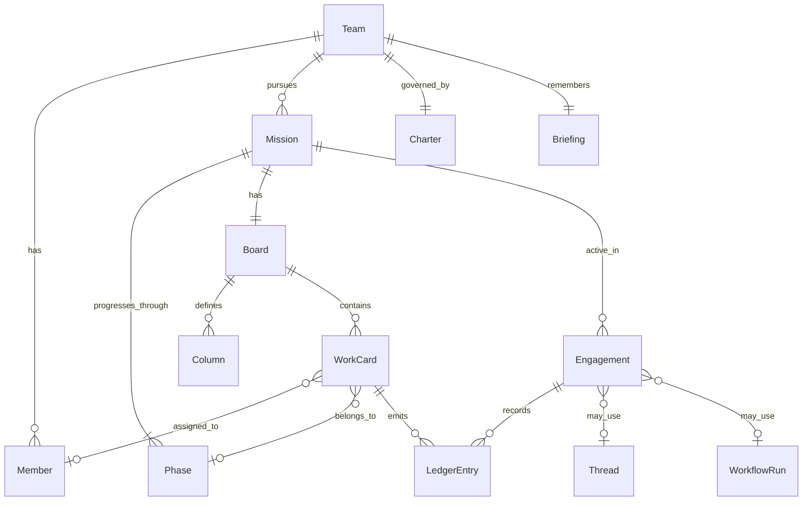

# myteams 方案

> 版本：v1.2（合并版）  
> 日期：2026-07-06  
> 状态：设计定稿，可实施  
> 合并自：`myteams-草案.md`、`agentTeams-最终方案.md`、`agentTeams-实施方案.md`、`adr/0001-team-as-primary-object.md`

---

## 目录

1. [愿景与边界](#1-愿景与边界)
2. [架构决策：Team 一等对象](#2-架构决策team-一等对象)
3. [两层结构与领域模型](#3-两层结构与领域模型)
4. [协作模式](#4-协作模式)
5. [三支队工作方式](#5-三支队工作方式)
6. [看板设计](#6-看板设计)
7. [记忆与进化](#7-记忆与进化)
8. [人的角色与 Hub](#8-人的角色与-hub)
9. [架构与技术栈](#9-架构与技术栈)
10. [实施路线](#10-实施路线)
11. [风险与缓解](#11-风险与缓解)
12. [待确认事项](#12-待确认事项)
13. [附录](#13-附录)

---

## 1. 愿景与边界

### 1.1 一句话

**myteams = 养多支专业 Agent 团队的平台——短剧、小说、应用开发各干各的领域；每支队有自己的干活方式；队长期存在，会自己进化。**

不是 Pi 插件，不是单一编排器，不是给所有场景套同一套流水线。

### 1.2 用户意图

```text
· 多个专业团队——短剧、小说、应用开发……各干各的领域
· 每个团队按自己的工作内容，用适合自己的方式
· 共性节奏：先头脑风暴 → 确定方案 → 再实施
· 团队长期存在，可以自主进化
· 需要看板掌握进展
```

产品中心是 **「多支可养成的专业编队」**，不是 **「一套通用协作原语」**。

| 你的要求 | 方案回答 |
|----------|----------|
| 多个专业团队，各干各的领域 | **Team 是一等对象**；平台管多支队并存 |
| 每队按自己的工作内容，用适合自己的方式 | 平台只提供 **共性节奏框架**；阶段内容、角色、产物由 **队宪（Charter）** 自定 |
| 共性节奏：头脑风暴 → 确定方案 → 实施 | 三阶段是 **命名约定**，不是硬编码流水线 |
| 团队长期存在，可以自主进化 | Team 不随单个作品结束而销毁；**Briefing（团队记忆）** 驱动养成 |
| 需要看板掌握进展 | 每 Mission 有 **队自定义看板**；卡片可 assign 给 Member；**不以看板替代 Team 中心** |

### 1.3 是什么 / 不是什么

| 是 | 不是 |
|----|------|
| 多支 **领域专业化**、**长期存在** 的 Agent Team | 一套流程打天下 |
| 每支队 **自定义** 三阶段工作方式 | 全局 Workflow 编辑器当核心 |
| **可见的队内协作现场**（看板 + 时间线 + 阶段） | 黑盒后台跑 Agent |
| **Mission 看板**：队自定义列、卡片 assign | 全局 Issue/PM 产品当中心 |
| **团队记忆驱动** 的自主进化 | 静态配置、每次从零 |
| **Harness 中立** 的执行接入 | Pi 的附属 MCP / 插件 |

参考项目矩阵用于 **避坑与验证假设**，不是零件目录。

---

## 2. 架构决策：Team 一等对象

**ADR 0001**（2026-07-06，已接受）

### 背景

参考项目分属不同层次：有的以 Issue 为中心（Multica、Symphony），有的以 Session 聊天为中心（OpenTeams），有的以岗位频道为中心（OpenCrew）。用户明确要求「多支专业团队长期存在、各干各的领域」。

### 决策

**Team 是 myteams 的一等对象**，而非 Workflow、Issue 或 Session。

- Mission 挂在 Team 下，Team 不因 Mission 结束而销毁
- 工作方式（阶段内容、角色、产物）由 Team 自定义
- Briefing 归属 Team，驱动跨 Mission 进化
- Thread / WorkflowRun 是 Team 可选的协作工具，不是产品中心

### 备选方案（未采纳）

| 方案 | 问题 |
|------|------|
| Issue 中心（Multica 式） | 把「养队」降格为「派活」 |
| Session 中心（OpenTeams 式） | 难表达「队长期存在、跨作品养成」 |
| 全局 Workflow 中心（Archon 式） | 易滑向「一套流程打天下」 |

### 后果

- 平台 API 以 `teams/:id/...` 为根路径
- Phase 1 先验证 Team + Mission + Ledger + Briefing + Board 闭环
- WorkItem（可选 Issue 层）推迟到 Phase 3，作为入口而非中心

---

## 3. 两层结构与领域模型

### 3.1 两层结构

```text
myteams（平台）
  ├── 编队：创建 / 管理多支 Team
  ├── 现场：Hub 展示看板、时间线、阶段与待拍板
  ├── 看板：Mission 级 WorkCard + 队自定义列 + Member assign
  ├── 记忆：Briefing 存储与注入
  ├── 接入：EngineAdapter 连接 Harness
  └── 编排：Thread / WorkflowRun 两种协作模式（队选用）

  └── Team × N（长期存在）
        ├── 领域与身份（短剧 / 小说 / 应用开发 …）
        ├── Member（持久角色，Agent + 可选人）
        ├── Charter（队宪：自治边界、升级规则）
        ├── 工作方式（本队三阶段定义、产物、门禁）
        ├── Mission（当前推进的作品 / 项目）
        │     └── Board（本 Mission 的工作看板）
        └── Briefing（原则 / 模式 / 教训）
```

**分工原则**：平台回答「怎么养多支队」；Team 回答「这支队怎么 brainstorm → 定案 → 实施」。

### 3.2 对象关系



### 3.3 核心对象

| 对象 | 定义 | 生命周期 |
|------|------|----------|
| **Team** | 专业编队：领域、成员、工作方式、历史 | **长期**；跨多个 Mission |
| **Member** | 队内角色（Agent 或人），有 handle、职责、人格 | 随 Team 存在；可演进 persona |
| **Charter** | 队宪：使命、自治边界（L0–L3）、升级条件 | 队可在边界内微调；L3 变更需人批 |
| **Mission** | 一件作品或项目 | 有始有终；结束后 Team 继续存在 |
| **Phase** | Mission 内阶段：brainstorm / scheme / delivery | 队自定义每阶段内容与门禁 |
| **Engagement** | 在某 Mission·Phase 上的一次活跃工作 | 可多次；结束触发 Closeout |
| **Ledger** | append-only 队内时间线 | 消息、决策、产物、责任、升级 |
| **Briefing** | 团队记忆：principles / patterns / scars | 跨 Mission 累积；驱动进化 |
| **Closeout** | Phase 或 Mission 收尾的结构化沉淀 | 触发 Briefing 更新 |
| **Board** | 某 Mission 的工作看板；列由队定义 | 随 Mission 创建 |
| **Column** | 看板列（如「进行中」「待审」） | 队级配置 |
| **WorkCard** | 看板卡片：可指派、可追踪的工作单元 | 可来自阶段产物拆分、委托人下达、Agent 自建 |

### 3.4 配置示例

**Team**（`teams/<id>/team.yaml`）：

```yaml
id: app-dev
name: 应用开发队
domain: software
defaultMode: hybrid          # thread | workflow | hybrid
phases:
  - id: brainstorm
    label: 头脑风暴
  - id: scheme
    label: 确定方案
  - id: delivery
    label: 实施
members: [...]
charter: charter.md
```

**Mission**：

```yaml
id: my-app-v1
title: 待办应用 MVP
teamId: app-dev
status: active               # active | paused | done
currentPhase: scheme
brief: "做一个本地优先的待办应用"
artifacts: []
```

**Member**：

```yaml
id: architect
kind: agent                  # agent | human
role: 架构师
handle: "@architect"
harness:
  engine: pi
  model: claude-sonnet-4
persona: members/architect.md
autonomy: L2
```

### 3.5 持久化布局

每支 Team 工作区自包含、Git 友好：

```text
teams/<team-id>/
  team.yaml          # 队定义
  board.yaml         # 看板列模板（Mission 创建时实例化）
  charter.md         # 队宪
  members/           # 角色人格
  phases/            # 各阶段产物与门禁
  workflows/         # 可选 WorkflowRun 定义
  briefing/          # 团队记忆
  missions/
    <mission-id>/
      mission.json   # 作品状态
      board.json     # 看板实例（列 + 卡片）
  ledger/            # 时间线（append-only）
```

运行时索引：`~/.agentteams/`（daemon 锁、活跃 session）。

---

## 4. 协作模式

借鉴 OpenTeams「Chat + Workflow」思想，但 **不以单 Session 为中心**。

### 4.1 Thread（轻）

**适合**：探索、创意碰撞、小修、对等讨论。

| 机制 | 说明 |
|------|------|
| @mention 路由 | `@编剧` `@架构师` 定向调度 Member |
| Ledger 对话 | 队内发言、决策可见 |
| Custody（可选，Phase 2） | 当前责任方；可与 WorkCard assign 合并 |

**借鉴**：Clowder @路由、OpenCrew A2A 协议  
**不搬**：球权全状态机、Slack 频道外壳

```text
委托人: "@编剧 这集加个反转"
  → Ledger: message + custody → 编剧 Member
  → Harness 执行 → Ledger: artifact（分集梗概）
  → custody → @导演 审节奏
```

### 4.2 WorkflowRun（重）

**适合**：步骤清晰、需审批、可重试的交付流程。

| 机制 | 说明 |
|------|------|
| 队级 YAML 步骤 | 每步指定 Member、依赖、自治等级 |
| 逐步门禁 | 人批 / 队共识 / 验收 |
| 单步重试 | 失败只重跑该步，不推翻全局 |

**借鉴**：Archon node 定义、OpenTeams 计划图  
**不搬**：Archon 工单中心、全局 DAG 编辑器

```yaml
# teams/app-dev/workflows/feature-delivery.yaml
steps:
  - id: implement
    member: builder
    autonomy: L1
  - id: review
    member: reviewer
    requires: [implement]
    gate: human_optional
  - id: integrate
    member: builder
    requires: [review]
```

### 4.3 三支队默认策略

| 队 | 默认模式 | 理由 |
|----|----------|------|
| **短剧** | Thread | 选题/人设/节奏碰撞多，流程弹性大 |
| **小说** | Thread | 连贯性互审、文风统一适合对话式 |
| **应用开发** | **Hybrid** | brainstorm/scheme 用 Thread；delivery 用 Workflow |

平台提供两种模式；**何时用哪种、何时切换** 写入各队 Charter。

---

## 5. 三支队工作方式

共性节奏：**头脑风暴 → 确定方案 → 实施**。  
下面是 **同一框架、不同诠释**——平台不强制阶段等价。

### 5.1 短剧创作队

| 阶段 | 这支队怎么做 | 典型产物 | 协作 |
|------|--------------|----------|------|
| 头脑风暴 | 选题、人设、冲突、分集钩子；编剧与总策划对等碰撞 | 选题池、人物小传、分集钩子 | Thread |
| 确定方案 | 选定本集/本季方向；导演卡节奏；分场大纲 | 分集大纲、场景表、制作清单 | Thread + 人批方向 |
| 实施 | 剧本 → 分镜 → 剪辑节奏 | 剧本定稿、分镜、成片 | Thread；按队宪谁审谁做 |

**成员**：总策划、编剧、导演、剪辑、委托人  
**看板列**：`选题池 → 大纲定稿 → 拍摄制作 → 待审 → 完成`（卡片单位：集/场）  
**Hub 侧重**：看板 + 分集列表、场景表、素材状态

### 5.2 小说创作队

| 阶段 | 这支队怎么做 | 典型产物 | 协作 |
|------|--------------|----------|------|
| 头脑风暴 | 世界观、主线、人物弧；发散与收敛交替 | 设定笔记、情节备选、人物关系 | Thread |
| 确定方案 | 卷章结构、POV、伏笔表；文风与禁忌 | 章节大纲、写作规范 | Thread + 人批主线 |
| 实施 | 分章写作 → 连贯性互审 → 文风修订 | 章节稿、修订记录 | Thread |

**成员**：主笔、世界观架构、连贯性编辑、文风编辑、委托人  
**看板列**：`构思 → 大纲 → 写作中 → 连贯审 → 文风审 → 定稿`（卡片单位：卷/章）  
**Hub 侧重**：看板 + 卷章树、人物关系、伏笔表

### 5.3 应用开发队

| 阶段 | 这支队怎么做 | 典型产物 | 协作 |
|------|--------------|----------|------|
| 头脑风暴 | 需求澄清、方案备选、风险与边界 | 需求摘要、方案对比 | Thread |
| 确定方案 | 架构/接口/里程碑；评审门禁 | 设计说明、验收标准 | Thread + **人批**后进入实施 |
| 实施 | 实现 → 交叉 Review → 集成验证 | PR、测试、可运行交付 | **WorkflowRun** |

**成员**：技术负责人、架构师、构建者、审查者、委托人  
**看板列**：`待办 → 进行中 → 待审 → 已完成`（卡片单位：功能/任务）  
**Hub 侧重**：看板 + diff 摘要、测试结果

### 5.4 Phase 门禁（队级可配置）

```yaml
# teams/app-dev/phases/scheme.yaml
gate:
  type: human_approval
  requiredArtifacts: [design-doc.md]
  approver: human
exitCriteria:
  - 架构决策已记录到 Ledger
  - 验收标准已写入 Mission
```

---

## 6. 看板设计

### 6.1 为什么需要看板

仅有 Ledger 时间线，委托人难一眼看清 **「还有多少活、卡在哪、谁在干」**。  
看板补这一层；与 Multica 的差别是：**看板服务 Team/Mission，不是反过来用 Issue 定义产品**。

```text
看板回答：有什么活、什么状态、谁负责
时间线回答：发生了什么、为何如此
阶段视图回答：在 brainstorm / scheme / delivery 的哪一段
```

### 6.2 Hub 三视图（并列）

| 视图 | 回答的问题 | 典型操作 |
|------|------------|----------|
| **看板** | 活在哪一列、谁 assign、是否阻塞 | 拖拽、assign、点开卡片看详情 |
| **时间线（Ledger）** | 谁说了什么、何时决策、产物链接 | 浏览、插话、@mention |
| **阶段** | Mission 在三段节奏中的位置 | 推进 Phase、触发门禁 |

委托人默认 landing：**看板**；需要追溯细节时切 **时间线**。

### 6.3 看板结构

```text
Board（1 Mission : 1 Board）
  ├── columns[]     # 队定义，有序
  └── cards[]       # WorkCard
        ├── title / description
        ├── columnId
        ├── assignee（Member id，可空）
        ├── phase?（可选，关联 brainstorm/scheme/delivery）
        ├── status（open | blocked | done）
        ├── blocker?（阻塞原因，Agent 可主动填报）
        ├── artifacts[]（产物路径）
        └── links（关联 Ledger 条目、WorkflowRun 步骤）
```

**队级看板模板**写在 `teams/<id>/board.yaml`，创建 Mission 时实例化。

### 6.4 卡片生命周期

```text
创建（委托人 / Agent / Phase 产物拆分 / Workflow 步骤 spawn）
  → 落入第一列或指定列
  → assign Member（可选自动 enqueue 执行）
  → 列间移动（每次移动写 Ledger）
  → blocked（Member 报阻塞 → 看板标记 + Ledger + 可选通知委托人）
  → done（可触发 Closeout 片段或 Workflow 下一步）
```

### 6.5 看板与协作模式联动

| 协作模式 | 看板角色 |
|----------|----------|
| **Thread** | 卡片是可 @ 的上下文锚点；讨论挂卡片，Ledger 双向链接 |
| **WorkflowRun** | 步骤可映射到卡片列移动；审批门禁 = 卡进入「待审」列 |
| **Hybrid（应用开发）** | brainstorm/scheme 少量卡；delivery 卡暴增，Workflow 驱动列流转 |

### 6.6 借鉴 Multica、不搬什么

| 借鉴 | 不搬 |
|------|------|
| Agent 出现在看板、可 assign | Issue 当全产品中心 |
| 卡片阻塞（blocker）可见 | 完整 Project/Milestone/Inbox |
| assign → enqueue 执行 | 云 SaaS、多租户优先 |

---

## 7. 记忆与进化

### 7.1 长期存在

```text
Team 创建
  → 连续推进 Mission A、B、C …（多部短剧 / 多本小说 / 多个应用）
  → 成员与人格跨 Mission 保持
  → 委托人可随时旁观、插话、在升级点拍板
  → Mission 结束 ≠ Team 销毁
```

### 7.2 进化循环

```text
Engagement 执行（带 Briefing 上下文）
        ↓
Closeout（队自定义：什么管用 / 什么翻车）
        ↓
Briefing 更新
  ├── principles  经检验的原则
  ├── patterns    可复用模式
  └── scars       踩坑与教训
        ↓
Charter / 工作方式微调（在自治边界内）
        ↓
下次 brainstorm / 定案 / 实施 自动带上这些惯例
```

**进化发生在 Team 层**，不是平台替队改代码。

### 7.3 Briefing 结构

```text
briefing/
├── principles.md    # 经检验的原则
├── patterns.md      # 可复用模式
├── scars.md         # 踩坑与教训
└── changelog.md     # 记忆演进记录
```

### 7.4 Closeout 模板（队级）

```markdown
## Closeout: {{mission}} / {{phase}}

### 什么管用
- ...

### 什么翻车
- ...

### 建议写入 Briefing
- [principle] ...
- [pattern] ...
- [scar] ...
```

### 7.5 自主等级（Autonomy）

借鉴 OpenCrew L0–L3，写入队宪与平台 Policy：

| 等级 | 含义 | 典型操作 |
|------|------|----------|
| **L0** | 仅建议 | 提案、分析，不执行 |
| **L1** | 可逆 | 措辞修订、局部实现、测试补充 |
| **L2** | 可回滚 | 模块拆分、人设调整、phase 产物清单变更 |
| **L3** | 不可逆 / 对外 | 发布成品、不可逆迁移、Charter 变更 → **必须经委托人批准** |

| 变更 | 自治 | 需人批 |
|------|------|--------|
| 新增 pattern / scar | L1 ✓ | |
| 修改 Member persona | L2 ✓ | |
| 修改阶段产物清单 | L2 ✓ | |
| 修改 Charter 自治边界 | | L3 ✓ |
| 对外发布成品 | | L3 ✓ |

### 7.6 Ledger 事件类型

| 类型 | 含义 |
|------|------|
| `message` | 队内发言（含 @mention） |
| `decision` | 阶段门禁决策 |
| `artifact` | 产物登记（路径 + 摘要） |
| `card_move` | 看板卡片列移动 |
| `custody` | 责任转移 |
| `escalation` | 升级待人拍板 |
| `closeout` | 阶段 / Mission 收尾 |

---

## 8. 人的角色与 Hub

### 8.1 委托人，不是传话员

```text
1. 创建或选用一支专业 Team（模板或自建）
2. 下达方向 — 新作品、新功能、新一季 …
3. 旁观协作（可选）
4. 在 L3 升级点拍板（方向冲突、不可逆、验收）
5. 验收成品；Closeout 触发 Briefing 更新
```

各队 Charter 写明：**哪些自治，哪些必须叫委托人**。

### 8.2 Hub 导航

```text
选 Team
  → 当前 Mission（可多个，通常聚焦一个）
  → 【看板】默认视图：列 + 卡片 + assignee + 阻塞标记
  → 【阶段】头脑风暴 / 确定方案 / 实施
  → 【时间线】Ledger：消息、决策、产物、卡片的移动记录
  → 产物面板（队自定义，可与卡片关联）
  → 待拍板队列（L3 Escalation）
```

### 8.3 看板交互要点

- 拖拽改列 → 写 Ledger，可选触发 Agent（如拖入「进行中」且已 assign）
- 点击卡片 → 侧栏：描述、assignee、阻塞、产物、关联时间线条目
- 委托人可：新建卡、assign、拖列、标记阻塞、批准「待审」列中的卡
- Agent 可：更新自己负责的卡、报阻塞、L1/L2 自建子卡

### 8.4 队差异化布局

由 Team `hubLayout` 配置驱动：

| 队 | 看板 + 辅助面板 |
|----|-----------------|
| 短剧 | 集/场看板 + 场景表、素材状态 |
| 小说 | 卷/章看板 + 伏笔表、人物关系 |
| 应用开发 | 任务看板 + diff、测试结果 |

---

## 9. 架构与技术栈

### 9.1 四层分工

```text
L4  Hub          人看现场、做 L3 决策
L3  Platform     Team 生命周期、编排、Briefing、Workspace 隔离
L2  Adapter      EngineAdapter：统一调度接口，对接多 Harness
L1  Harness      Pi / Codex / Claude / acpx …（外部，非产品中心）
```

**立场**：越往上越接近「做什么 / 怎么协作」；越往下越接近「单次 Agent 怎么跑」。

### 9.2 系统拓扑

```text
┌──────────────┐   WebSocket    ┌──────────────────┐
│  Hub (Web)   │◄──────────────►│  Platform Core   │
└──────────────┘                │  (teams-daemon)  │
┌──────────────┐   HTTP/WS       └────────┬─────────┘
│ Hub (Desktop)│◄────────────────────────┘
└──────────────┘                          │
┌──────────────┐   CLI                     │
│  teams-cli   │◄──────────────────────────┘
└──────────────┘
                              ┌───────────┴───────────┐
                              │                       │
                         Pi RPC                  acpx session
```

### 9.3 平台核心职责

| 职责 | 说明 |
|------|------|
| Team 生命周期 | 创建、持久化、多 Mission |
| 看板 | Board / WorkCard CRUD、列流转、assign、阻塞；变动同步 Ledger |
| 协作编排 | Thread / WorkflowRun 调度、Ledger 写入 |
| 上下文组装 | Charter + Briefing + Mission/Phase + Ledger 近期 + Member persona → 注入 Harness |
| Briefing 管理 | 存储、检索、注入、changelog |
| Workspace 隔离 | 每 Team 自包含工作区，便于 Git 与队自治 |
| 升级队列 | L3 Escalation 待人拍板 |

### 9.4 Harness 适配层

**AgentSession 接口**：

```typescript
interface AgentSession {
  id: string;
  memberId: string;
  engine: string;
  prompt(messages: Message[]): AsyncIterable<AgentEvent>;
  resume(checkpoint: string): void;
  abort(): void;
}
```

| Engine | Phase 1 | 接入方式 |
|--------|---------|----------|
| **pi** | ✅ 默认 | `pi --mode rpc` JSONL |
| **acpx** | 预留 | `acpx pi prompt` |
| **codex** | 预留 | app-server JSON-RPC |
| **claude-code** | 预留 | CLI wrapper |

每次 Member 被调度时，平台组装：Charter 摘要 → Briefing 相关条目 → Mission/Phase → Ledger 近期 → Member persona。Harness 只负责执行；**协作语义由平台管**。

### 9.5 项目结构

```text
myteams/
├── CONTEXT.md                 # 领域词汇表
├── package.json               # Bun workspaces
├── packages/
│   ├── core/                  # 领域模型 + 存储
│   ├── harness/               # EngineAdapter
│   ├── daemon/                # Platform Core（Phase 1 后期）
│   └── cli/                   # teams-cli
├── teams/
│   ├── app-dev/
│   ├── short-drama/
│   └── novel/
└── docs/
```

| 包 | 职责 |
|----|------|
| `@agentteams/core` | Team/Mission/Ledger/Briefing/Board 类型与文件存储 |
| `@agentteams/harness` | AgentSession 接口与 Pi adapter |
| `@agentteams/cli` | 队管理、Mission、Ledger、看板操作 |
| `@agentteams/daemon` | 常驻编排、WebSocket API（Phase 1 末） |

**技术栈**：TypeScript + Bun monorepo。

---

## 10. 实施路线

### 10.1 Phase 1 — 证明「一支队走完三段 + 看板可用」

**目标队**：应用开发队（易验证、参考多）

| 步骤 | 交付 | 验收 |
|------|------|------|
| 1 | Team / Mission / Member / Charter / **board.yaml** | 队定义与看板列模板可版本化 |
| 2 | **Mission 看板** + WorkCard assign + Ledger 联动 | 可建卡、拖列、assign；变动出现在时间线 |
| 3 | Phase 视图 + Ledger | 阶段与看板并列可见 |
| 4 | 接 1 种 Harness（Pi RPC） | brainstorm 跑通；卡可触发 Agent |
| 5 | scheme 人批 + delivery WorkflowRun ↔ 看板列同步 | 三段闭环；实施卡批量流转 |
| 6 | Closeout → Briefing | 第二次 Mission 可感知记忆 |
| 7 | **Hub Web 最小看板**（+ 时间线只读） | 委托人默认看板掌握进展 |

**周计划**：

| 周 | 交付 |
|----|------|
| W1 | core 包 + 三队模板 + CLI `list/show/init` |
| W2 | Mission 生命周期 + Board + Ledger 写入 |
| W3 | Pi harness 接入 + brainstorm 跑通 |
| W4 | scheme 门禁 + delivery WorkflowRun |
| W5 | Closeout + Briefing 写回 |
| W6 | daemon 薄层 + Hub Web 最小看板 |

**Phase 1 不做**：第二/三队模板、多 Harness、飞书/Slack、跨 Mission 队级总览看板、Workflow 可视化编辑器。

### 10.2 Phase 2 — 验证「同平台、异工作方式」

- 短剧队、小说队各完成一个 Mission（**各自看板列**）
- 卡片阻塞 + Custody 与 assign 合并
- 看板拖拽触发 Agent 执行
- 第二 Harness（acpx / Codex）

### 10.3 Phase 3 — 平台化

- Team 级跨 Mission 总览看板
- 跨 Team 委托人仪表盘
- Briefing 语义检索
- Team 模板市场
- Desktop Hub（Tauri 可选）

---

## 11. 风险与缓解

| 风险 | 缓解 |
|------|------|
| 做成通用 DAG 平台 | Team 一等对象；Workflow 是队可选工具 |
| 做成聊天产品 | 看板 + Mission + Phase；Hub 默认看板 |
| 做成 Multica 式 Issue 中心 | 看板挂在 Mission 下；不做全局 Backlog/PM |
| Harness 绑定 | EngineAdapter 抽象；Pi 为默认之一 |
| 记忆污染 prompt | Briefing 分桶 + 按需检索 + changelog |
| 参考项目拼盘 | 每项能力标明「借鉴 / 不搬」；矩阵作教科书 |
| 三队模板维护成本 | 共享 core schema，差异只在 `phases/` 与 `members/` |
| 进化失控 | L3 门禁 + Charter 变更需人批 |

---

## 12. 待确认事项

1. **Phase 1 样板队**：应用开发队是否 OK？还是短剧 / 小说优先？
2. **进化边界**：L0–L3 默认是否合理？有无必须追加的 L3 场景？
3. **看板默认列**：应用开发 `待办→进行中→待审→完成` 是否 OK？
4. **Hub**：Phase 1 直接 **Web 看板 + 时间线**，是否同意？
5. **默认 Harness**：Pi RPC 优先，是否同意？

---

## 13. 附录

### 13.1 参考项目：借鉴什么、不搬什么

| 参考 | 借鉴 | 不搬 |
|------|------|------|
| **OpenTeams** | Thread + Workflow 双模式 | 单 Session 中心 |
| **OpenCrew** | 持久岗位、L0–L3、Closeout、知识沉淀 | Slack + OpenClaw 外壳 |
| **Multica** | 看板 + assign Agent、阻塞可见 | Issue 当全产品中心、完整 PM/SaaS |
| **Clowder** | @mention 路由、共享记忆、养成感 | 球权全状态机、Redis 重栈 |
| **Archon** | Workflow 步骤、门禁、单步重试 | 工单调度当产品中心 |
| **Symphony** | 工单驱动执行思路 | Codex 单绑定、Linear 中心 |
| **Paseo** | Timeline 可观测、本地 Hub | AGPL 全栈 fork |
| **acpx** | 多引擎 CLI 接入思路 | 绑 acpx 为唯一入口 |
| **Pi** | 默认执行底座之一 | 产品降为 Pi 插件 |

### 13.2 相关文档

| 文档 | 说明 |
|------|------|
| [CONTEXT.md](../CONTEXT.md) | 领域词汇表 |
| [横向对比矩阵.md](./横向对比矩阵.md) | 参考项目对照教科书 |
| `docs/*-分析.md` | 各参考项目深度分析 |

### 13.3 合并说明

本文件取代以下文档的主体内容，原文保留为历史索引：

- `myteams-草案.md` — 方向稿（v1.0）
- `agentTeams-最终方案.md` — 设计定稿（v1.1）
- `agentTeams-实施方案.md` — 技术实施（v1.1）
- `adr/0001-team-as-primary-object.md` — ADR 0001

---

*本文档为 myteams 唯一方案主文档；确认后按 Phase 1 路线实施。*