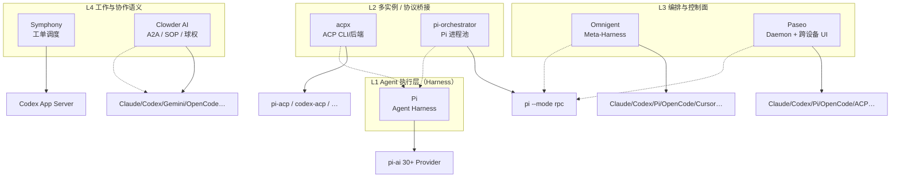

# 参考项目横向对比矩阵

> 对比对象：`references/` 下已拆解的 7 个实体  
> 更新日期：2026-07-05  
> 详细分析见：`docs/*-分析.md`

---

## 1. 生态分层（一图看懂）



**读图要点**：越往上越接近「做什么工作 / 怎么协作」；越往下越接近「单个 Agent 怎么跑」。Pi 是共享的执行层底座，上层项目可叠加组合。

---

## 2. 总览矩阵

| 维度 | **Pi** | **pi-orchestrator** | **acpx** | **Paseo** | **Omnigent** | **Clowder AI** | **Symphony** |
|------|--------|---------------------|----------|-----------|--------------|----------------|--------------|
| **层次** | L1 执行 | L2 进程监督 | L2 协议客户端 | L3 控制面 | L3 Meta 编排 | L4 协作平台 | L4 工单调度 |
| **一句话** | 极简 Agent Harness | 多 Pi RPC 进程池 | ACP 无头 CLI/后端 | 本地多 Provider 开发环境 | 开源 Meta-Harness | 多 Agent 团队协作平台 | Linear 工单自主执行 |
| **语言** | TypeScript | TypeScript | TypeScript | TypeScript (Expo/Electron) | Python + React | TypeScript (Next/Fastify) | Elixir（参考实现）+ SPEC 语言无关 |
| **成熟度** | 生产可用 | Experimental | Alpha（测试厚重） | Beta | Alpha | 生产级（Cat Cafe 提炼） | Engineering Preview |
| **开源协议** | MIT | MIT | MIT | AGPL-3.0 | — | — | Apache 2.0 |

---

## 3. 驱动与触发

| 维度 | Pi | pi-orchestrator | acpx | Paseo | Omnigent | Clowder AI | Symphony |
|------|-----|-----------------|------|-------|----------|------------|----------|
| **谁发起工作** | 用户 / SDK / RPC 调用方 | 外部程序 `spawn` | CLI / 脚本 / Flow / 嵌入方 | 用户（App/CLI/Web） | YAML Agent / Web UI / CLI | CVO + 猫猫 / @路由 | Linear 看板轮询 |
| **自动调度** | 无 | 无 | Flow 图（实验性） | cron / Loop | Polly 等子 Agent spawn | serial/parallel 路由 | 5s 轮询 + dispatch |
| **任务来源** | 即时 prompt | 手动指定 cwd | 命令行参数 / Flow input | 用户操作 / MCP 工具 | Agent YAML / 会话 | Thread / Mission / Feature | Linear Issue |
| **工单/Backlog** | 无 | 无 | 无 | 弱（Loop/Schedule） | 弱 | 强（Mission Hub） | 强（Linear 一等公民） |

---

## 4. Agent 与协议

| 维度 | Pi | pi-orchestrator | acpx | Paseo | Omnigent | Clowder AI | Symphony |
|------|-----|-----------------|------|-------|----------|------------|----------|
| **绑定 Agent** | Pi 自身 | 仅 Pi | 20+（经 ACP adapter） | Claude/Codex/Copilot/OpenCode/Pi/OMP… | Claude/Codex/Pi/OpenCode/Cursor/Hermes… | Claude/Codex/Gemini/OpenCode… | **仅 Codex**（参考实现） |
| **Pi 接入方式** | 原生 | `pi --mode rpc` 子进程 | `npx pi-acp`（ACP） | `pi --mode rpc` 子进程 | `pi` SDK + `pi-native` Bridge | L1 CLI Adapter | 需自实现（SPEC 无绑定） |
| **对外协议** | 自有 RPC JSONL / SDK | Orchestrator IPC JSONL | ACP JSON-RPC (stdio) | WebSocket + Zod Schema | HTTP/SSE + OpenAPI | HTTP/WS + Socket.IO + MCP Callback | Codex app-server JSON-RPC |
| **跨 Agent 切换** | 换 pi-ai Provider | 不适用 | `acpx <agent>` 换名 | Provider 选择器 | Harness 插件注册表 | 按 breed/角色 | 不适用 |
| **结构化输出** | RPC 事件流 | 转发 RPC 事件 | `--format json` NDJSON | Timeline 条目 | BlockStream / SSE | API + 证据库 | 日志 + JSON API |

---

## 5. 并发、会话与隔离

| 维度 | Pi | pi-orchestrator | acpx | Paseo | Omnigent | Clowder AI | Symphony |
|------|-----|-----------------|------|-------|----------|------------|----------|
| **并发单位** | 单 Session（单进程） | 多 Pi 子进程 | 多 Session `(agent,cwd,name)` | 多 Agent 实例 | 多 Harness 子进程 / 会话 | 多 Thread / 平行 invocation | 多 Linear Issue |
| **隔离边界** | cwd + Session 树 | 每实例独立进程+cwd | 每 session scope | 每 Agent + workspace | Bridge 目录 / 容器 | Worktree + Thread | **每工单独立 workspace** |
| **会话存储** | `~/.pi/agent/sessions/*.jsonl` | `instances.json` 元数据 | `~/.acpx/sessions/*.json` | `$PASEO_HOME/agents/` | Server DB + Bridge 目录 | Redis + SQLite | 无（Agent 会话在 Codex 内） |
| **崩溃恢复** | Session 文件可续 | 不自动重启子进程 | 检测死进程 + reload session | Daemon 恢复 Provider 会话 | WARM_REATTACH / COLD_ONLY | Invocation 队列 + 胶囊重注入 | 内存状态丢失；工单可重 dispatch |
| **子 Agent** | 扩展实现（非内核） | 无 | Flow `acp` 节点 | `create_agent` MCP 工具 | YAML `agent`/`spawn` | @mention 串行链 | 无（每工单单 Codex） |

---

## 6. 协作与业务语义

| 维度 | Pi | pi-orchestrator | acpx | Paseo | Omnigent | Clowder AI | Symphony |
|------|-----|-----------------|------|-------|----------|------------|----------|
| **A2A / Handoff** | 无 | 无 | 无（Flow 可编排） | handoff Skill / detached subagent | Polly 跨厂商委派 | **行首 @ 路由 + 球权状态机** | 无 |
| **跨模型 Review** | 无 | 无 | `compare` 命令 | 多 Provider 并用 | Polly 强制不同厂商 | **SOP 硬规则（跨 family）** | 工作流 prompt 约定 |
| **SOP / 流程规范** | Skills 按需 | 无 | Flow 图（实验性） | Skills（loop/handoff/committee） | Policy 三层栈 | **YAML 机器真相源 + predicate** | **WORKFLOW.md** |
| **共享记忆** | Session 树 / 扩展 | 无 | Session 历史 | Timeline | Server DB | **证据库 + Entity Registry** | 无 |
| **身份/Persona** | AGENTS.md / Skills | label 可选 | 无 | Agent 元数据 | Agent YAML | **猫猫角色 + Pack 编译** | Prompt 模板变量 |

---

## 7. 控制面、UI 与可观测性

| 维度 | Pi | pi-orchestrator | acpx | Paseo | Omnigent | Clowder AI | Symphony |
|------|-----|-----------------|------|-------|----------|------------|----------|
| **UI** | TUI（pi-tui） | 无 | CLI only | Desktop/Mobile/Web/CLI | Web + Desktop + TUI 镜像 | Next.js Hub（3003） | 可选 Phoenix Dashboard |
| **远程访问** | Radius（可选） | Unix socket 本地 | 无 | Relay E2E 加密 | Server + Runner Tunnel | 飞书/Telegram 等 | 无 |
| **终端集成** | 内置 bash 工具 | 无 | ACP terminal 能力 | 高性能 PTY 管线 | tmux Native 桥接 | CLI 调用 | Codex sandbox 内 |
| **成本/Token 可见** | 内置统计 | 无 | quiet 模式 stderr | Timeline | Server 侧 | finance 包 | **orchestrator 聚合** |
| **API** | RPC JSONL | IPC JSONL | `acpx/runtime` 嵌入 | WebSocket RPC | OpenAPI `/v1/*` | REST + MCP | JSON Observability API |

---

## 8. 权限、策略与安全

| 维度 | Pi | pi-orchestrator | acpx | Paseo | Omnigent | Clowder AI | Symphony |
|------|-----|-----------------|------|-------|----------|------------|----------|
| **内置权限系统** | 无（Project Trust） | 无 | `--approve-reads/all/deny-all` | Question permission 流转 | Policy 引擎 + OS 沙箱 | 四条铁律 + Approval Hub | Codex approval_policy |
| **沙箱** | 容器/Gondolin 文档 | 无 | `--cwd` 限制 | Provider 自管 + Daemon | bwrap/seatbelt/云沙箱 | 运行时配置只读 | workspace-write sandbox |
| **非交互自动化** | `-p` / RPC | RPC | `--non-interactive-permissions` | 非交互 trust 默认 | Native Hook evaluate | MCP Callback | `approval_policy: never` |
| **供应链** | shrinkwrap + pin | 随 Pi | adapter 版本 pin | 常规 | uv lock | pnpm monorepo | Elixir mix.lock |

---

## 9. 工作流定义方式

| 项目 | 策略载体 | 版本化 | 机器可检查 |
|------|----------|--------|------------|
| **Pi** | Extensions / Skills / `.pi/` | Git | 弱（测试 + AGENTS.md） |
| **pi-orchestrator** | 无 | — | 无 |
| **acpx** | CLI flags / Flow `.ts` / `~/.acpx/config.json` | Flow 可入库 | Flow 图 + exit code |
| **Paseo** | Skills + Daemon 工具 | Git | Timeline 协议契约 |
| **Omnigent** | Agent YAML + Policy YAML | Git | Policy evaluate + CI |
| **Clowder AI** | Prompt 片段 + Pack + `sop-definitions/*.yaml` | Git | **predicate 渐进机器化** |
| **Symphony** | **`WORKFLOW.md`**（front matter + prompt） | Git | 弱（prompt 约定） |

---

## 10. 「Orchestrator」同名不同义

| 项目 | Orchestrator 管什么 | 不管什么 |
|------|---------------------|----------|
| **pi-orchestrator** | 哪些 **Pi 进程** 在跑；RPC 转发 | 做什么任务、Agent 间协作 |
| **Symphony Orchestrator** | 哪些 **Linear 工单** 该跑；并发/重试/blocked | Agent 内部推理 |
| **Clowder InvocationQueue** | 哪些 **猫猫调用** 该执行；路由模式 | 单个 CLI 的工具实现 |
| **Omnigent Server/Runner** | 哪些 **Harness 会话** 活着；策略/协作 | Harness 内部 loop |
| **Paseo AgentManager** | 哪些 **Agent 实例** 及 Timeline | Provider 内部协议 |
| **acpx Queue Owner** | 哪个进程 **持有 session 写锁** | 业务任务分配 |

---

## 11. Pi 的三条接入路径对比

| 路径 | 入口 | 协议 | 能力覆盖 | 典型上层 |
|------|------|------|----------|----------|
| **Pi SDK** | `createAgentSession()` | 进程内 API | 最全 | 嵌入式工具 |
| **Pi RPC** | `pi --mode rpc` | JSONL stdio | 全量 RPC 命令 | Paseo、pi-orchestrator、Omnigent pi-native |
| **Pi ACP** | `acpx pi` → `pi-acp` | ACP JSON-RPC | ACP 子集 | acpx、Flows、ACP 编辑器生态 |

**选型建议**：

- 同进程、深度定制 → SDK  
- 多实例隔离、要 Pi 全能力 → RPC +（可选）pi-orchestrator  
- 跨 agent 统一 CLI、CI 管道 → acpx  
- 跨设备 UI + Git 工作区 → Paseo  

---

## 12. 第二批参考项目速览（Agent Teams 赛道）

| 项目 | 层次 | 一句话 | 协作主轴 |
|------|------|--------|----------|
| **Multica** | L4 工作平台 | Issue 看板 + Agent 队友 + Daemon | **Work（Issue）** |
| **OpenTeams** | L4 协作工作台 | Free Chat + Workflow 双模式 | **Chat + DAG** |
| **OpenCrew** | L4 团队 OS | Slack 频道=岗位，Markdown 协议 | **IM + 岗位** |
| **Archon** | L4 工作流引擎 | YAML DAG，worktree，人工 gate | **Workflow** |
| **CCG** | Harness 插件 | Claude Code 内策略路由 + Agent Teams | **Strategy（插件）** |

### 12.1 三轴分类（myteams 设计用）

| 轴 | 代表 | 核心对象 | 强项 |
|----|------|----------|------|
| **工作轴 Work** | Multica、Symphony | Issue / 工单 | 活从哪来、状态跟踪、assign |
| **对话轴 Thread** | OpenTeams Chat、OpenCrew、Clowder | Thread / 频道 / @ | 灵活 A2A、身份感、可见交互 |
| **流程轴 Workflow** | Archon、OpenTeams WF、CCG | DAG / Phase / Strategy | 可重复、步骤控制、重试审批 |

**结论**：成熟的 Agent Teams 产品几乎都占 **≥2 轴**；OpenTeams 明确 **hybrid**（Chat + Workflow），Multica 用 Issue 驱动执行，OpenCrew 用 Thread+协议，Clowder 用 Thread+球权。

---

## 13. myteams 组合参考（v0.6 更新）

| myteams 能力 | 首选借鉴 | 次选 | 勿单一依赖 |
|---------------|----------|------|------------|
| **产品双模式** | **OpenTeams**（Free Thread + Workflow） | OpenCrew hybrid 模板 | 仅 Clowder @ |
| **工作对象入口** | **Multica**（Issue/assign） | Symphony 工单 | 无 Work 只有聊天 |
| **Workflow DAG** | **Archon**（YAML node） | OpenTeams 计划图 | CCG（Harness 内） |
| **@ 路由 + 责任** | Clowder / OpenCrew | Multica mention | — |
| **球权状态机** | Clowder（裁剪 SM） | — | 全栈 fork |
| **Squad 稳定寻址** | **Multica** | — | — |
| **自主等级 L0–L3** | **OpenCrew** | Archon interactive gate | — |
| **Closeout / Artifact** | OpenCrew、Paseo handoff | Clowder | 纯聊天 |
| **策略路由（轻/重）** | **CCG** strategy 思想 | — | 复制 CCG 全引擎 |
| **执行多引擎** | acpx + **EngineAdapter** | Multica daemon | 绑 Pi |
| **本地 Hub UI** | OpenTeams、Multica | Paseo Timeline | — |

### 推荐分层（v0.6）

```
[ 策略平面 ]  WORKFLOW / sop / Autonomy L0–L3 / review 规则
              ↓
[ 协作平面 ]  Workspace
                ├─ Thread 模式：Message + @ + Custody（轻）
                ├─ Workflow 模式：DAG Run + 步骤审批/重试（重）
                └─ Work 模式（可选）：WorkItem / Squad assign（入口）
              ↓
[ 执行平面 ]  EngineAdapter registry（pi / codex / claude / …）
              ↓ Delivery 队列 + isolation（worktree）
```

**myteams v0.7 立场**：参考矩阵用于**避坑与验证假设**，不用于拼功能。产品自有模型见 [myteams-草案.md](./myteams-草案.md)（Team / Mission / Ledger / Engagement / Briefing）。

---

## 14. 成熟度与风险速查

| 项目 | 生产可用性 | 主要风险 |
|------|------------|----------|
| **Pi** | 高 | 无内置沙箱；orchestrator 实验性 |
| **pi-orchestrator** | 低 | 可能删除；无自动恢复；无业务语义 |
| **acpx** | 中（Alpha） | CLI 表面仍演进；queue owner 阻塞问题在改进 |
| **Paseo** | 中高（Beta） | AGPL；协议/功能双契约维护成本高 |
| **Omnigent** | 低（Alpha） | 全栈复杂；Harness 双轨维护 |
| **Clowder AI** | 高（生产提炼） | 全栈重量；Redis 依赖；品牌/文化绑定强 |
| **Symphony** | 低（Preview） | 参考实现原型；Codex 单绑定；blocked 不持久 |
| **Multica** | 中高 | 全栈 PM+Daemon；云依赖可选 |
| **OpenTeams** | 中 | Tauri 全栈重；双模式产品完整 |
| **OpenCrew** | 中 | 强依赖 Slack+OpenClaw |
| **Archon** | 中高 | 工作流强；多 Agent 群聊弱 |
| **CCG** | 中 | 仅 Claude Code 生态 |

---

## 15. 文档索引

| 项目 | 深度分析 |
|------|----------|
| Pi | [pi-分析.md](./pi-分析.md) |
| pi-orchestrator | 见 [pi-分析.md](./pi-分析.md) §3.5、§9 |
| acpx | [acpx-分析.md](./acpx-分析.md) |
| Paseo | [paseo-分析.md](./paseo-分析.md) |
| Omnigent | [omnigent-分析.md](./omnigent-分析.md) |
| Clowder AI | [clowder-ai-分析.md](./clowder-ai-分析.md) |
| Symphony | [symphony-分析.md](./symphony-分析.md) |
| Multica | [multica-分析.md](./multica-分析.md) |
| OpenTeams | [openteams-分析.md](./openteams-分析.md) |
| OpenCrew | [opencrew-分析.md](./opencrew-分析.md) |
| Archon | [Archon-分析.md](./Archon-分析.md) |
| CCG Workflow | [ccg-workflow-分析.md](./ccg-workflow-分析.md) |

---

*本矩阵用于 myteams 架构决策；v0.6 起默认 **Harness 中立 + 双模式协作平台**，Pi 为默认引擎之一而非产品中心。*